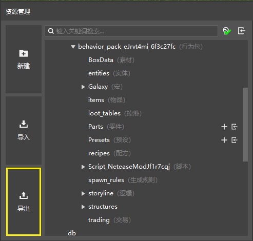
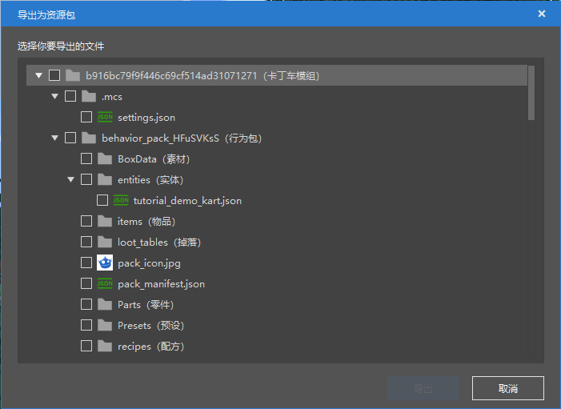

# 使用我的世界开发工作台导出作品

在本节中，我们将学习使用我的世界开发工作台导出作品。

## 直接导出作品

我们在我的世界开发工作台中我们的作品上右键或者点击“更多”按钮，即可看到“**导出**”按钮和“**导出(含编辑信息)**”按钮，他们分别可以用于导出纯粹的地图或附加包，或者导出带有我的世界开发工作台工程文件的地图或附加包。这将导出一个`.zip`格式的文件。

## 导出为资源包

我们在编辑中底部的“资源管理”窗格中可以点击“导出”按钮并选择一部分资源将其导出为一个资源包。

当我们选择资源后，“导出”按钮将会亮起，然后我们点击该按钮即可保存资源包。这将允许我们导出一个`.mep`格式文件。
