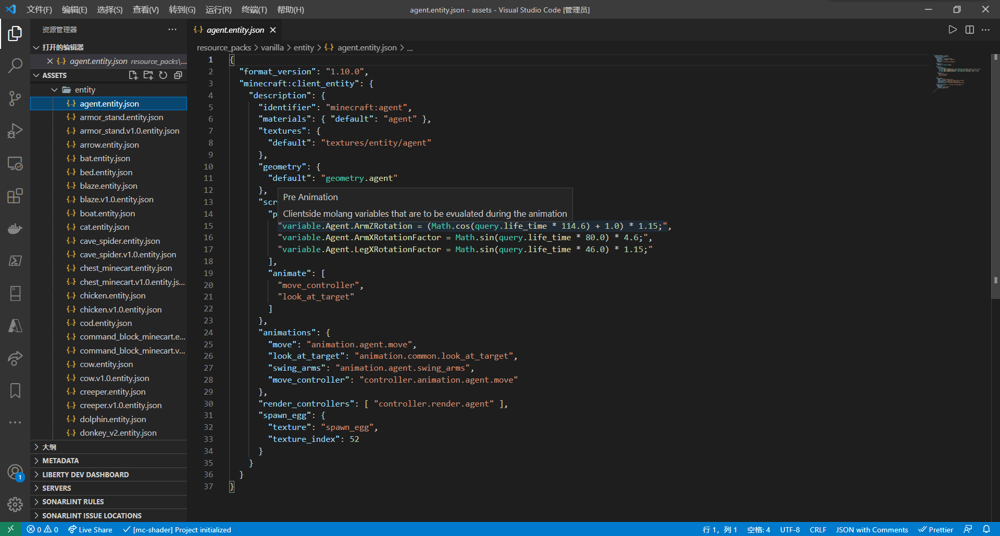

# 社区工具介绍

学习完了官方的工具我的世界开发工作台，我们接下来一起认识一些社区开发的优秀工具。熟练掌握这些工具，有助于我们开发模组时更快更好地完成那些本来冗杂而繁复的各种工作。

## Blockbench

**Blockbench**是免费的一个不可多得的模型制作工具，在基岩版中它主要被用来制作实体模型。在制作实体模型的同时，它还可以制作模型对应的纹理贴图和动画，还可以将模型导出为OBJ格式文件。Blockbench支持加载插件，通过**Minecraft Entity Wizard**插件，开发者可以快速制作出一个带有完整模型、动画和AI的基岩版实体。Blockbench有网络应用（WebAPP）和终端程序两种版本，网络应用的存在极大方便了开发者通过多种设备进行模型制作的需求。BLockbench的工程文件的后缀为`.bbmodel`，可以在我的世界开发工作台中用于原版模型几何的导入。

- 下载地址：[https://www.blockbench.net/](https://www.blockbench.net/)

- 网络应用：[https://web.blockbench.net/](https://web.blockbench.net/)

## Blockception's Minecraft Bedrock Development

**Blockception's Minecraft Bedrock Development**是一个Visual Studio Code扩展，由Blockception工作室开发。它能够为JSON文件（包括Molang代码）、MCFunction文件和本地化等文件提供代码高亮和自动补全支持。它支持这些文件的自动补全、模式验证、快速格式化和代码诊断等一系列功能。它还可以通过控制台命令一键生成资源包、行为包和世界模板的文件，可以方便地进行批量编程。

- 下载地址：[https://marketplace.visualstudio.com/items?itemName=BlockceptionLtd.blockceptionvscodeminecraftbedrockdevelopmentextension](https://marketplace.visualstudio.com/items?itemName=BlockceptionLtd.blockceptionvscodeminecraftbedrockdevelopmentextension)

## bridge.

**bridge.** 是一个功能强大的附加包集成开发环境。它支持几乎全部附加包文件的代码高亮、自动补全，支持资源包、行为包、皮肤包和世界模板等一系列附加包格式。bridge.拥有树状JSON视图，可以方便开发者快速地定位和增删JSON文件节点，以便于快速开发出正确且内容充实的附加包文件。bridge.还支持一系列第三方扩展，它们可以更好更有力地驱动附加包的创作。在最新版中，bridge.只有网络应用（WebAPP）的形态，建议使用Chromium内核的浏览器来安装网络应用。

- 网络应用：[https://bridge-core.app/](https://bridge-core.app/)

## Snowstorm

**Snowstorm**是一个功能强大的国际版粒子制作器，由Blockbench的开发人员制作。它拥有一个可视化界面和操作面板。通过操作面板，你可以添加和修改粒子的各种属性，它们会实时显示在右侧的预览界面中。这使得粒子的制作非常高效。Snowstorm既有网络应用（WebAPP）又有功能相同的Visual Studio Code扩展。

- 网络应用：[https://snowstorm.app/](https://snowstorm.app/)
- 扩展下载：[https://marketplace.visualstudio.com/items?itemName=JannisX11.snowstorm](https://marketplace.visualstudio.com/items?itemName=JannisX11.snowstorm)

## Chunker

**Chunker**是一个用于转换Java版和基岩版存档的网络工具，同时可以通过它轻松地配置世界设置。Chunker支持存档设置、维度和区块数据的转换，这包括方块、生物群系、战利品表和地图信息等各类数据。你还可以在转换的过程中一键对区块和维度进行修剪，或在转换之后执行LevelDB的压缩方法以缩小存档体积等。Chunker是一个网络应用（WebAPP），需要在线打开。

- 网络应用：[https://chunker.app/](https://chunker.app/)

## Mcblend

**Mcblend**是一个Blender插件，可以用来创作基岩版实体的模型和动画。通过Blender的强大动画功能，配合Mcblend，可以快速地制作基岩版实体的动画。Mcblend可以导入和导出我的世界基岩版的多边形网格模型和基于立方体的模型，生成模型的UV贴图和纹理，导出动画和姿态。更强大的功能是，Mcblend可以检测骨架中通过约束而移动的部分并将其自动添加到我的世界实体导出的动画中，它还可以一键将物理模拟添加到实体模型中。Mcblend目前只能从它的Github仓库的发布页中下载。

- 下载地址：[https://github.com/Nusiq/mcblend/releases](https://github.com/Nusiq/mcblend/releases)