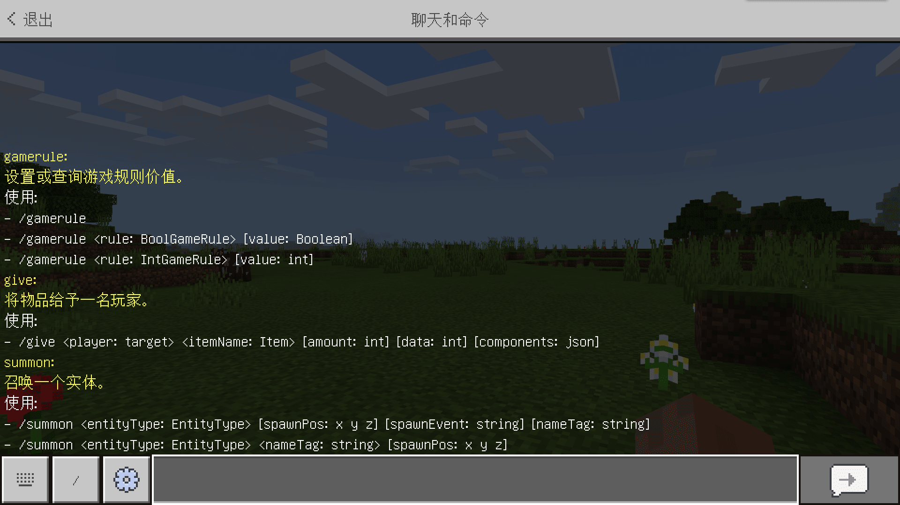

# 命令的用途

**命令**（**Command**）是我的世界中一个非常重要的系统。通过操作命令，你可以在世界中快速执行各式各样的操作，从简单的改变游戏模式或改变天气，到复杂的记分板和函数逻辑。

创作命令的初衷是为了通过这种系统让游戏世界得以动态运行。例如，开发者可以通过命令实时监测玩家周围的环境，然后对特定的环境做出特定的反应。通过这样的操作可以使游戏不再是一个纯粹的静态。虽然没有了命令，我们依旧有很多种形式为游戏添加各种逻辑，但是命令作为与游戏嵌合得最好且最简单的一种表示形式，不仅可以简化模组的开发，还可以使游戏运行地更加流畅。

同时，命令被整合到了模组开发的方方面面中。我们可以用**函数**（**Function**）来批量执行命令，我们还可以在实体、方块和物品等逻辑中执行命令，甚至，我们还可以通过模组API执行命令来简化脚本的逻辑或和模组其他部分相兼容，比如通过统一的记分板来记录世界信息，调配游戏资源内容。

接下来，我们将通过简洁易懂的语言一起来学习命令的执行。