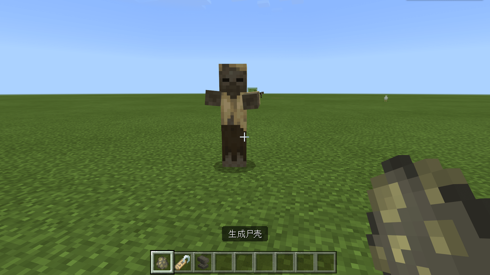
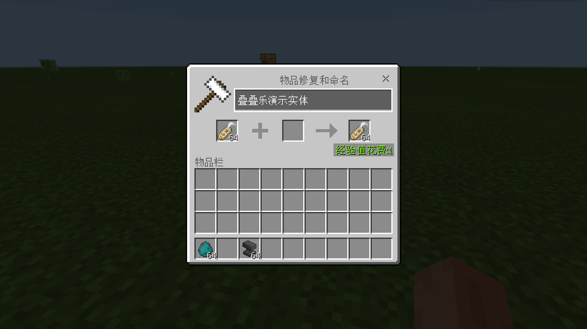
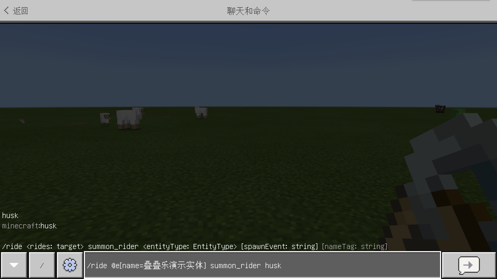
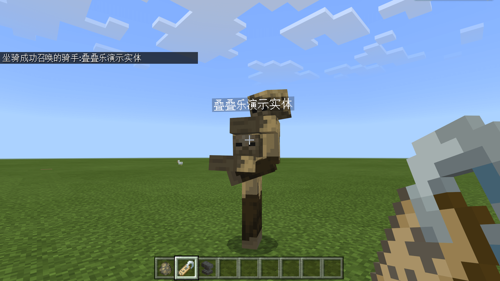
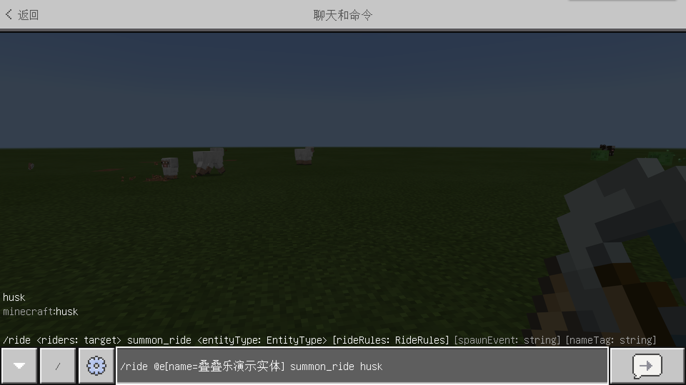
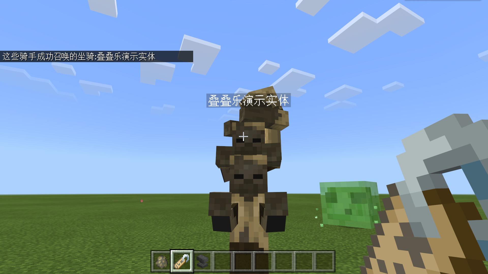

# 挑战：实体叠叠乐

在本节中，我们一起来进行一个挑战——实体叠叠乐。我们将运用目标选择器和命令相配合，制作一组叠高高的实体。

## 召唤实体

为了制作叠高高的实体，我们先召唤出一个基础实体，比如一个**尸壳**（**Husk**）。尸壳在白天不会燃烧，所以我们可以放心将其召唤出来。我们使用尸壳的刷怪蛋召唤出一个尸壳。



## 为尸壳命名

我们希望使用`/ride`命令来使一个尸壳骑乘另一个尸壳，然而尸壳不是玩家，所以不能使用玩家名作为`target`类型的参数值，我们必须使用目标选择器。为了使目标尸壳被精确选中，我们可以使用`name`选择器参数，因此我们需要给这个尸壳命名。使用铁砧和命名牌使尸壳获得一个名字。




## 为尸壳添加一个骑手

我们先为该尸壳添加一个**骑手**（**Rider**），即让另一个尸壳骑乘在该尸壳的头上。我们使用`/ride`命令的`summon_rider`参数，这个参数可以召唤一个新的实体充当骑手。

```shell
/rider @e[name=叠叠乐演示实体] summon_rider husk
```



可以看到，我们使用了`@e`选择器配合`name`参数精确指定到了该实体。执行成功后，我们可以看到这个尸壳头上已经出现了一个新的尸壳。



## 为尸壳添加一个坐骑

我们还可以让这个尸壳再坐在另一个尸壳的身上，所以我们可以继续用`/ride`命令为其添加一个**坐骑**（**Ride**）。我们只需要将`summon_rider`参数改为`summon_ride`，即可成功添加一个坐骑。

```shell
/rider @e[name=叠叠乐演示实体] summon_ride husk
```



成功之后，我们看到了三个尸壳坐在一起，颇有叠高高的风味。

