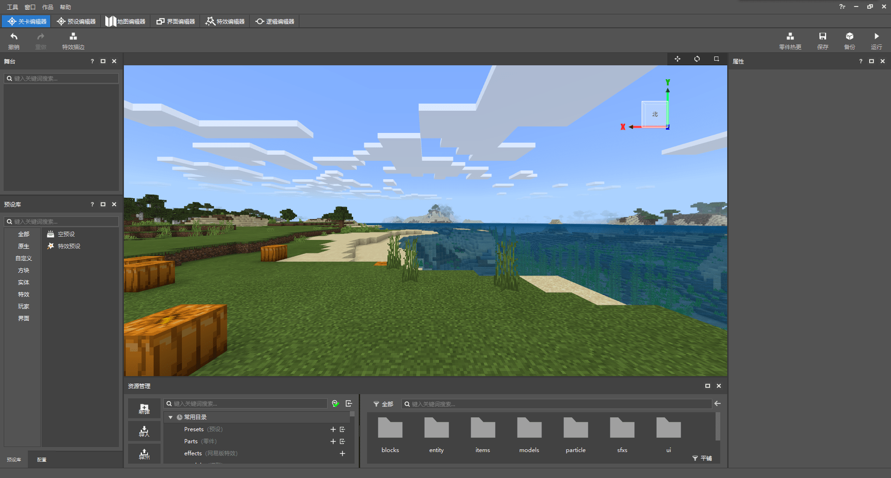
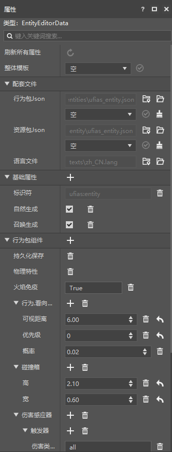
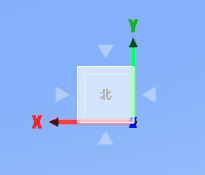

# 适应新版关卡编辑器

为了更好地探索新版关卡编辑器，我们创建一个新版地图组件。这样，我们每次所做的修改都可以跟随地图保留在一起，方便我们进行探索。现在，我们打开这个新版地图。

## 什么是预览窗

正如第三章中我们介绍的那样，我们可以看到在界面中央有一个**游戏预览窗**，这里便是我们进行预览更改的地方。我们所有的更改都可以通过这个预览窗具现化、可视化。通过这个预览窗，我们能够直观地感受到我们添加的内容，同时可以便捷地更改各种玩法。

## 什么是属性

在屏幕的右侧，我们可以看到有一个“**属性**”窗格，这里是显示和修改我们自定义的配置或预设的属性的地方。**属性**（**Property**）是一个配置或预设的各种性质。同一个配置或预设，一旦更改了一些属性，其表现也就会变得略微不同甚至大不一样。

## 什么是舞台

在屏幕的左上角，我们可以看到“**舞台**”窗格。**舞台**（**Stage**）是用于显示当前存档中放置的预设的窗口。我们可以在舞台中看到预设的名字和各种挂接状态，通过在舞台中拖动我们可以更改预设的顺序和挂接状态，更好地进行编辑。我们已经在第三章中初步介绍过预设，在下面的第三节中，我们还会一起使用预设进行各种具体的创作。

## 移动与旋转视角

在预览窗中，鼠标左键主要用于点击和选择预设，那么如果我们要移动和旋转视角，应该如何操作呢？

### 移动

移动分为快速移动和慢速移动，当鼠标的焦点位于预览窗内部时，我们可以通过**W**、**S**、**A**、**D**来进行前后左右的快速移动，通过**空格键**与**Shift键**进行升高和下降。当鼠标的焦点位于预览窗外时，我们可以通过**W**、**S**、**A**、**D**来进行前后左右的慢速移动，此时空格键将不起作用，同时Shift键仅仅是将视角更改为潜行状态，但并不影响移速。

### 旋转

将鼠标焦点移动至预览窗内，按下**鼠标右键**，你将进入旋转模式，此时移动鼠标，视角将会随着鼠标移动而移动。

在预览窗的右上角，我们还可以看到一个小型的坐标系，那便是我们当前的视角所对应的坐标系。我们可以通过点击坐标系上的**三角形按钮**来快速更改我们当前的朝向。