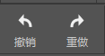
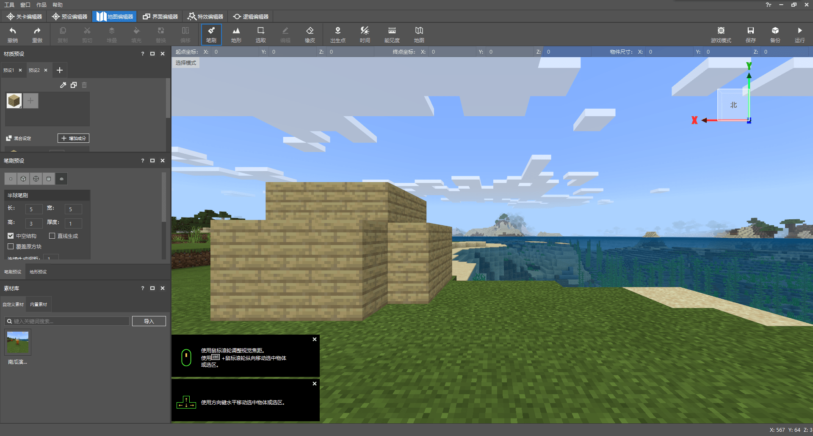
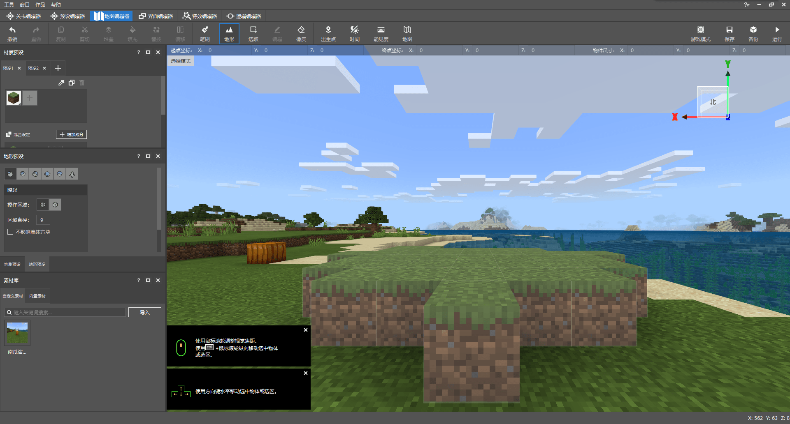

# 建造并打磨地图

在本节中，我们将一起使用**地图编辑器**学习如何建造和打磨地图。我们使用和上文中同一个测试地图，在顶部将编辑器类型切换为“地图编辑器”即可打开我们的地图编辑功能。

和其他编辑器一样，地图编辑器也具备撤销和重做的功能，所以各位开发者们在摸索地图编辑器时不必担心会破坏地形，放心大胆进行探索即可。如果有操作失误，也可以及时使用快捷操作栏中的“撤销”按钮来撤回错误的操作。

## 选取、拖动与缩放区域

如果你是初次进入地图编辑器，我们可以看到顶部的快捷操作栏中的”**选取**“按钮已经被按下，此时我们处于**选择模式**。在选择模式下，我们可以在预览窗中按下鼠标并拖动以**选取**区域。如图，我们选取了一个区域：

我们可以通过该区域的某个顶点（示例中是右下角顶点）的坐标轴来移动这个区域。按住某个轴再进行**拖动**可以使区域沿该轴移动。按下坐标轴原点的方块再移动可以使其自由移动。

我们在选择好一个区域之后依旧可以更改该区域的选择范围。只需将鼠标移动到对应的面上，按住该面进行拖动，就可以在该面垂直的方向上增大或缩小区域。

我们称如此选中了一个区域的边界盒为**包围盒**。我们单击选中包围盒，点击顶部快捷操作栏中的“**编辑**”按钮，可以使其进入**编辑模式**。

编辑模式下的包围盒如果再次进行拖动，将带领其内部的所有方块一起移动。如果拖动某个面进行缩放，将使其内部的方块一同“**缩放**”，此时缩放可能会导致内部的方块失真。同时，进入编辑模式后会呼出一个二级菜单，通过该二级菜单我们可以进行同样的缩放以及旋转操作。

## 撤销、重做与清除区域

在快捷操作栏的最左侧，我们有“**撤销**”和“**重做**”按钮。通过这两个按钮我们可以随时撤销我们的上一步操作，如果误撤了操作，还可以随时通过重做按钮进行恢复。

如果我们想清除某片区域，比较快捷的方法是使用“**橡皮**”。我们在快捷操作栏中选中“橡皮”。

然后在预览窗中想要清楚的部分进行涂抹，即可快速清除方块。

当然，橡皮的清除效率还是有限。为了提高清除效率，一个更好地方法是先通过“选取”进行区域的选择，然后直接按下**Delete键**，即可将区域内的方块清空为空气。

## 使用方块作为素材

为了使地形制作更为便捷，我们可以使用**素材**来快速地在世界中放置一些结构。在左下角我们可以看到**素材库**窗格。我们可以通过我的世界开发工作台产生的素材文件（`.mld`文件）、地图文件（`.osm`）文件和各种模型文件（`.obj`、`.fbx`等）来导入一个素材。导入的素材便可以作为快捷途径一键设置在世界中。

下面我们演示使用方块作为素材。

### 保存素材

为了使用方块作为素材，首先我们需要在地图中将一些方块保存为素材。我们在此选中一棵桦树，点击上方的“**保存为素材**”按钮来保存素材。

此时我们便可以看到我们左下角的“素材库”窗格中出现了我们刚刚保存的素材：

我们还可以通过右键该素材选择“导出”来将其导出为`.mld`文件以备他用。

### 放置素材

此时我们只需要鼠标左键单机该素材，便可以在世界中选择位置进行放置。

## 利用笔刷预设改变空间

我们可以使用**笔刷**快速地在世界中以特定的形状“刷上”特定的方块。笔刷预设分为“单点笔刷”“方形笔刷”“球形笔刷”“圆柱笔刷”和“半球笔刷”。

我们在“**材质预设**”窗格中添加自己想要的笔刷材质，然后在顶部的快捷工具栏中选中“**笔刷**”按钮。

即可开始在世界中以笔刷预设的形状放置方块。

## 使用地形预设设计地形

除了笔刷，我们还可以通过**地形预设**来改变地形。地形预设是一系列预先设定好的地形操作模式，分为“隆起”“侵蚀”“平滑”“填充”“顶层覆盖”和“植物”，其中除了“植物”外，其他的都是单纯的对地形进行操作，比如“隆起”就是让指定区域内的方块隆起1格。

选中想要的地形预设，配置好相关的参数，然后在顶部快捷工具栏中选择“**地形**”按钮，就可以开始改变地形了。

## 改变时间、能见度和出生点

我们可以通过顶部快捷操作栏中的“时间“”能见度“和”出生点“按钮快速改变当前的能见度、时间和出生点。值得注意的是，能见度改变的只是当前编辑器内的能见度，但是时间和出生点的改变将会影响地图发布后的时间和出生点。

改变出生点：

改变时间为午夜：

增加能见度：

## 进入游戏模式

我们在地图编辑器中可以通过进入**游戏模式**来真实地体验我们编辑的地形，同时也可以方便我们制作一些素材。点击右上角的“**游戏模式**”按钮来进入游戏模式。

进入游戏模式后，将模拟玩家在真实游戏中的控制。你将可以使用正常的键鼠控制来游玩你刚刚编辑的世界：

在游戏中按**Esc键**将返回普通的选择模式。

## 保存区域结构并跨存档分享

在选中一定区域后，除了保存为素材，我们还可以将其保存为结构，并在其他存档中通过结构方块加载它们。选择“保存为结构”，输入结构名即可将其保存为结构：

保存的结构将会出现在你的行为包的`structures`文件夹下的`<namespace>`文件夹中，比如我当前的命名空间为`demo_world`，则它会出现在`structures`文件夹下的`demo_world`文件夹中。

我保存的结构名为`some_grass_block`，因此结构文件的名称将是`some_grass_block.mcstructure`。在结构方块中，我们只需要调用`demo_world:some_grass_block`即可成功调用我们的结构！

## 当前编辑器的限制

需要提醒的是，当前的关卡编辑器和地图编辑器还有一些限制的，比如无法进入其他维度进行调试等，需要各位开发者稍加注意。
