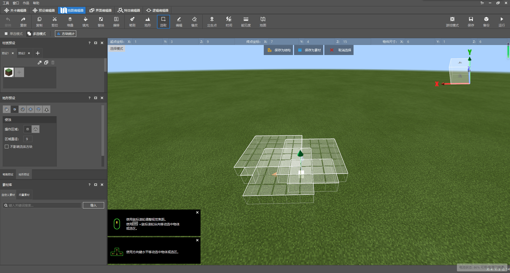
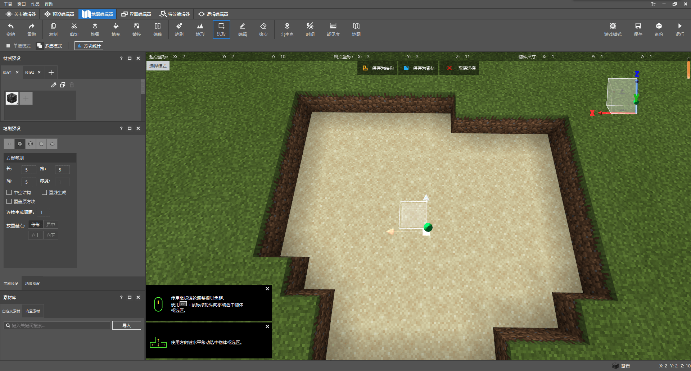
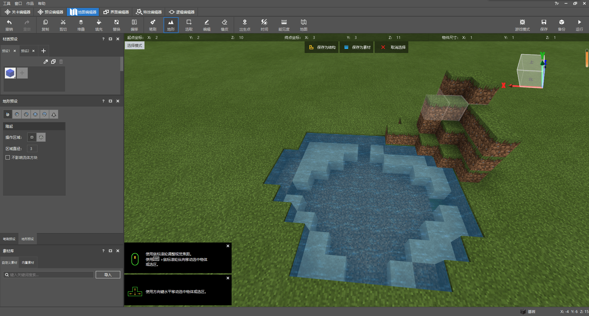
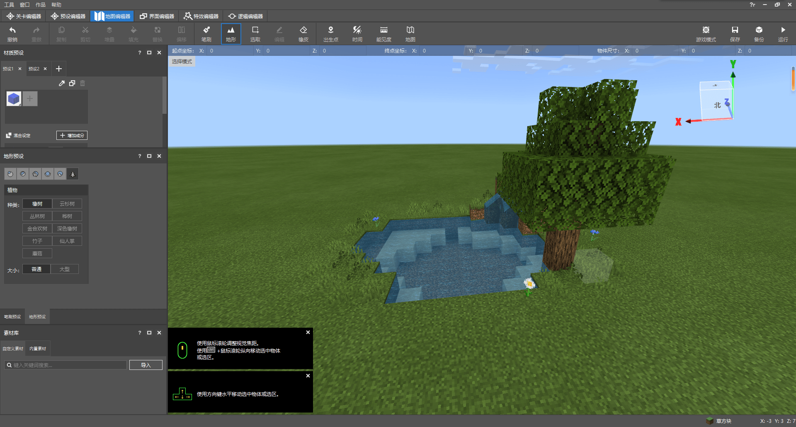

# 挑战：设计地形并和好友分享

在本节中，我们将一起设计一个湖泊湿地并通过导出的方式与好友分享。可以点击 [对应的湿地链接](https://g79.gdl.netease.com/addonguide-6.zip)下载资源。

## 设计一处湖泊湿地

为了快速设计一处湖泊湿地，我们需要用到地形编辑器的笔刷和地形预设。为了大家快速上手，我们本次演示设计一个比较小的湖泊湿地，大家可以根据自己的喜好自行进行操作，充分发挥想象力，无需拘泥于复原本教程图示中的样子。

首先，为了做出一个湖泊，我们可以先将地表“挖”出一个坑，比较简单的方法便是通过选区功能选择并使用**`Delete`键**快速删除一部分方块。比如，我们可以如下这样选择并删除。我们采用“**多选模式**”：

接下来，我们将湖底填充为沙子来模仿真正的湖泊。我们打算使用沙子材质的**单点笔刷**，放置基点改为**居中**。小心地填充每一处区域。

当然，如果地块较大，我们便推荐另一种便捷的方式——**顶层替换**。哦们切换到“**顶层覆盖**”**地形预设**，然后点击“**顶层替换**”按钮。

这样我们便可以使用顶层替换功能批量替换我们的地形的最顶层方块。

我们为了让湖泊更真实，需要让湖泊稍加凹陷。我们打算采用“**侵蚀**”**地形预设**。为了使侵蚀有效，我们先在湖泊中央删去一个方块。

然后从中间这个方块处开始向四周“涂抹”侵蚀。

这样就形成了最中间为泥土，靠近岸处为沙子的湖泊结构。接下来我们填充水体。我们使用顶部功能区中的“替换”功能。我们先选中我们的整个湖泊，我们欲将选中区域内的空气方块替换为水。我们点击快捷功能区中的”**替换**“按钮。

我们找到空气那一栏，我们希望将后面的方块替换成水。此时，我们选择静止的水来替换，所以我们不选择”流动水“，而是直接选择”水“。

可以看到，我们已经成功将水体放置在湖泊中了！

现在，我们已经完整地制作了一个湖泊，但是，这个湖泊明显并不是很真实，所以我们继续制作它的“外饰”。比如，我们想制作一个假山。我们可以使用“**隆起**”**地形预设**，并稍微调小半径。

我们还可以再假山上放置一个水源来模拟一个泉眼。我们使用单点笔刷放置一个水源。注意，此时我们应选择流动水，否则方块将无法更新，水将无法流下假山。

> **补充知识**：液体方块的更新原理
>
> 液体方块一般都同时存在两种方块，分别是**静止形态**和**流动形态**。静止形态的液体在世界中不会时刻进行方块更新。只有当静止形态的液体的毗邻发生更新时它才会受到更新，然后转变为流动形态的液体。而流动形态的液体自存在起便会时刻进行更新，直到其方块状态相对固定，然后重新变为静止形态。所以当放置流动形态的液体方块时他们会立即开始流动，而静止形态的液体方块则会因为得不到更新而静止在空中。
>
> 事实上，水源方块和水流方块在本质上并没有什么区别。不管是流动方块还是静止方块，只要其附加值为0，即是水源，可以与桶互动；其余的附加值皆为水流，不可被桶捞起。

在“生成”了一个假山后，我们还可以通过花草树木对湖泊进行点缀。目前新版编辑器中还没有一个相对较好的放置花草的方法。我们直接点击右上角的按钮**进入游戏模式**通过骨粉放置花草。

同时也可以对地形上一些“漏洞”进行修补。

回到正常模式，我们可以看到我们的湖泊已经被花花草草围绕了。

接下来我们放置一棵树，以作为收尾。我们可以通过“地形预设”中的“植物”预设来放置一棵橡树。通过放置、撤销、再放置的循环直到放出一棵你理想的“树型”，比如如下这种效果就很合适：

至此，我们大功告成！我们成功地制作了一个湖泊湿地的地形。现在再看起来，这个地形已经“比较真实”了。我们可以用它当做素材来进行以后的创作了。

## 导出为素材和结构

为了接下来进一步使用该地形，也为了便于分享给他人，我们可以将其导出为素材或结构。首先，我们将我们制作的地形完整地选中。

### 导出为素材

我们点击顶部的“**保存为素材**”，就可以将该地形保存为素材。务必取消“去除流体”的选项，否则将无法保存水。

保存之后，我们可以在素材库中看到我们的地形。我们可以右键它继续选择导出，即可导出到外部。

### 导出为结构

我们点击顶部的“**保存为结构**”，就可以将该地形保存为结构。此时结构便位于行为包的`structures`文件夹内，直接将其复制出来即可。

当然，如果你的结构相当大，已经不适用于使用一个单独的结构文件保存了。那么编辑器此时还提供了切分结构的功能。选中“切分结构”，此时我们可以将大结构切分成许多小结构。

此时，编辑器还会生成一个对应的`.json`扩展名文件用于保存各个切分结构的位置信息。你可以后续通过模组API中的`PlaceStructure`接口通过脚本还原放置这个切分结构到你的世界中！

至此，你已经成功地导出了素材和结构了，与其他开发者伙伴们分享你的成果吧！