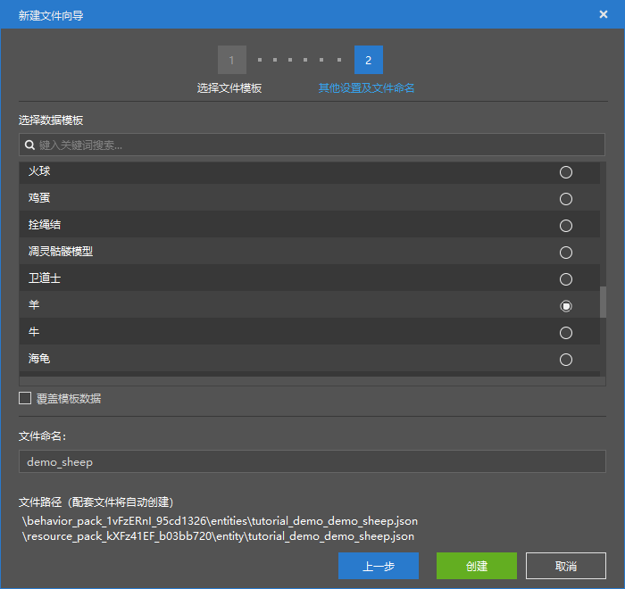
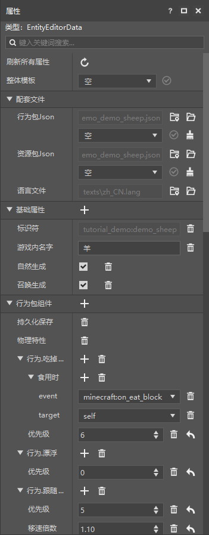
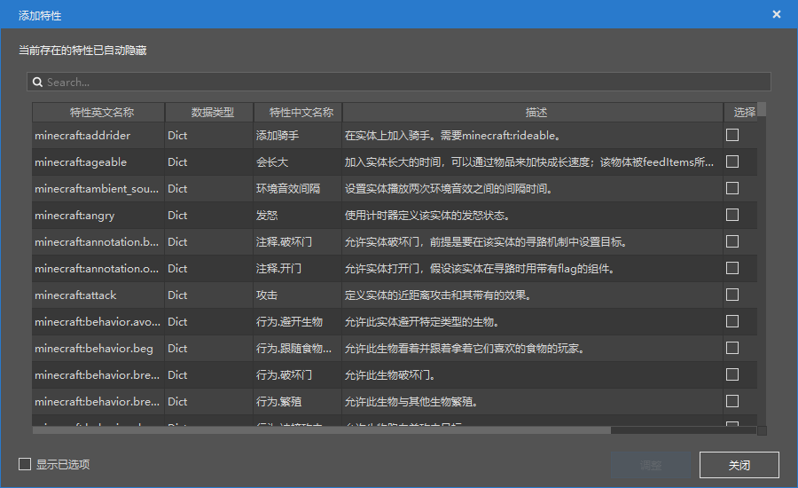
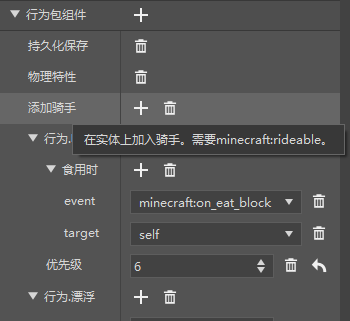
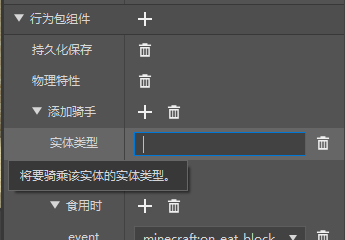
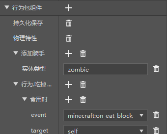
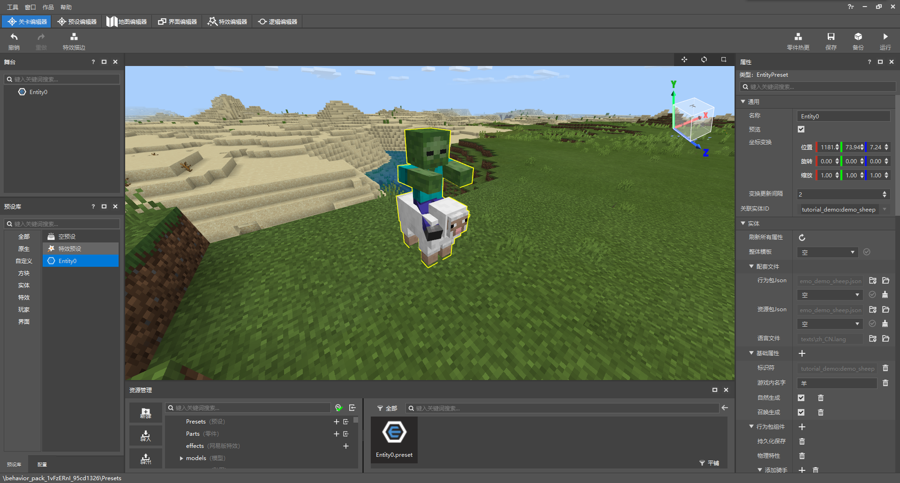

# 初步了解实体功能配置

在本节中，我们将一起初步了解实体功能配置。一起通过实体配置来制作一个**实体**（**Entity**）。

## 创造一个新的实体

我们已经在前面的章节了解到，要通过我的世界开发工作台中的编辑器创建一个实体，我们需要使用实体配置。而实体配置可以通过**关卡编辑器**的“**资源管理**”窗格的“**新建**”按钮快速进行创建。我们通过该功能来打开实体配置的向导窗口。

我们可以看到我们有许多数据模板可以用来选择。如果我们选择了一个数据模板，我们将可以继承该数据模板的所有预先设置的配置，可以在这个配置的基础上进行进一步的修改。如果我们选择了“空“模板，我们便可以从头开始一个实体的配置。这里为了演示方便，我们选择”羊“的模板。创建完毕后，我们在左侧“**配置**”窗格中选中该实体，窗口右侧的”**属性**“窗格中将出现这个实体的属性。

## 设置实体AI与组件

在属性窗格中，我们可以看到有三个大分类，分别是**配套文件**、**基础属性**和**行为包组件**。

- **配套文件**：每种配置其实都是由多个文件构成的，比如实体的一个配置就是一个行为包JSON文件、一个资源包JSON文件和语言文件中的涉及到该实体的部分所构成的。这里列出了该配置的配套文件。
- **基础属性**：基础属性是该实体的**描述**部分，通常由标识符、名称等基础属性构成，描述了一个实体的基本性质。你可以通过该分类标题右侧的“+”来添加一个属性。
- **行为包组件**：行为包组件是一个实体的主体组成部分。实体的大部分内容、特性、行为都是在这里定义的。编辑器支持各种**组件**的树状修改，你可以通过该分类标题右侧的“+”来添加一个组件。

为了设置实体的AI和组件，我们需要再深入了解一下“**组件**（**Component**）”到底是什么。事实上，组件是微软对于实体定义JSON文件中一个对象字段的称呼，不同的组件可以用来定义实体不同的性质、功能。在编辑器中，我们无需接触到复杂的JSON修改，编辑器将JSON解析为了树状的可视化编辑供我们修改，同时将组件名进行了翻译。所以我们便可以通过编辑器便捷地增删和修改组件。其中能够控制生物AI的组件被冠以“**行为.**”的前缀。

为了不和“作品组件”中的组件概念冲突，在编辑器的一些地方组件字段及其子字段也被称为**特性**。我们点击“**+**”来添加组件，就可以看到“添加特性”窗口。

> **选读：实体的组件**
>
> 往深处看，组件也有不同的类型。大部分普通的组件都是用来定义实体所具备的一个“功能”的，比如实体的骑乘功能、攻击功能、呼吸功能等。有些组件可以定义一个实体的“AI行为”，比如何时闲游、何时看向玩家、何时游泳等，这种组件称为**AI意向**（**AI Goal**），一般有一个`behavior.`（“行为.”）前缀。有些组件定义了一些实体的固有性质，如生命值的高低，被称为**特性**（**Attribute**）；而另一些定义了实体的“能够干什么”的性质，被称为**属性**（**Property**）。还有一些组件是用于定义实体处于特定的状态时将会触发何种**事件**（**Event**）的，这些组件被称为**触发器**（**Trigger**）。
>
> 往高处看，我的世界的组件其实是属于一种被称作**ECS**（**实体-组件-系统**，**Entity-Component-System**）的架构，这种架构意味着游戏中每一个基本单元都是一个**实体**（此处为广义的*实体*，比如方块、物品、实体都是一种*实体*），每个实体又由一个或多个**组件**构成。组件中没有任何方法，只有代表实体特性的**数据**。**系统**则仅仅负责处理这些数据，仅仅关心拥有某个组件的实体的特性，通过组件提供的数据代入系统内置的相关方法，更新实体的信息。这种通过ECS系统的组件（数据）修改游戏的方法被称为**数据驱动**（**Data-Driven**）式的

我们向我们的“羊实体”中添加一个新的组件，比如`addrider`组件，这个组件可以为羊添加一个骑手。我们在“添加特性”窗口中选中这个组件，点击“**调整**”按钮。可以看到“属性”窗格中已经出现了“添加骑手”的组件。

我们点击“添加骑手”右侧的“**+**”按钮，可以看到又弹出了一个 **“添加特性"** 窗口。我们在此添加该组件的`entity_type`字段。该字段用于指定羊的骑手为何种生物。选定并点击“**调整**”按钮，我们可以看到“添加骑手”下面多出了一个“实体类型”。

我们可以随意输入一个实体的种类，比如僵尸（`zombie`）。

此时，我们的实体生成时头顶将骑着一个僵尸，让我们用这个实体配置创建一个实体预设，并放置在关卡编辑器中来查看效果。

成功了！我们成功为该实体添加了一个组件，这个组件可以让实体每次生成都附带一个僵尸骑手。

如果我们想为实体添加一个AI，我们也是有一样的操作过程。只不过我们要选择那些带有`behavior.`（“行为.”）前缀的组件来添加。这些组件可以让生物的行为（即AI）更加丰富！

## 自定义实体的生成规则

我们的自定义实体目前还只是一个独立的实体，如果没有配置对应的生成规则将无法**自然生成**（**Naturally Spawn**）。所以，我们需要使用生成规则配置来进行生成规则的创建和修改。我们将在第七节中为我们的这只“羊”添加一个生成规则。