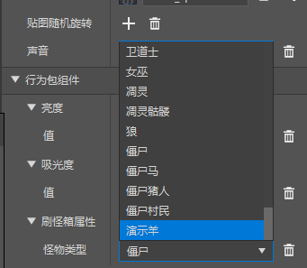
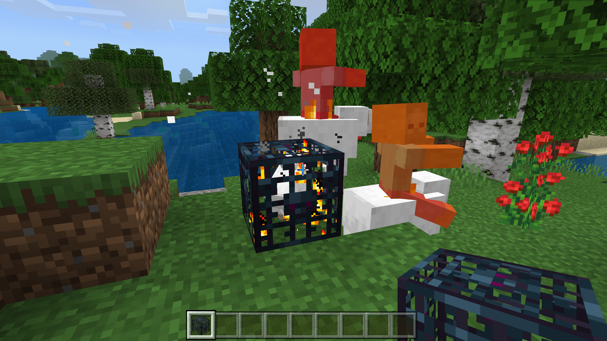

# 初步了解方块功能配置

在本节中，我们将初步了解自定义方块。一起通过方块配置来制作多种**方块**（**Block**）。

## 自定义刷怪笼

在本段中，我们想要自定义一个刷怪笼。我们可以从“**刷牛方块**”数据模板开始。

我们可以看到，方块也分为**配套文件**、**基础属性**和**行为包组件**。决定了这个方块是刷牛方块的核心属性和组件便是“基础属性”中的“**继承方块**”和“行为包组件”中的“**刷怪箱属性**”。刷怪箱属性的“怪物类型”中便是该刷怪箱要刷的怪物类型。我们不妨将其改为我们第一节中自定义的头顶一个僵尸的“羊”。

这样，我们便得到了一个可以刷僵尸羊骑手的方块，我们可以将其更改纹理后放在地形中实现其他功能。当然，这里除了国际版自定义生物之外也支持原版的生物，因此你可以灵活运用该功能。

## 自定义光源方块

我们还可以通过“**普通的发光方块**”数据模板来创建一个光源。

我么可以看到，决定是否发光的属性是“亮度”组件。1.0的发光强度有点太亮了，我们希望将其调低，比如，我们可以调到0.6。

稍加更换纹理，我们便完成了一个光源方块的制作！