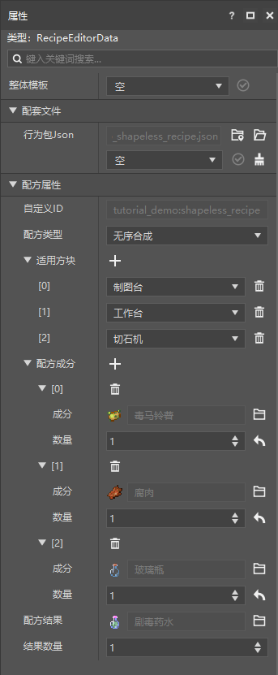
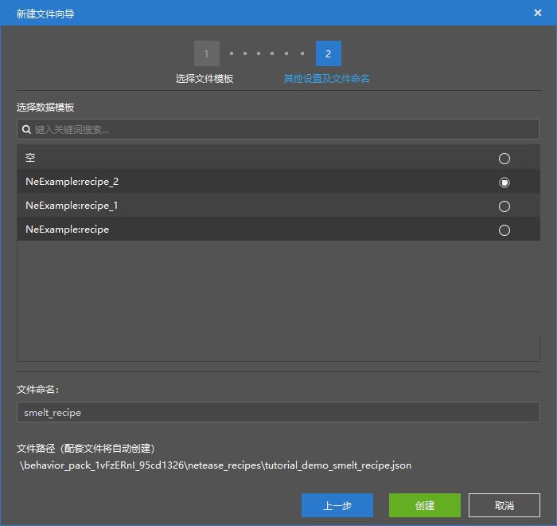

# 初步了解配方配置

在本节中，我们将初步了解自定义配方。我们还记得，在第一章中，我们便亲手制作过一个有序**配方**（**Recipe**），接下来，我们详细介绍一下不同的配方配置数据模板。

## 自定义无序配方

我们使用`NeExample:recipe_1`数据模板，可以快速创建一个无序配方。

我们可以看到，这和有序配方的属性界面还是有很多不同的，最明显的便是**适用方块**和**配方成分**。有序配方只能适用于工作台，但是无序配方却可以适用于很多其他方块，比如**制图台**和**切石机**。

配方成分也不再是网格的形状，而是一个线性的列表，分别列出了各个物品和所需的数量。

## 自定义熔炉配方

我们还可以使用`NeExample:recipe_2`数据模板快速创建一个熔炉配方。

我们可以看到，输入输出都变得单一了起来，因为这是一种用于烧炼的配方，所以输入输出都变成了一对一的关系。

通过更改输入输出，增删适用方块，我们便可以轻松制作一个新的配方。