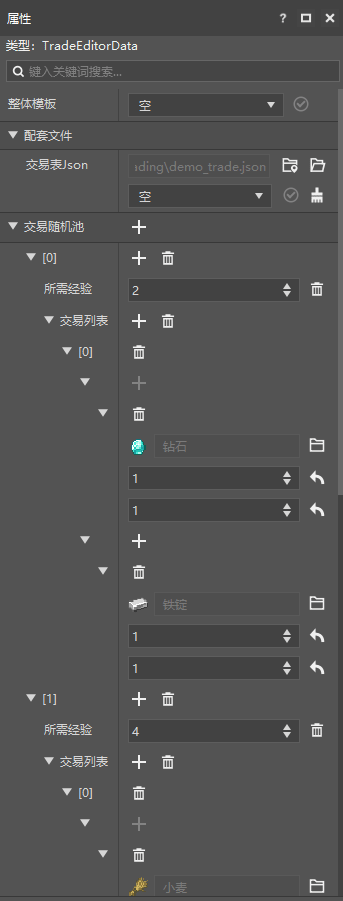
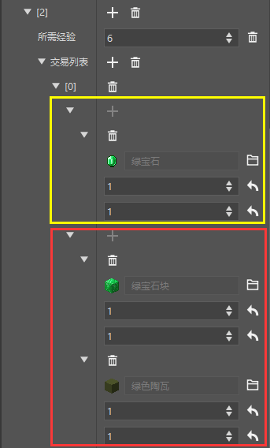
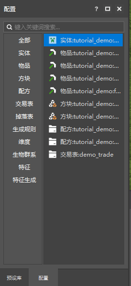
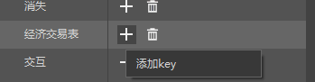
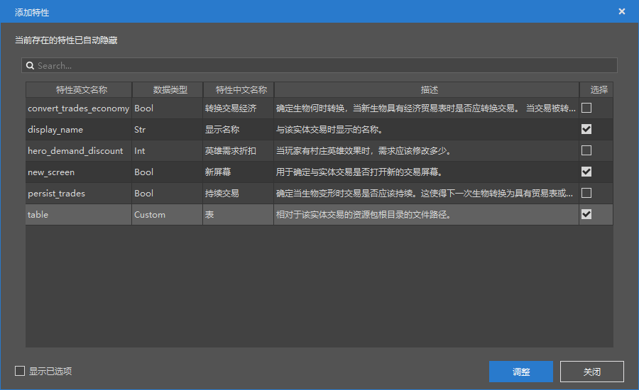
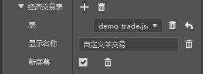
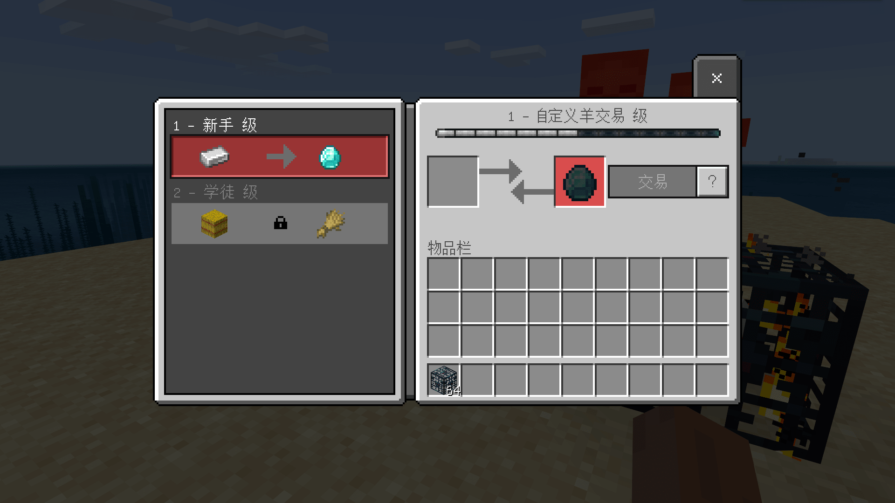

# 初步了解交易表配置

在本节中，我们将初步了解自定义交易。一起通过交易表配置来制作一个类似于村民交易的自定义**交易**（**Trade**）。

## 创建交易表

我们希望能通过数据模板更好地观察交易表的结构，所以我们创建一个“多路交易表”。

事实上，此时我们依旧不能看清楚交易表的结构，所以我们先将交易表的顶级对象折叠。

现在我们便能够观察到交易表的顶级结构了。事实上，一张交易表是由一个或多个**品质**（**Tier**）的交易组成的，而不同的品质是由交易不同的经验花费区分开的。当生物生成时，可以选择从不同品质的交易池中抽取一个或多个来作为自己的交易。

每个品质的交易中又存在一个“**交易列表**”，列表里存在多个交易，分别是该品质具有的交易项。每个交易都是“交易列表”的一个元素。在实体生成时，会从列表里随机选取一个作为该品质的交易。

有的交易是一换一的，有的交易是一换多的。不管怎么样，交易所交付的物品必须只有一个，而交易返回的物品则可以有许多。这便是一整张交易表的结构。

## 挂接交易表

交易表可以挂接在实体上，我们不妨继续使用我们在第一节中定义的实体“羊”，将我们刚刚定义的交易表挂接在羊实体上。

我们在左侧的“配置”窗格中选择我们的自定义“羊”。

此时右侧的“属性”窗格将更换为羊的属性。我们添加一个行为包组件。找到`minecraft:economy_trade_table`组件。这个组件用于给一个实体添加一个交易表。

在属性中找到“**经济交易表**”，点击“**+**”按钮。

简单地选中`display_name`、`new_screen`和`table`。并点击“**调整**”。

选择我们的交易表并将其配置如下，其中“显示名称”完全可以根据个人喜好来进行配置。

点击右上角的“运行”进入游戏自测，使用我们的刷怪笼刷出我们的羊，右键我们的羊进行互动，我们将看到我们的交易自定义成功了！

