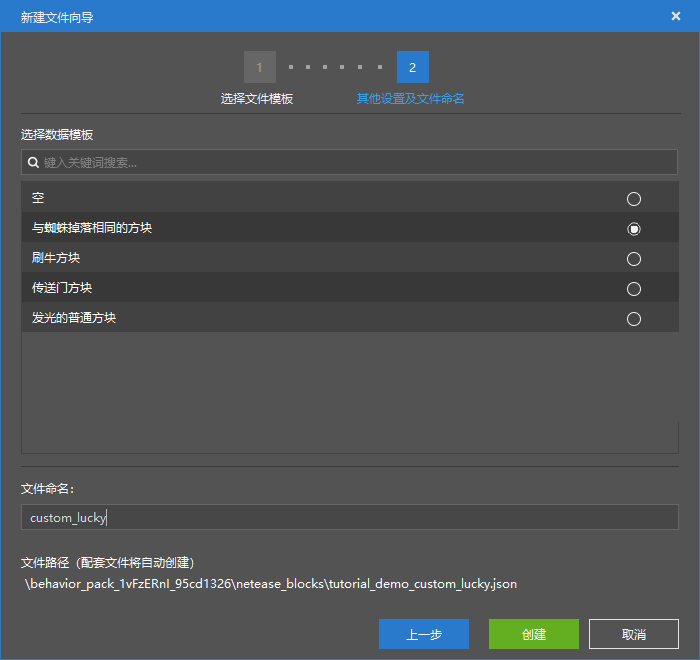

# 初步了解掉落表配置

在本节中，我们将初步了解自定义战利品表。**战利品表**（**Loot Table**，***掉落表***）常用于生物或方块破坏、箱子和宝藏的战利品抓取。

## 创建战利品表

和交易表一样，我们选择一个“多路战利品表”。

和交易表类似，战利品表也是从池子中**掷取**（**Roll**）一个或多个物品。战利品表的根节点的每一个元素都称为一个**池**（**Pool**）。如下所示，我们创建的战利品表有2个池。

每次掷取战利品表，每个池都会进行一次或多次掷取，掷取由”**随机次数**“决定。而掷取过程则是根据”**随机权重**“随机地从”**随机池**“中抽出一个物品出来。多次掷取时就抽出多次，最后每个池中抽出的所有物品加起来便是此次该战利品表掷取的所有物品。

## 挂接战利品表

战利品表可以挂接在多个地方。此次我们以制作一个幸运方块为例，演示如何将战利品表挂接在方块上。

### 制作幸运方块

我们先配置一个“与蜘蛛掉落相同的方块”，该方块自带一个“掉落属性”组件，可以用来挂接战利品表。

我们选择我们的战利品表，此时便算作挂接成功了。

此时我们可以进入游戏来观察一下效果。

可以看到，我们的战利品表挂接成功了！我们可以向战利品表中添加更多有趣的物品，来完善我们的“‘内容庞大”的幸运方块了！