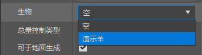
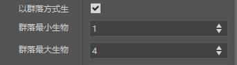
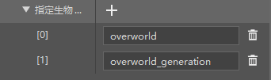
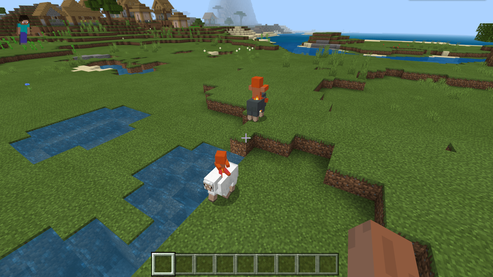

# 初步了解生成规则配置

在本节中，我们将初步了解自定义生成规则。**生成规则**（**Spawn Rule**）是用于使生物在世界中**自然生成**（**Naturally Spawn**）的规则。

## 创建生成规则

我们通过生成规则配置来创建一个空的生成规则。


我们可以看到，生成规则的配置还是十分简单易懂的，大多都是字面意思。我们直接开始尝试为我们的自定义实体“羊”配置生成规则。

### 将实体挂接在生成规则上

我们找到“**生物**”，选择我们的羊。



我们希望羊只生成在草方块上，所以在“**可生成于方块**”处添加一个草方块。


我们希望每次羊都有概率成群结队地生成，所以我们选中“**以群落方式生成**”并适当修改其值。



我们希望这种羊生成的多一些，所以增大“**生成权重**”为20（原版羊是12）。


我们希望其只在主世界生成，所以我们指定代表主世界的两个“**生物群系标签**”。



事实上，我的世界开发工作台的编辑器中默认只能形成`all_of`的过滤器逻辑，即只有同时具有标签`overworld`和`overworld_generation`的生物群系才能生成，但是事实上任何生物群系只可能具有上述的其中一种，所以我们需要手动将其更改为`any_of`。我们在“资源管理”窗格的行为包下的`spawn_rules`文件夹中找到我们的生成规则，双击将其打开。打开后文件内容如下文所示：

```json
{
    "format_version": "1.8.0",
    "minecraft:spawn_rules": {
        "conditions": [
            {
                "minecraft:biome_filter": {
                    "all_of": [ // 更改此处！
                        {
                            "operator": "==",
                            "test": "has_biome_tag",
                            "value": "overworld"
                        },
                        {
                            "operator": "==",
                            "test": "has_biome_tag",
                            "value": "overworld_generation"
                        }
                    ]
                },
                "minecraft:herd": {
                    "max_size": 4,
                    "min_size": 1
                },
                "minecraft:spawns_on_block_filter": [
                    "minecraft:grass"
                ],
                "minecraft:spawns_on_surface": {

                },
                "minecraft:weight": {
                    "default": 20
                }
            }
        ],
        "description": {
            "identifier": "tutorial_demo:demo_sheep",
            "population_control": "animal"
        }
    }
}
```

我们将`minecraft:biome_filter`组件下的`all_of`修改为`any_of`后保存。更改完成后的`minecraft:biome_filter`组件节选如下：

```json
"minecraft:biome_filter": {
    "any_of": [ // 更改完成
        {
            "operator": "==",
            "test": "has_biome_tag",
            "value": "overworld"
        },
        {
            "operator": "==",
            "test": "has_biome_tag",
        }
    ]
}
```



现在打开游戏进行自测，很轻松便能够找到我们想要的生成结果了！