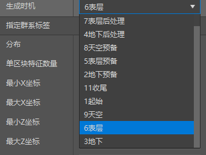
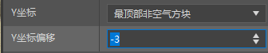

# 初步了解特征生成配置

在本节中，我们将初步了解自定义特征规则。一起通过特征生成配置来制作能够使特征**自然生成**（**Naturally Generate**）的**特征规则**（**Feature Rule**，又译**地物规则**）。

## 创建特征规则

我们通过特征生成配置来创建一个特征规则。

我们可以将特征挂接在“**特征**”属性一栏。

然后根据自己的意愿对其他属性稍加改动，比如，我们可以通过“**生成时机**”属性修改特征的**放置阶段**（**Placement Pass**），但是此处我们无需修改，因为我们的池塘放置在“表层”阶段即可。

由于我们的池塘结构是高出地表3格的，所以我们将Y坐标偏移改成-3。

为了避免生成过多，将每个区块特征数目减少。

这样，我们就完成了一个特征规则的创建。

我们进入游戏自测，很容易就能找到我们的特征。但是，我们也发现了我们的特征放置出来之后和原本的结构稍有不同，那是因为在我们的特征放置之后，又有其他特征被放置，他们的放置阶段在“表层”阶段之后，比如图中的冰、顶层雪和水边自然生成的砂砾和沙子。

这样我们就成功制作了一个特征规则！有关特征的更多详细内容我们将在第十六章中共同学习。