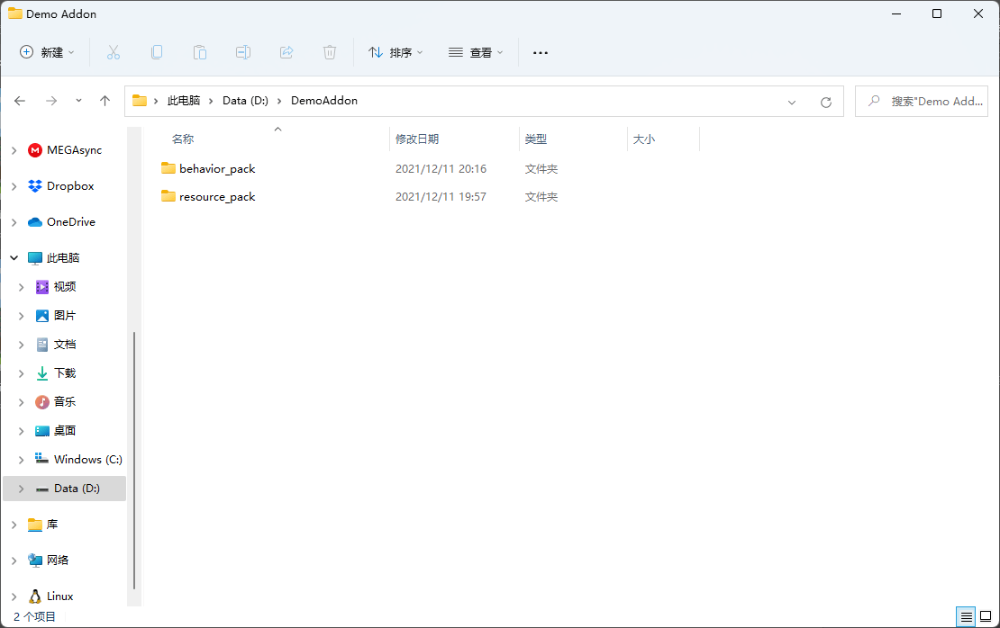
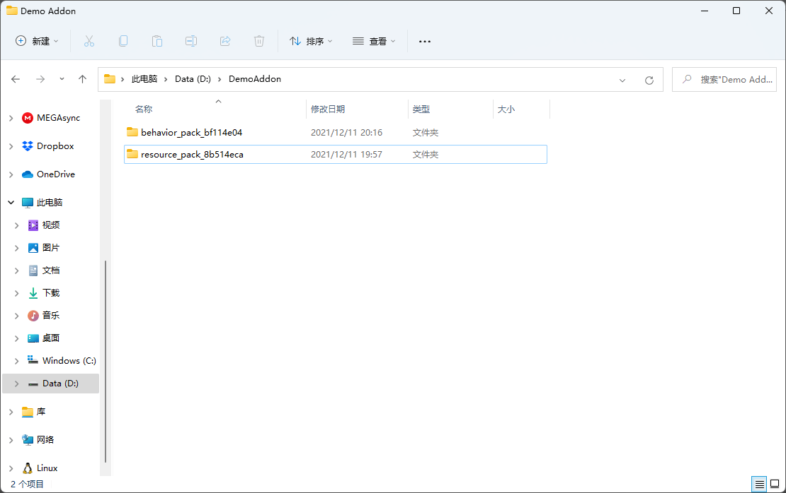
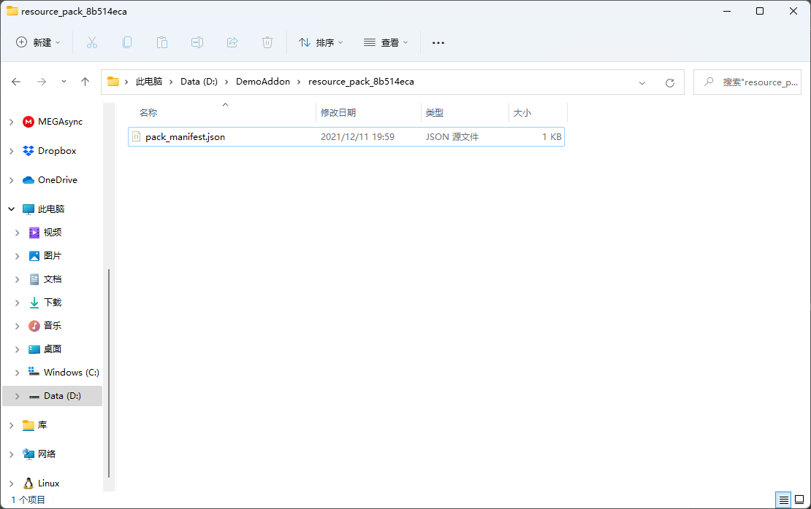
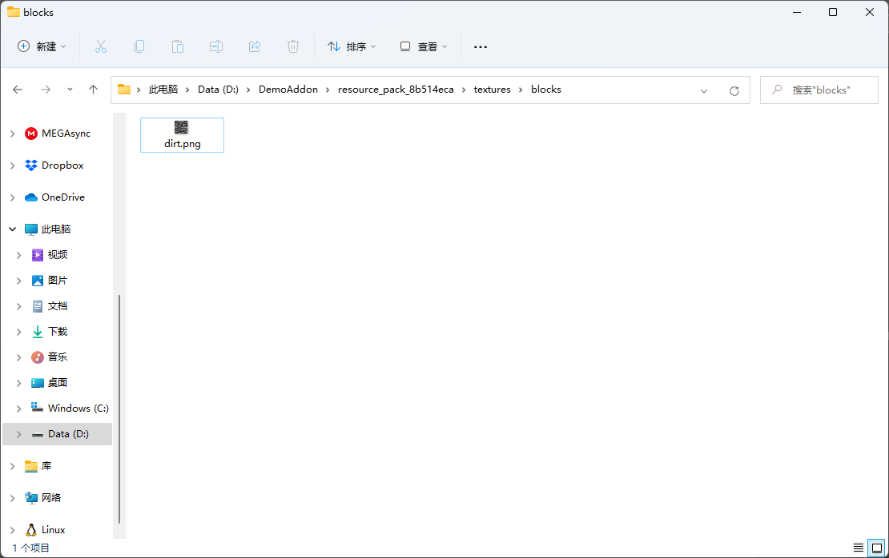
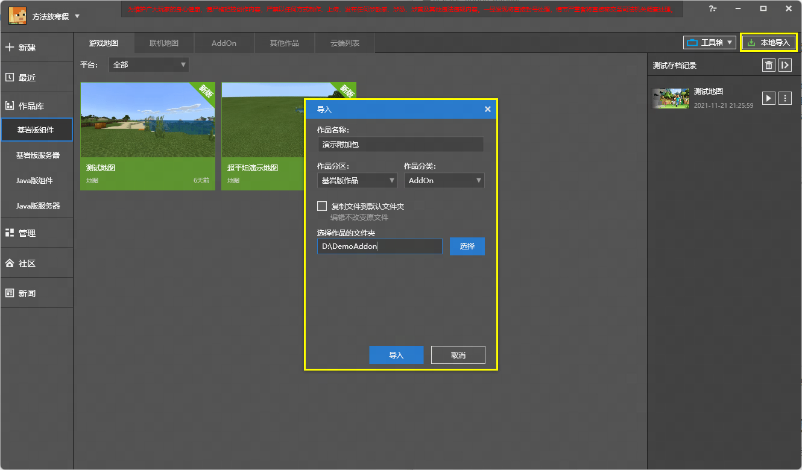
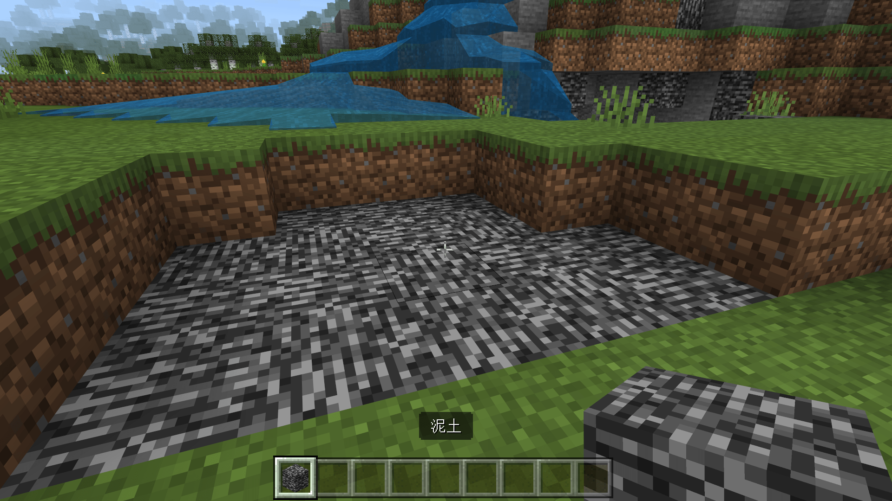

# 挑战：亲手新建一个附加包

在本节中，我们一起来完成一个挑战，亲手通过文件级操作的形式制作一个附加包！

## 新建一个完整的附加包

事实上，要制作一个没有功能的附加包格外简单。因为附加包中唯一必须的文件是清单文件（`pack_manifest.json`或`manifest.json`），所以当一个文件夹只包含一个清单文件的时候，我们就认为这个附加包已经具备正常的基本功能了。事实上，一个只含有清单文件的附加包是可以被游戏正常世界并加载的，只是其中任何额外的功能都没有罢了。

不过也正因如此，我们首先便需要为附加包制作正确的清单文件。

### 新建工作区和清单文件

为了使我们的附加包今后可以同时兼容我的世界开发工作的编辑器，我们在创建附加包的文件夹结构时也应稍加注意。



由于我们希望我们的附加包同时具备资源包部分和行为包部分，所以我们新建一个大的文件夹用于容纳一个资源包和一个行为包。同时，如果我们后续将该附加包导入我的世界开发工作台，那么这个文件夹将用于作为我们的“工作区”文件夹。因此，我们也不要在这个文件夹中再额外放置任何除了资源包和行为包的东西了。在这里，我们使用了`DemoAddon`作为我们的大的主文件夹的名字。需要注意的是，为了后续能够在我的世界开发工作台中导入，我们所有文件夹的名字都需要使用**全英文书写**。

接下来，我们应该建立资源包文件夹和行为包文件夹。在上图中，我们可以看到我已经建立了这两个文件夹。但是，我们还需要注意一点，那便是，**资源包和行为包文件夹的名字不应太过简单**，比如，不应如上述仅仅是用“资源包”和“行为包”的英文名直接来命名。因为在资源包和行为包导入游戏后，不同开发者开发的不同模组的资源包和行为包都会放在一起。所以如果有一个玩家加载了大量的模组，那么就极易可能出现其中两个模组的文件夹名称“撞车”的现象，这将导致出现各种的潜在错误。因此，我们建议将这两个文件夹的名字尽可能修改成“只有你可能写得出来的样子”，或者使用随机生成的数字或字母来命名。这样可以在最大程度上避免重名而导致的游戏加载失败。



如图所示，我们使用了随机生成的两串字母和数字来重命名了文件夹。有人会问，咱们给这些文件夹重命名成了不同的样子，那么之后编辑器或者游戏怎么还能知道哪个是资源包，哪个是行为包呢？因为，不管是编辑器还是游戏本身，他们都会通过读取清单文件的方式来区分各种附加包。所以，接下来我们为资源包和行为包建立清单文件。

资源包和行为包都分别需要建立一个清单文件。我们首先在资源包中建立。我们打开我们的资源包文件夹。新建一个名字叫做`manifest.json`的文件。



用任何一种文本编辑器打开文件，输入我们的清单文件的内容。此时，我们了解一下清单文件的格式。

#### 清单文件格式

以下是一个清单文件的格式：

```json
{
    "format_version": 1, // Number类型，清单文件的格式版本（Format Version），在目前的中国版附加包中请填写1。
    "header": { // Object类型，以下这部分是你的附加包的头（Header），这里是该附加包最主要的信息，所有类型的附加包的清单都必须包含如此的头。
        "name": "Name", // String类型，该附加包的名字。
        "description": "Main Description", // String类型，该附加包的简介。
        "uuid": "f61b3faf-e3f3-448d-b19a-0445f504263b", // String类型，该附加包的UUID，格式为Version 4 UUID：xxxxxxxx-xxxx-xxxx-xxxx-xxxxxxxxxxxx，其中x可以为任意数字或a-f的任意字母，不能和其他UUID相同。UUID可以用UUID生成器：https://www.uuidgenerator.net/ 获取。
        "version": [0, 0, 1], // Array类型，该附加包的版本，格式为“语义化版本（Semver）”格式，即[Major, Minor, Patch]，分别为该附加包的主版本号、次版本号和修订版本号，这里代表0.0.1版本。
        "min_engine_version": [1, 2, 0], // 格式版本为“1”时为可选，Array类型，该附加包适配基岩引擎的最低版本，格式为“语义化版本（Semver）”格式。若我的世界低于该版本，则该附加包不会工作。该值如若填写，将会影响到游戏中的版本化变更（Versioned Change）接口，比如影响到引擎使用哪种版本的命令和Molang的语法。
    },
    "modules": [ // Array类型，以下是该附加包具有的模块（Module），一个模块对应一个附加包所具有的功能，可以有一个模块，也可以由多个模块，但不论有几个，这里都必须是一个数组的形式，而里面的每个模块分别以一个对象的形式存在，并且一个附加包至少要求有一个模块。
        {
            "description": "Module Description", // String类型，该模块的简介，不在游戏内显示。
            "uuid": "9b75733a-cf3b-48fe-9df0-91fb4fc81dfe", // String类型，该模块的UUID，不能和其他UUID相同。
            "version": [ 0, 0, 1 ], // Array类型，该模块的版本，格式为“语义化版本（Semver）”。
            "type": "resources" // String类型，该模块的类型，代表了该包拥有哪些功能，在中国版附加包中可以为“resources”或“data”，分别代表资源包和数据包。
        } // Object类型，第一个模块。
        // ...
    ],
    "dependencies": [ // 可选，Array，该附加包的依赖（Dependency）包，只有当该数组内所有附加包都加载时，该包才会正常加载。其中UUID和版本需要完全对应。当你在游戏里将该附加包加入当前运行的包列表时，如果该附加包有依赖，则其依赖也会自动加入对应列表。建议附加包中的资源包和行为包互为依赖，这样可以最大可能避免“玩家只加载了其中一个包”的情况出现。
        {
            "uuid": "a0490260-2b0f-40a2-b31e-bd992ed0a14d",
            "version": [ 0, 0, 1 ]
        } // Object类型，第一个依赖项。
        // ...
    ],
    "capabilities": [ // 可选，Array类型，该附加包的权能（Capability，又称固有功能），目前中国版附加包中只有下述两者可用。
        "chemistry", // 允许使用化学。
        "raytraced" // 允许使用光线追踪。
    ]
}
```

我们可以看到，一个清单文件是一个JSON对象，其中该对象有如下字段：

- **格式版本**（**Format Version**，`format_version`）：在我的世界附加包中，几乎大部分JSON文件都具有一个格式版本，格式版本代表了该JSON文件使用的**模式**（**Schema**）为哪个版本。换言之，格式版本决定了游戏应该用“什么格式”来读取这个JSON文件。
- **头**（**Header**，`header`）：头是一个附加包最主要的信息，包括了名称、描述和UUID。
- **模块**（**Module**，`modules`）：模块是决定一个附加包类型的地方。目前我们可以在其类型字段中使用`resources`来代表资源包，`data`来代表行为包。
- **依赖**（**Dependency**，`dependencies`）：一个附加包的依赖往往也是一个附加包，此时依赖里的UUID就是那个附加包的UUID。资源包和行为包互为依赖是制作附加包时最方便且可信的填写形式。
- **权能**（**Capability**，又称**固有能力**，`capabilities`）：该附加包能够使用的固有能力。

例如，我们在我们的资源包的清单文件中如下书写：

```json
{
    "format_version": 1,
    "header": {
        "name": "Resource Pack",
        "description": "A demo resource pack",
        "uuid": "f61b3faf-e3f3-448d-b19a-0445f504263b",
        "version": [0, 0, 1]
    },
    "modules": [
        {
            "description": "A demo resource module",
            "uuid": "9b75733a-cf3b-48fe-9df0-91fb4fc81dfe",
            "version": [ 0, 0, 1 ],
            "type": "resources"
        }
    ],
    "dependencies": [
        {
            "uuid": "a0490260-2b0f-40a2-b31e-bd992ed0a14d",
            "version": [ 0, 0, 1 ]
        } // 依赖行为包
    ]
}
```

我们在我们的行为包的清单文件中如下书写：

```json
{
    "format_version": 1,
    "header": {
        "name": "Behavior Pack",
        "description": "A demo behavior pack",
        "uuid": "a0490260-2b0f-40a2-b31e-bd992ed0a14d",
        "version": [0, 0, 1]
    },
    "modules": [
        {
            "description": "A demo behavior module",
            "uuid": "426f64e6-f008-4965-8a80-ce1bf4184321",
            "version": [ 0, 0, 1 ],
            "type": "data"
        }
    ],
    "dependencies": [
        {
            "uuid": "f61b3faf-e3f3-448d-b19a-0445f504263b",
            "version": [ 0, 0, 1 ]
        } // 依赖资源包
    ]
}
```

这样，我们的两个清单文件就完成了！

### 补充其他文件夹

事实上，当具备清单文件之后，一个附加包就可以正常运作了。但是，我们依旧可以再补充一些我们需要的文件夹，比如，我们需要接下来创建实体，那么我们就可以在资源包中创建`entity`文件夹，同时在行为包中创建`entities`文件夹。

在这里，为了演示需要，我们尝试创建了所有的文件和文件夹。各位开发者可以根据自己的需要自行选择需要创建的文件夹。我们创建好文件夹之后如下：

```shell
DEMOADDON
├─behavior_pack_bf114e04
│  │  pack_icon.jpg
│  │  manifest.json
│  │
│  ├─animations
│  ├─animation_controllers
│  ├─biomes
│  ├─blocks
│  ├─config
│  ├─customBook
│  ├─entities
│  ├─features
│  ├─feature_rules
│  ├─functions
│  ├─Galaxy
│  │  ├─Macro
│  │  └─Template
│  ├─items
│  ├─loot_tables
│  ├─netease_biomes
│  ├─netease_blocks
│  ├─netease_dimension
│  ├─netease_effects
│  ├─netease_enchants
│  ├─netease_features
│  ├─netease_feature_rules
│  ├─netease_group
│  ├─netease_items_beh
│  ├─netease_micro_blocks
│  ├─netease_recipes
│  ├─netease_tab
│  ├─Parts
│  ├─Presets
│  ├─recipes
│  ├─Script_xxx
│  ├─spawn_rules
│  ├─storyline
│  │  └─level
│  ├─structures
│  ├─texts
│  └─trading
└─resource_pack_8b514eca
    │  biomes_client.json
    │  blocks.json
    │  pack_icon.jpg
    │  manifest.json
    │  sounds.json
    │
    ├─animations
    ├─animation_controllers
    ├─attachables
    ├─effects
    ├─entity
    ├─font
    ├─items
    ├─materials
    ├─models
    │  ├─animation
    │  ├─editor_materials
    │  ├─effect
    │  ├─geometry
    │  ├─mesh
    │  ├─netease_block
    │  └─skeleton
    │
    ├─netease_items_res
    ├─particles
    ├─render_controllers
    ├─shaders
    │  ├─glsl
    │  └─hlsl
    ├─sounds
    ├─texts
    ├─textures
    │  │  terrain_texture.json
    │  │
    │  ├─blocks
    │  ├─entity
    │  ├─items
    │  ├─models
    │  ├─particle
    │  ├─sfxs
    │  └─ui
    └─ui
```

## 尝试修改方块纹理

我们尝试将一个方块的纹理修改为其他的贴图，然后导入游戏来验证我们的包是否能够成功运作。

我们得知，原版的泥土方块的纹理位于资源包的`textures\blocks`文件夹中的`dirt.png`文件，我们不妨将其替换为基岩的纹理。我们从原版的模板包中找到基岩的纹理，将其重命名为`dirt.png`然后复制到我们资源包的`textures\blocks`文件夹内。如图所示：



这样，我们便等于是将原版的某个纹理进行了替换。接下来我们就需要进入游戏验证了。

## 导入我的世界开发工作台并应验效果

为了验证效果，我们需要先将我们的附加包导入我的世界开发工作台。

我们打开我的世界开发工作台，切换到“**作品库**”选项卡，点击右上角的“**本地导入**”按钮，即可弹出一个“导入”对话框。我们输入“作品名称”，在“作品分类”处选择基岩版“附加包”。然后将我们最一开始的那个附加包工作区文件夹输入或“选择”到最下面的地址栏中。点击“**导入**”按钮即可成功导入作品。



然后，我们便可以像往常一样，打开编辑器或者直接进入开发测试进行自测了。



我们可以看到，我们的泥土的纹理已经全部变成基岩的纹理了！这代表我们的附加包制作取得了成功！接下来，各位开发者们可以进一步根据自己的意愿进行其他附加包内容的文件级创作了。