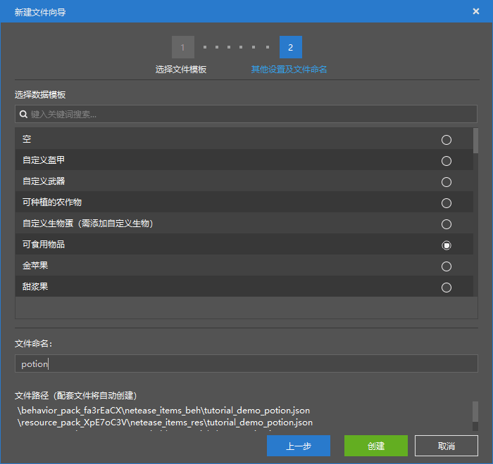
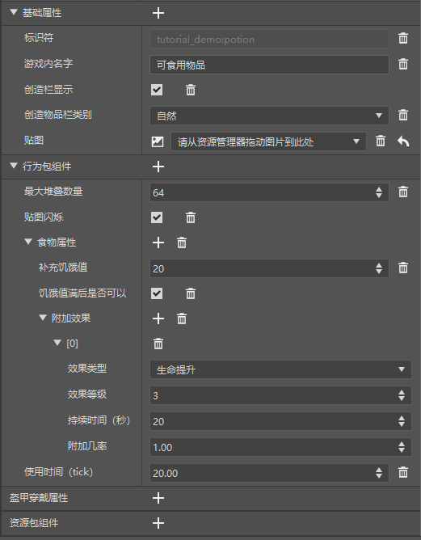
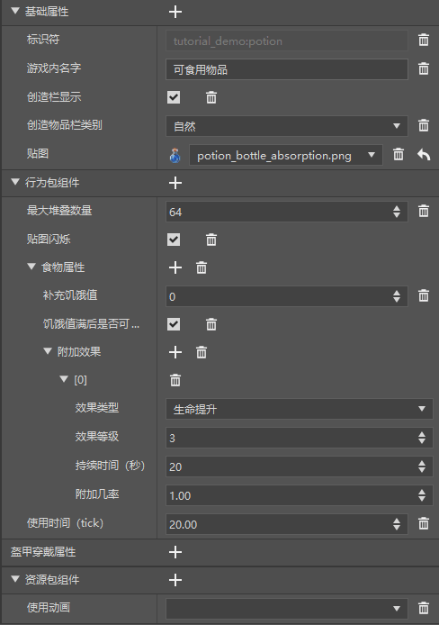
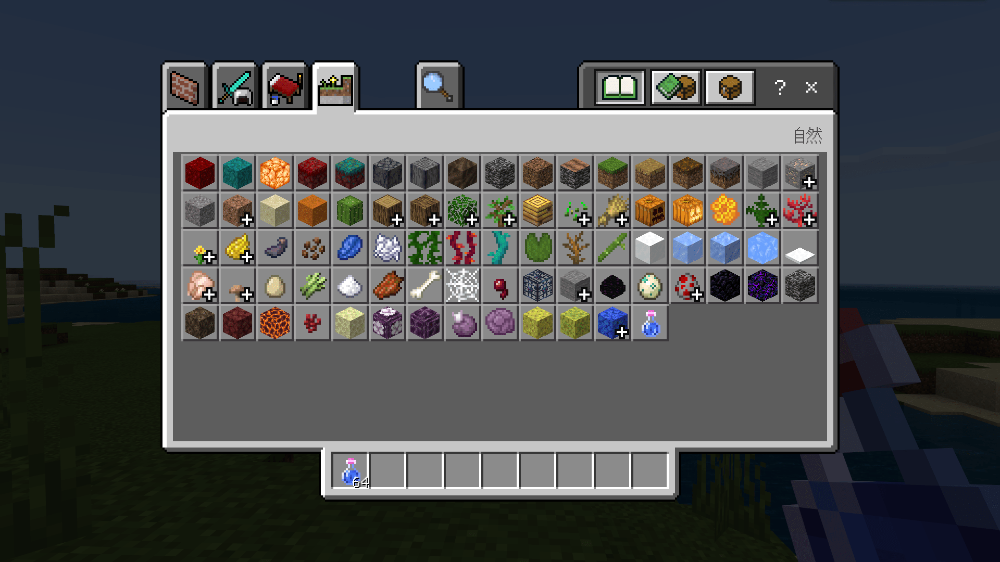
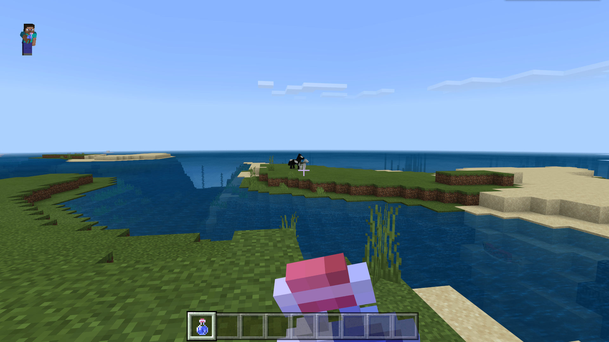
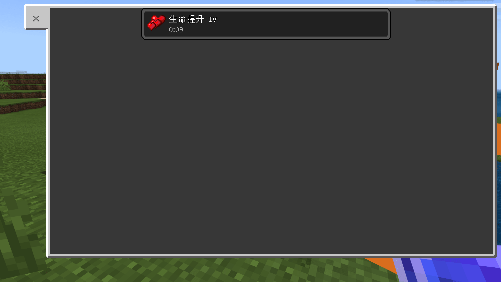

# 制作一个新药水

在本节中，我们一起来制作一个新的药水物品。

## 创建配置

我们打开我的世界开发工作台的编辑器，通过创建**配置**的方式快速创建一个新物品。




我们希望创建的物品可以像食品那样被吃掉或喝掉，所以这里我们选择“**可食用物品**”作为数据模板。



创建完成后，我们便可以在“属性”窗格中看到我们新物品的属性了。

## 更改属性

和普通的空物品相比，可食用物品多了一些组件。其中尤为重要的便是“**食物属性**”组件。

这个组件其实就是JSON文件中的`minecraft:food`组件。`minecraft:food`主要用于定义一个物品食用后恢复的**饥饿值**（**Hunger Value**）和**饱和度**（**Saturation**），同时可以定义食用时触发的事件、产生的状态效果等。我们就需要用到产生状态效果这一功能。

我们保持“**饥饿值满后是否可以**”食用这一栏为选中状态，把“**补充饥饿值**”改为0。由于下面已经自动生成了一个“**附加效果**”，所以我们只需要更改“**效果类型**”等属性为我们需要的值即可。

这样，我们就制作了一个和药水功能基本一致的物品了。不过还有一点我们需要注意。普通食品和液体食品的食用动画和播放的音效是不同的。不过，这一点我们也可以进行更改。



我们在“**资源包组件**”中加入“**使用动画**”组件。将使用动画的`eat`更改为`drink`即可。只不过，由于编辑器的限制，我们需要在资源包中手动更改该组件的值。我们在资源包中更改如下：

```json
{
  "format_version": "1.10",
  "minecraft:item": {
    "description": {
      "identifier": "tutorial_demo:potion"
    },
    "components": {
      "minecraft:icon": "tutorial_demo:potion",
      "minecraft:use_animation": "drink" // 更改此处
    }
  }
}
```

同时，我们也可以打开行为包来查看我们的行为包定义文件。通过编辑器修改，然后再打开文件亲自学习JSON的写法是一种非常好的附加包学习方式。行为包中的文件如下：

```json
{
  "format_version": "1.10",
  "minecraft:item": {
    "description": {
      "identifier": "tutorial_demo:potion",
      "category": "Nature"
    },
    "components": {
      "minecraft:foil": true,
      "minecraft:food": {
        "can_always_eat": true,
        "effects": [
          {
            "amplifier": 3,
            "chance": 1.0,
            "duration": 20,
            "name": "health_boost"
          }
        ],
        "nutrition": 0
      },
      "minecraft:max_stack_size": 64,
      "minecraft:use_duration": 20.0
    }
  }
}
```

这样，我们的药水就创建完成了！我们打开游戏来验证效果。



可以看到药水正确添加到了“自然”（Nature）分类中。



喝药水的声音也是液体食用声音。



并且在食用后正确给予了我们效果。这代表我们成功添加了一个新的药水物品！