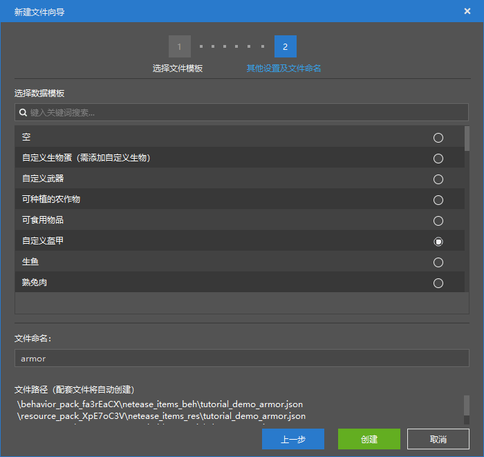
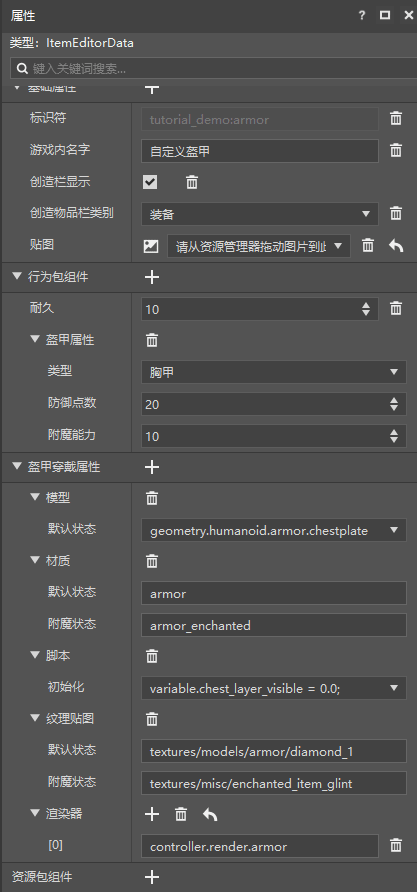

# 制作一个新盔甲

在本节中，我们将一起新建一个盔甲，使其具备一定的防御能力。

## 创建配置

我们打开我的世界开发工作台的编辑器，通过创建**配置**的方式快速创建一个新物品。



我们以“**自定义盔甲**”为基础，这样便可以创建一个盔甲。



我们可以看到，盔甲相比于其他物品，多出了一个盔甲穿戴属性栏。这里便是盔甲的**附着物**（**Attachable**，***挂件***）定义的位置。

## 更改属性

我们先着眼于行为包组件。我们可以看到，盔甲具有一个“**盔甲属性**”组件，其本质是JSON中的`netease:armor`组件。该组件可以做到修改盔甲的**护甲值**（**Armor Value**）和附魔能力等。

对于盔甲的附着物，其JSON文件存放在资源包的`attachables`文件夹中。它的定义文件与实体的资源包定义文件几乎一致，只不过它只有那么一个资源包定义。附着物的作用是单纯显示一个没有行为逻辑的模型，比如玩家身上穿着的盔甲模型。因此它只需要一个资源包定义文件。

我们将该物品对应的JSON文件的示例放出供大家参考。首先是行为包定义文件。

```json
{
  "format_version": "1.10",
  "minecraft:item": {
    "description": {
      "category": "Equipment",
      "identifier": "tutorial_demo:armor",
      "custom_item_type": "armor"
    },
    "components": {
      "minecraft:max_damage": 10,
      "netease:armor": {
        "armor_slot": 1,
        "defense": 20,
        "enchantment": 10
      }
    }
  }
}
```

然后是资源包。

```json
{
  "format_version": "1.10",
  "minecraft:item": {
    "description": {
      "identifier": "tutorial_demo:armor"
    },
    "components": {
      "minecraft:icon": "tutorial_demo:armor"
    }
  }
}
```

附着物的定义文件也非常简单，因为这种格式我们之前在第八章中就已经充分学习过了。

```json
{
  "format_version": "1.8.0",
  "minecraft:attachable": {
    "description": {
      "identifier": "tutorial_demo:armor",
      "geometry": {
        "default": "geometry.humanoid.armor.chestplate"
      },
      "materials": {
        "default": "armor",
        "enchanted": "armor_enchanted"
      },
      "textures": {
        "default": "textures/models/armor/diamond_1",
        "enchanted": "textures/misc/enchanted_item_glint"
      },
      "render_controllers": [
        "controller.render.armor"
      ],
      "scripts": {
        "parent_setup": "variable.chest_layer_visible = 0.0;"
      }
    }
  }
}
```

在下一节的挑战中，我们将为这个物品添加一个3D模型，这将用到我们的附着物功能。