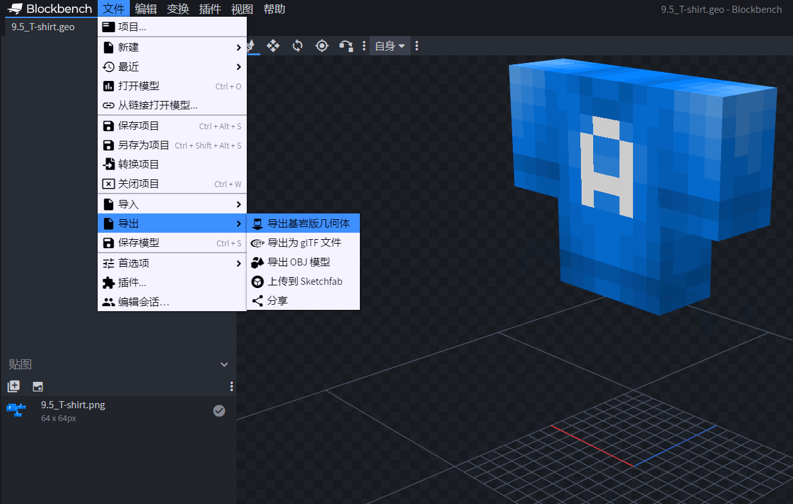
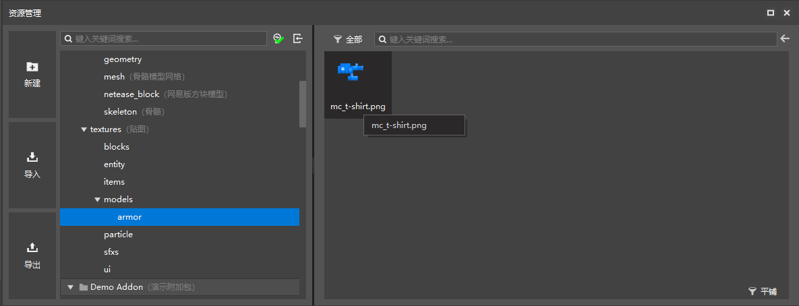
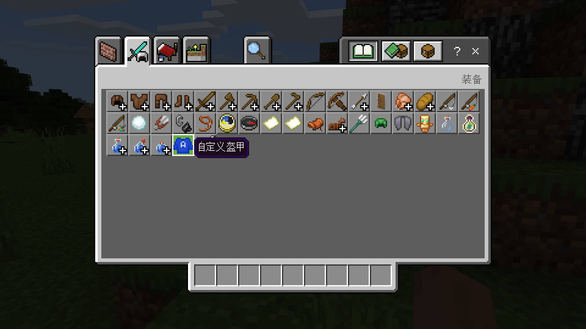
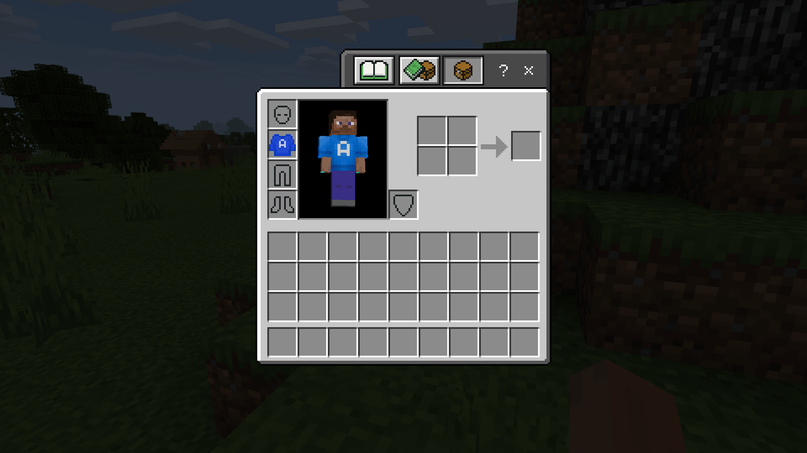

# 挑战：制作一个3D盔甲

接下来，我们为我们上一节中添加的盔甲挂接一个模型。所使用的模型可在[3D盔甲资源包](https://g79.gdl.netease.com/addonguide-9.zip)下载。

## 准备3D盔甲模型

3D盔甲模型本质上就是一个实体模型，所以我们可以用Blockbench来制作这样的模型。在玩法地图教程中，我们一起制作了很多模型，这些模型都可以在玩法地图教程的示例包中下载找到。我们拿出一个T恤衫模型，将`.bbmodel`文件在Blockbench中打开。



我们通过Blockbench的导出功能将模型的**几何**（**Geometry**）导出为JSON文件。然后将这个文件和纹理文件一起准备好，将其导入到编辑器中。


将几何文件放置在资源包的`models/entity`下。



将纹理文件放在`textures/models/armor`下。事实上，纹理文件不像几何文件那么严格，因此放在其他文件夹中也是可以的。但是，为了和原包保持一致，且避免和其他附加包冲突，我们还是作此安排。

## 编辑附着物

我们打开我们的附着物JSON定义文件。我们需要将附着物的几何和纹理修改为我们自己的资源。

```json
{
  "format_version": "1.8.0",
  "minecraft:attachable": {
    "description": {
      "identifier": "tutorial_demo:armor",
      "geometry": {
        "default": "geometry.mc_t-shirt" // 修改此处
      },
      "materials": {
        "default": "armor",
        "enchanted": "armor_enchanted"
      },
      "textures": {
        "default": "textures/models/armor/mc_t-shirt", // 修改此处
        "enchanted": "textures/misc/enchanted_item_glint"
      },
      "render_controllers": [
        "controller.render.armor"
      ],
      "scripts": {
        "parent_setup": "variable.chest_layer_visible = 0.0;"
      }
    }
  }
}
```

我们按照上述写法进行修改，这样，我们的几何和默认纹理就修改成功了。





打开游戏自测观察效果，我们可以看到，盔甲穿着到身上之后确实显示出了应有的模型和纹理！