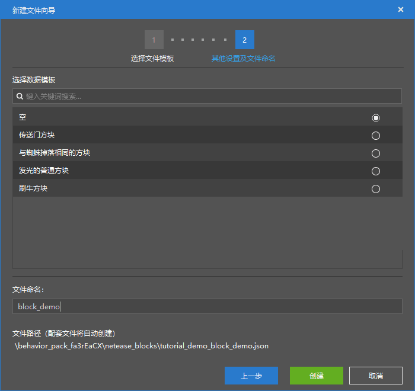
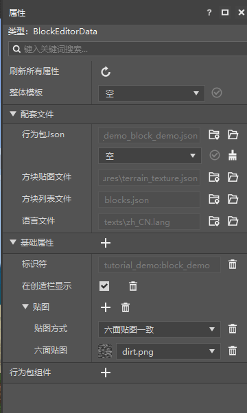
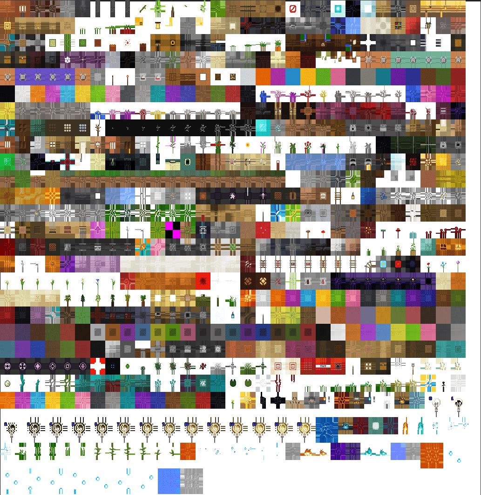

# 认识自定义方块

在本节中，我们一起考察自定义方块的格式。依据惯例，我们先使用编辑器快速创建一个自定义方块，以便于我们查看它的基本结构。


我们选择“方块配置”，然后创建一个空的自定义方块。



我们可以看到，编辑器提示我们将创建以下配套文件：

```shell
./behavior_pack/netease_blocks/tutorial_demo_block_demo.json
```



从文件的结构可以看到，我们的自定义方块只有一个行为包定义文件。但是事实上，方块也是需要客户端定义的，不过这个客户端定义比较特殊，不像物品和实体那样是单独的一个文件。方块的客户端定义文件是一个单独的文件，其中包含了所有需要定义的方块的客户端资源，那便是资源包根目录下的`blocks.json`。

不过，在此之前，我们先一起来看行为包定义文件。

## 行为包定义

```json
{
  "format_version": "1.10.0",
  "minecraft:block": {
    "description": {
      "identifier": "tutorial_demo:block_demo",
      "category": "construction",
      "base_block": "none"
    },
    "components": {

    }
  }
}
```

- `format_version`：这是这个方块的**格式版本**（**Format Version**）。方块稳定的格式版本有`1.10.0`和`1.16.0`，它们均不需要开启实验性玩法，我们依旧推荐格式版本`1.10.0`。`1.16.100`及以上的格式版本意味着新版方块，这需要开启实验性玩法，我们不推荐使用。同样，如果使用`1.16.100`及以上的新版方块，则只需创建行为包定义文件，客户端需要的数据将从服务端通过来自数据包的形式接收。
- `minecraft:block`：方块的模式标识符。其下有`description`和`components`对象。

我们再依次查看`description`对象下的属性。

- `identifier`：字符串，该方块的赋命名空间标识符，格式为`<namespace>:<identifier>`。需要注意的是，由于方块的内部代码限制，就算我们设定了命名空间，但是依旧无法避免重名冲突现象。这是因为方块作为方块物品存在时可以使用带有命名空间的标识符作为唯一标识符，但是方块作为自身或世界中的实例时只能够使用上述格式中的`<identifier>`作为标识符。所以我们依旧要保证上述格式中的`<identifier>`的唯一性，比如，我们可以使用类似`<namespace>:<namespace>_<name>`的格式来保证其唯一性。
- `category`：可选，字符串，将物品注册到创造物品栏的分类。默认为`construction`（建筑）。若填写`commands`则只能通过指令和api获取，填写`none`则只能通过api获取，支持填入自定义分页的名称。
- `base_block`：可选，字符串，中国版特有的描述属性，可以继承原版的一些种类的方块，从而定义具有原版硬编码特性的方块。目前可以填写`mob_spawner`、`portal`、`custom_crop_block`、`liquid`、`custom_heavy_block`等。

## 资源包定义

资源包定义文件在资源包根目录下的`blocks.json`，所有的方块的资源包定义皆集中在这一个方块中。

```json
{
  "format_version": [ 1, 1, 0 ],
  "tutorial_demo:block_demo": {
    "textures": "tutorial_demo:dirt"
  }
}
```

方块的资源包定义文件的格式版本为非常旧的`1.1.0`，且需要用语义化版本数组的形式写入。下面每一个字段的键名是方块的赋命名空间标识符，值是一个对象，其中`textures`字段是该方块的纹理文件的短名称。方块纹理的短名称和物品的一样，依旧是在一个图集文件中定义的，我们稍后会一起来看方块的图集文件。

我们下面展示一段原版方块的更详细的资源包定义。

```json
{
  "format_version": [ 1, 1, 0 ],
  "air": {},
  "stone": {
    "textures": "stone",
    "sound": "stone"
  },
  "grass": {
    "isotropic": {
      "up": true,
      "down": true
    },
    "textures": {
      "up": "grass_top",
      "down": "grass_bottom",
      "side": "grass_side"
    },
    "carried_textures": {
      "up": "grass_carried_top",
      "down": "grass_carried_bottom",
      "side": "grass_carried"
    },
    "sound": "grass"
  },
  "dirt": {
    "isotropic": true,
    "textures": "dirt",
    "sound": "gravel"
  },
  // ...
  "sand": {
    "isotropic": true,
    "textures": "sand",
    "brightness_gamma": 0.55,
    "sound": "sand"
  },
  // ...
  "leaves": {
    "isotropic": {
      "up": true,
      "down": true
    },
    "textures": "leaves",
    "carried_textures": "leaves_carried",
    "brightness_gamma": 0.80,
    "sound": "grass"
  },
  // ...
  "dispenser": {
    "textures": {
      "up": "dispenser_top",
      "down": "dispenser_top",
      "north": "dispenser_side",
      "south": "dispenser_front_horizontal",
      "west": "dispenser_side",
      "east": "dispenser_front_vertical"
    },
    "carried_textures": {
      "up": "dispenser_top",
      "down": "dispenser_top",
      "north": "dispenser_side",
      "south": "dispenser_front_horizontal",
      "west": "dispenser_side",
      "east": "dispenser_side"
    },
    "sound": "stone"
  },
  // ...
}
```

我们可以看到，除了`textures`之外，我们还可以设置声音（`sounds`）、手持纹理（`carried_textures`）、各向异性（`isotropic`）和亮度伽马值（`brightness_gamma`）和等，并且每个面可以单独设置这些值。事实上，我们还可以通过`blockshape`设置方块形状。

声音是用于链接一个系统声音事件（亦称存档声音事件）的集合的。在资源包根目录的`sounds.json`文件的`block_sounds`对象中，我们为每种方块大类设置了一个系统声音事件集，用于方块相关音效的“自动”播放，比如`normal`、`gravel`、`wood`等。这里便需要填写对应的系统声音事件集名称。其实实体的音效播放也是如此，只不过实体的系统声音事件集名称和实体标识符是一致的，所以他们可以自动地链接在一起。

各向异性是用于开启纹理的随机旋转的。开启了各向异性的面将采用伪随机的形式通过世界种子进行纹理的随机旋转。

方块形状是一种类似于方块模型的属性。开发者可以用方块形状继承一个原版的方块模型，同时继承所有该模型的渲染方法和渲染属性，比如是否进行背面消隐、环境光遮蔽等。

### 图集

与物品的图集称为物品图集不同，方块的图集称为**地形图集**。



我们可以在`textures/terrain_texture.json`处找到方块的图集定义。

```json
{
  "resource_pack_name": "tutorial_demo",
  "texture_name": "atlas.terrain",
  "padding": 8,
  "num_mip_levels": 4,
  "texture_data": {
    "tutorial_demo:dirt": {
      "textures": "textures/blocks/dirt"
    }
  }
}
```

`atlas.terrain`是地形图集的图集标识符，不可以改变为其他的字段。`padding`是每个纹理文件整合为一个大的图集文件时的内边距。我们可以看到上面的示例大图集文件中每个纹理周围都存在一段延伸的边距，这便是由该字段定义的，这是为了避免MIPMAP过程中不同方块的贴图之间像素融合的问题。`num_mip_levels`是该图集文件进行的MIPMAP次数，MIPMAP次数越多远处的方块的噪点越少。在`texture_data`中，便是短名称的定义了。这一点和物品是一致的。

在定义好了我们的方块纹理后，我们的方块便算是初步完成了！
