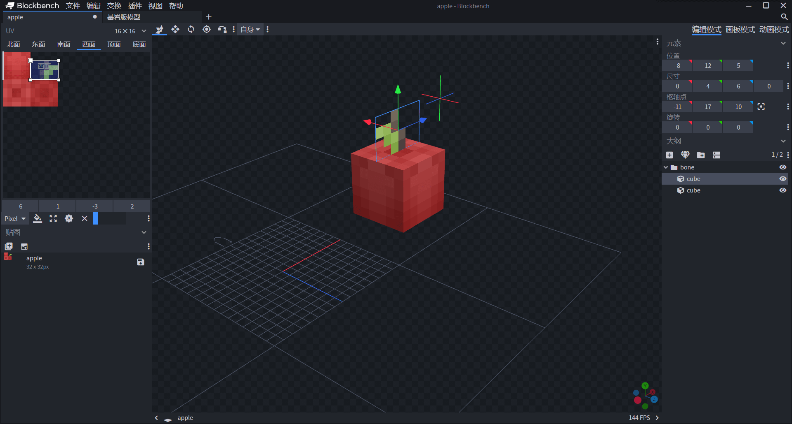

# 制作一个苹果方块

我们学会了如何自定义一个基本的方块，下面，我们学习如何自定义方块模型。可通过[方块模型资源](https://g79.gdl.netease.com/addonguide-10.zip)将模型资源下载到本地。

## 准备苹果模型

虽然目前最新版的国际版接口已经支持了方块的自定义模型，但是该接口需要`1.16.100`以上的实验性玩法。我们使用中国版单独支持的中国版方块模型。

中国版方块模型也是使用Blockbench支持的模型，只不过方块的(0, 0, 0)在模型的(8, 0, 8)处，也就是说整体方块需要以基面中央为西北下角进行制作，并且需要使用“**自由模型**”模式。



我们准备好了一个苹果模型，用来模仿树上挂着的苹果。我们将其保存为`.bbmodel`文件。

## 在编辑器中导入模型

中国版的方块模型使用特殊的文件模式，为了快速将其转换为中国版方块模型格式，我们需要使用编辑器导入模型。我们在“文件管理”窗格中找到导入按钮。


我们选择Blockbench模型，即可将其导入为方块模型。


输入好模型的标识符，选该模型对应的方块物品贴图文件，点击确定即可成功导入。之后，该文件将被导入至资源包的`models/netease_block`文件夹中。

我们可以来查看该模型文件。可以看到此时这个文件已经被转换成了一个JSON文件。

```json
{
  "format_version": "1.13.0",
  "netease:block_geometry": {
    "description": {
      "identifier": "tutorial_demo:apple",
      //"item_texture": "tutorial_demo:apple_icon",
      "textures": ["tutorial_demo:apple"],
      "use_ao": false
    },
    "bones": [{
      "cubes": [{
        "origin": [8, 12, 5],
        "pivot": [11, 17, 10],
        "rotation": [0, 0, 0],
        "size": [0, 4, 6],
        "uv": {
          "down": {
            "texture": 0,
            "uv": [0, 0],
            "uv_size": [0, 3]
          },
          "east": {
            "texture": 0,
            "uv": [3, 1],
            "uv_size": [3, 2]
          },
          "north": {
            "texture": 0,
            "uv": [0, 0],
            "uv_size": [0, 3]
          },
          "south": {
            "texture": 0,
            "uv": [0, 0],
            "uv_size": [0, 3]
          },
          "up": {
            "texture": 0,
            "uv": [0, 0],
            "uv_size": [0, 3]
          },
          "west": {
            "texture": 0,
            "uv": [6, 1],
            "uv_size": [-3, 2]
          }
        }
      }, {
        "origin": [5, 6, 5],
        "pivot": [11, 6, 5],
        "rotation": [0, 0, 0],
        "size": [6, 6, 6],
        "uv": {
          "down": {
            "texture": 0,
            "uv": [6, 3],
            "uv_size": [-3, 3]
          },
          "east": {
            "texture": 0,
            "uv": [0, 0],
            "uv_size": [3, 3]
          },
          "north": {
            "texture": 0,
            "uv": [0, 0],
            "uv_size": [3, 3]
          },
          "south": {
            "texture": 0,
            "uv": [0, 0],
            "uv_size": [3, 3]
          },
          "up": {
            "texture": 0,
            "uv": [0, 3],
            "uv_size": [3, 3]
          },
          "west": {
            "texture": 0,
            "uv": [0, 0],
            "uv_size": [3, 3]
          }
        }
      }],
      "name": "bone",
      "pivot": [0, 0, 0],
      "rotation": [0, -90, 0]
    }]
  }
}
```

我们可以看到格式版本为`1.13.0`，模式标识符为`netease:block_geometry`。在`description`中，`identifier`为你刚刚输入的标识符带上了命名空间，`item_texture`为方块物品的纹理贴图的短名称，`textures`是用于本模型UV映射的纹理贴图。`use_ao`为是否为本模型启用**环境光遮蔽**（**Ambient Occlusion**）。环境光遮蔽是一种描绘物体和物体相交或靠近的时候遮挡周围漫反射光线的效果。

## 使用编辑器配置苹果方块

我们在编辑器中打开方块，找到”**属性**“窗格中的”**基础属性**“，点击”**+**“。


我们选择`model`来在方块的描述中添加一个模型字段。


我们在下拉菜单中选择刚刚导入的模型，即可将模型挂接在方块上。接下来，我们只需要进一步配置苹果方块的其他相关属性即可完成制作。


我们一起通过对应的JSON文件来考察各个组件的含义。

```json
{
  "format_version": "1.10.0",
  "minecraft:block": {
    "description": {
      "identifier": "tutorial_demo:apple"
    },
    "components": {
      "minecraft:block_light_absorption": {
        "value": 0
      },
      "minecraft:destroy_time": {
        "value": 1.0
      },
      "minecraft:loot": {
        "table": "loot_tables/custom_apple.json"
      },
      "netease:aabb": {
        "clip": {
          "max": [0.6875, 1.0, 0.6875],
          "min": [0.3125, 0.375, 0.3125]
        },
        "collision": {
          "max": [0.6875, 1.0, 0.6875],
          "min": [0.3125, 0.375, 0.3125]
        }
      },
      "netease:pathable": {
        "value": true
      },
      "netease:render_layer": {
        "value": "alpha"
      },
      "netease:solid": {
        "value": false
      }
    }
  }
}
```

`minecraft:block_light_absorption`是该方块的**不透明度**（**Opacity**），即光线吸收程度。该值越大光线在穿过时将减少得越多。我们希望这个方块不影响光线传播，所以将其改成和空气的不透明度保持一致。

`minecraft:destroy_time`是该方块的**硬度**（**Hardness**），即方块的破坏基时间，单位为秒（s）。实际的破坏时间将根据该基时间乘以对应的速度修饰符而计算产生。

`minecraft:loot`为该方块掉落的战利品表，我们将其设定为可以掉落苹果物品的战利品表。


`netease:aabb`是只运行在中国版的组件，用于设定一个方块的**轴对其边界框**（**Axis-Aligned Bounding Box**，或译**轴对其包围盒**，简称**AABB**），即该方块的**碰撞**（**Collision**）体积和**裁剪**（**Clip**）体积。碰撞体积是该方块在世界中与实体相碰撞的体积，通常称为**碰撞箱**（**Collision Box**）；裁剪体积则是用于设定方块的裁剪面，与游戏内的射线相交互的体积，比如用于玩家相机的射线和弹射物消失的轨道检测，通常称为**击中箱**（**Hitbox**）。

`netease:pathable`同样是中国版的组件，用于设定一个方块是否为可寻路方块。可寻路方块允许自己在生物寻路算法计算时被视作可践踏的方块。

`netease:render_layer`是中国版的组件，决定该方块的**渲染图层**（**Render Layer**）。方块的渲染图层是一系列预置的渲染方法，分别于不同的材质相绑定，用于决定一个方块是否透明、半透明、双面渲染等。

`netease:solid`是中国版的组件，决定该方块是否为**固体**（**Solid**）。在基岩版中固体属性决定着生物在方块中是否会受到窒息伤害。

我们将该方块设置为不吸光的非固体，边界框设定为和模型一致，渲染图层设置为透明，即可完成一个常规的非固体方块的设置。


我们进入游戏自测，可以看到苹果的渲染和模型都非常正常，正符合我们的预期！