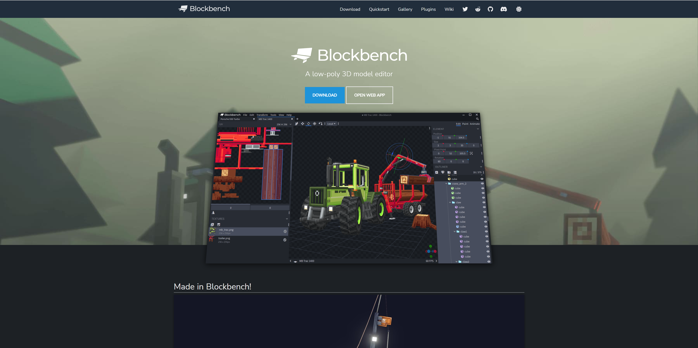
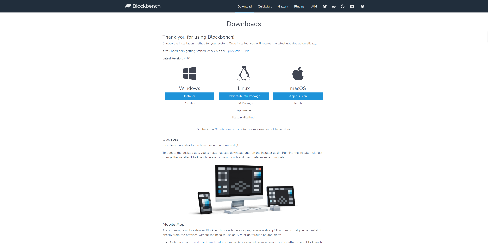
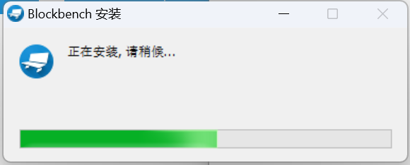
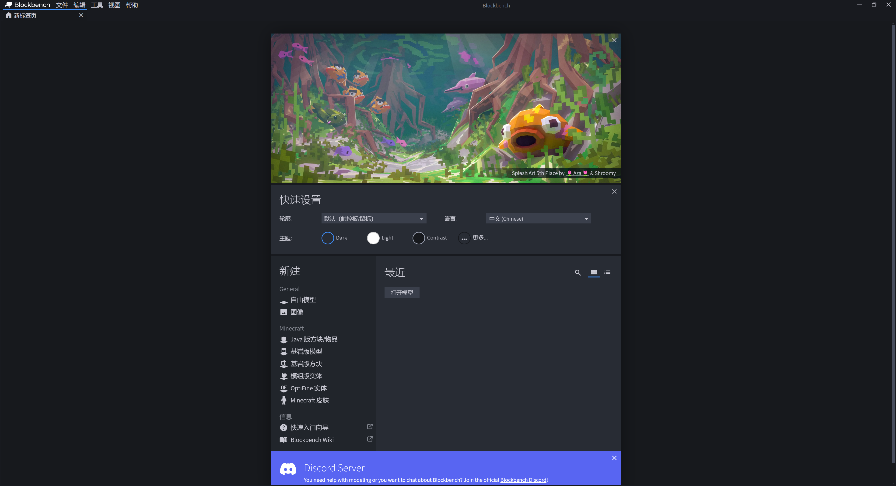
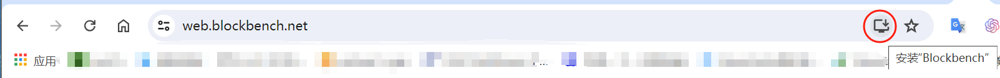

# 安装Blockbench

Blockbench是一款集建模、纹理绘制、模型动画的制作于一体的模型工具。通过Blockbench，我们可以更方便和可视化地制作实体和方块模型，并配套制作其纹理和动画。

下面，我们一起在我们的计算机上安装Blockbench！

## 下载

打开Blockbench官网：https://www.blockbench.net/ 。我们可以看到页面正中央有两个按钮。

点击“ **Download（下载）** ”按钮，我们会被定向到下载安装包的界面。

根据你的系统，选择合适的包体下载即可。其中Windows下的“ **Installer** ”代表安装程序，“ **Portable** ”代表免安装的绿色版程序，可以放入U盘等移动设备携带。

## 安装

以Windows为例，如果你下载的是免安装的程序，直接解压下载到的压缩包即可。如果下载了安装程序，我们应该遵循如下步骤安装。

1. 双击打开安装程序。你会看到安装程序自动弹出正在安装：

   

2. 等待安装完成，Blockbench会自动弹出。

   

3. 首次打开时会显示“快捷设置”面板。你可以在快捷设置中选择使用的操作方式和界面语言，以及Blockbench的主题色。选择完成后你便完成了安装！

今后，如果你想打开Blockbench，你只需要在桌面上找到Blockbench图标，双击即可打开。

## WebApp

Blockbench还有另外一种完全免安装的使用方式，那便是其可以直接作为一个网页使用。在官网点击下载按钮右侧的“ **Open Web App（打开WebApp）** ”按钮，在弹出的新标签页中，你可以看到和上述Blockbench界面完全相同的界面，你可以正常使用其中所有的功能。

你也可以记住或收藏WebApp的网址，以便下次可以快速打开：https://web.blockbench.net/ 。此外，在部分浏览器中，你可以在地址栏找到“ **安装‘Blockbench’** ”的按钮，例如Chrome中：

点击之后，浏览器会在你的桌面创建一个伪应用的图标，双击进入后你便依旧可以直接进入到该WebApp中进行使用。唯一不足的是，当Blockbench版本更新时，你需要重新安装来解决更新问题。