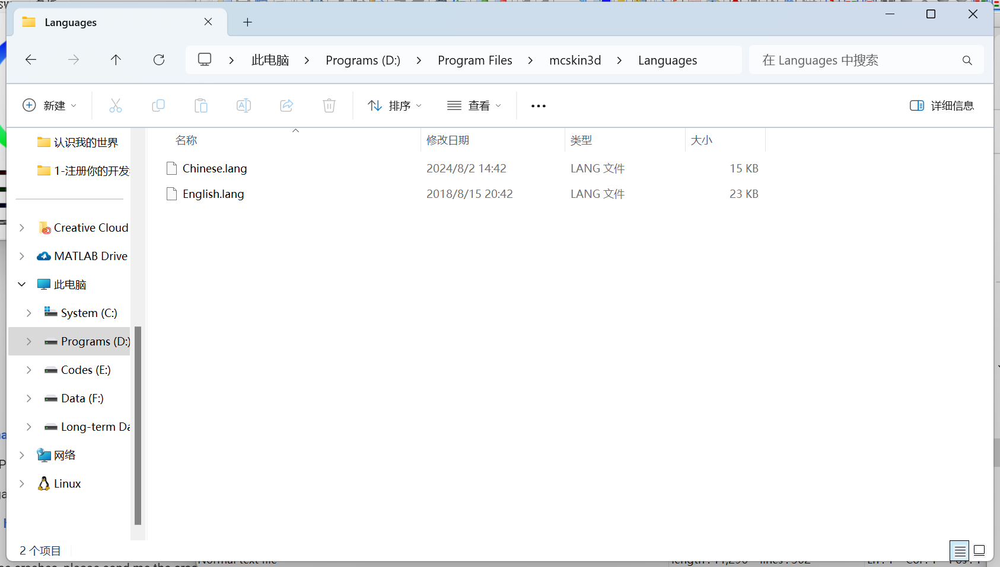
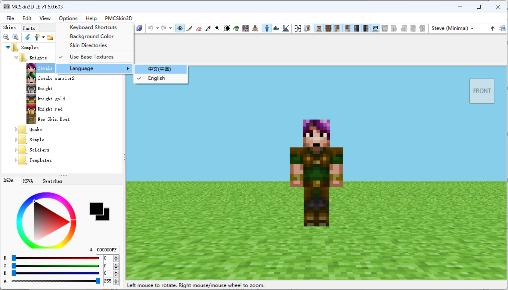
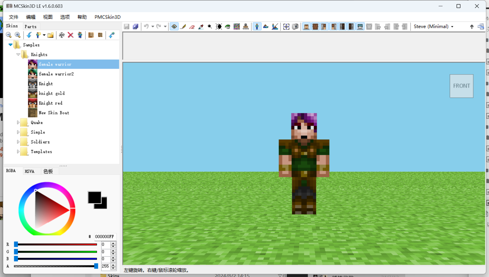
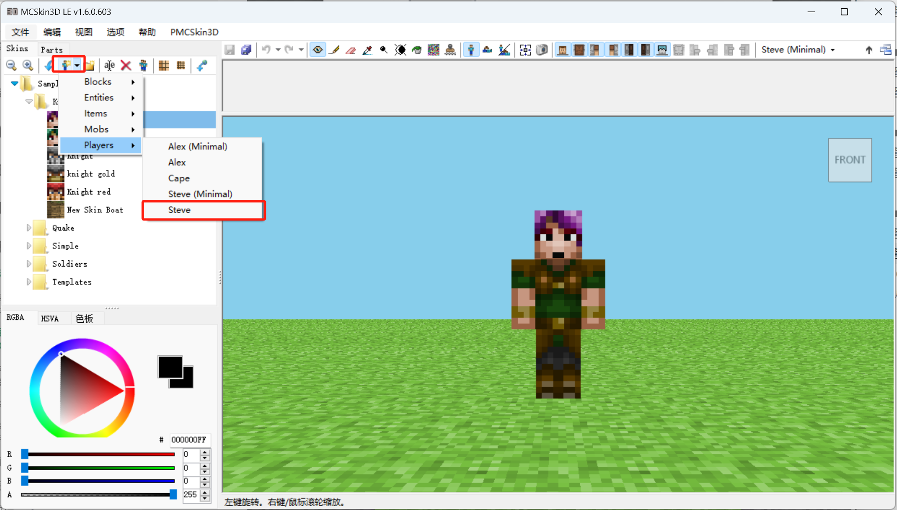
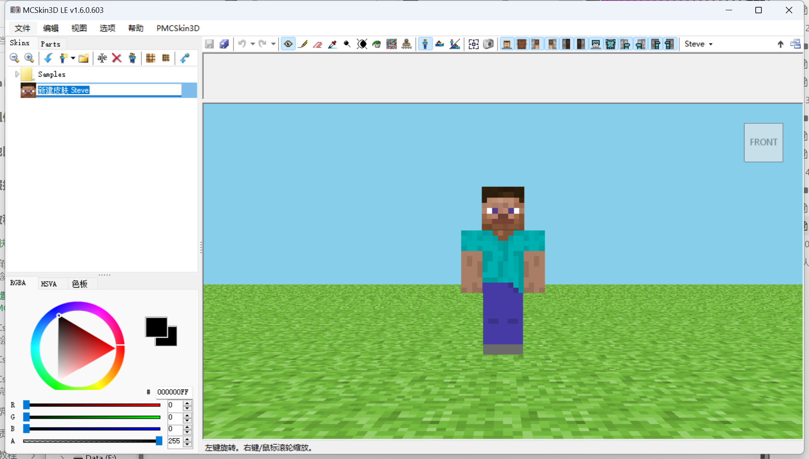
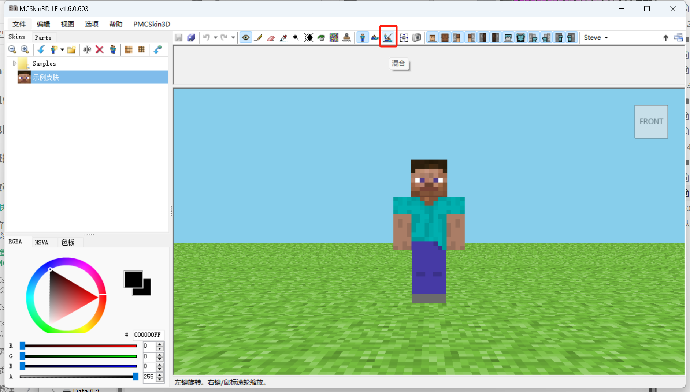
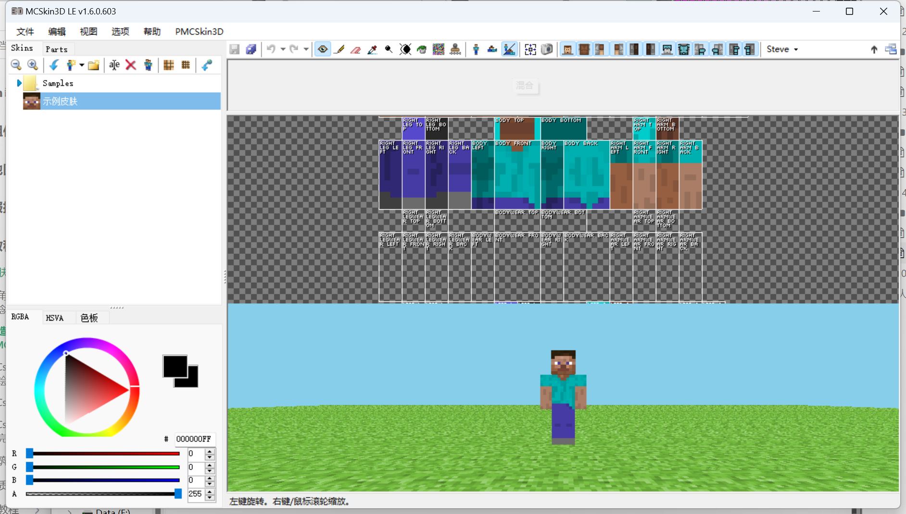
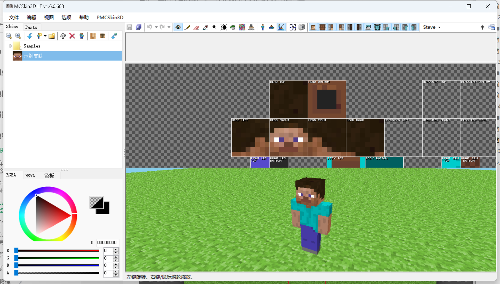
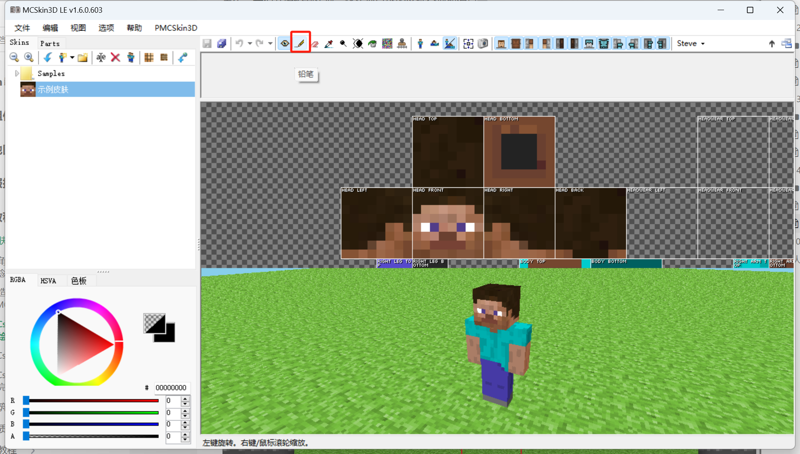
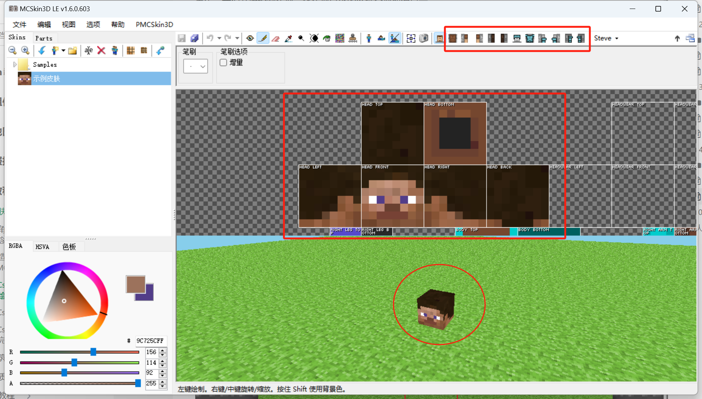

# MCSkin3D功能简介

如果你是按照上一课的指导下载安装了MCSkin3D，那么你可能会发现你下载到的MCSkin3D用没有中文的界面。不过不要担心，我们一起来为其添加中文界面支持。

## 汉化

为了使其具备中文界面，笔者特地亲自翻译并制作了一份MCSkin3D中文语言文件，[点击此处](https://x19.fp.ps.netease.com/file/673dbaa496bcf2af0c87eda25gprBjCd05)以下载该语言文件。

如果一切正常，你将下载到一个名为`Chinese.lang`的语言文件。我们接下来安装该文件到MCSkin3D中。

找到上一节中你解压缩MCSkin3D时选择的文件夹，例如`D:\Program Files\mcskin3d`。打开该文件夹，在该文件夹内你会发现一个名称为`Languages`的文件夹。打开`Languages`文件夹。此时你的位置应该是`D:\Program Files\mcskin3d\Languages`。

将`Chinese.lang`复制到这里，如图所示：

返回上级文件夹，打开`MCSkin3D.exe`，按图找到调整语言的选项：

选择“中文（中国）”，点击。你的UI界面将被调整为中文！至此，你便可以正常使用了。

## 基本功能

点击“ **Skins（皮肤）** ”选项卡内的“ **在此处新建皮肤** ”按钮，将会在左侧文件夹树状图你当前选中位置新建一个皮肤。该位置实际上便是你安装路径下的`Skins`文件夹。以上面举例路径为例，便是`D:\Program Files\mcskin3d\Skins`。我们可以在下拉菜单中选择皮肤模板，我们以Steve（史蒂夫）为例。

在新建皮肤时，我们可以为其命名。之后，我们也可以右击该皮肤文件，在右键菜单中为其重命名。

一共有三种视图模式：

- 透视：3D透视模式下预览皮肤的最终成品。
- 纹理：2D模式下查看皮肤文件当前的展开图。
- 混合：两种模式皆显示。

我们在顶部工具栏内调整为混合模式。当然，我们也可以在顶部菜单栏内进行模式调整。

此时我们的视图变为了同时显示3D和2D。

在使用相机工具时，我们可以在3D视图窗口下左键进行相机的旋转，右键或滚轮进行缩放。在2D视图窗口下，左键移动纹理文件，右键或滚轮缩放。

我们在顶部工具栏中切换为铅笔工具，来进行上色。当然，我们也可以在菜单栏的“编辑”下拉菜单中找到供选择工具。

在每种模式下鼠标的按键的功能都不一致，注意此时底部的状态栏告诉我们左键为绘制前景色，右键和滚轮为缩放，按下Shift再使用左键为绘制背景色。

我们可以在3D视图下绘制，也可以在2D视图下绘制。他们会达到相同的效果。

工具栏的最右侧是切换显示每一种部件。

我们可以将无关部件取消选中，以此在当前切换为不显示，以此防止绘制位置错误：

MCSkin3D功能远不止于此，你可以自行探索，亦可以结合以下参考资料进行学习。相信你可以早日成为熟练的皮肤制作者！

参考资料：

- [美术教程-创造一个专属皮肤——设计皮肤&MCSkin3D软件](https://mc.163.com/dev/mcmanual/mc-dev/mconline/100-历史归档教程/40-%E7%BE%8E%E6%9C%AF%E6%95%99%E7%A8%8B/1.%E7%9A%AE%E8%82%A4%E6%95%99%E7%A8%8B/02.%E5%88%9B%E9%80%A0%E4%B8%80%E4%B8%AA%E4%B8%93%E5%B1%9E%E7%9A%AE%E8%82%A4.%E8%AE%BE%E8%AE%A1%E7%9A%AE%E8%82%A4&MCSKIN3D%E8%BD%AF%E4%BB%B6.html?catalog=1)：中国版官方的皮肤教程。
- [软件学习：MCskin3D软件教程](https://mc.163.com/dev/mcmanual/mc-dev/mconline/100-历史归档教程/60-%E6%88%91%E7%9A%84%E4%B8%96%E7%95%8C%E5%88%9B%E9%80%A0%E8%90%A5%E6%95%99%E7%A8%8B/%E7%9A%AE%E8%82%A4%E5%88%B6%E4%BD%9C%E5%9F%BA%E7%A1%80%E6%95%99%E7%A8%8B/5-%E8%BD%AF%E4%BB%B6%E5%AD%A6%E4%B9%A0%EF%BC%9AMCskin3D%E8%BD%AF%E4%BB%B6%E6%95%99%E7%A8%8B.html?catalog=1)：中国版官方的MCSkin3D教程。