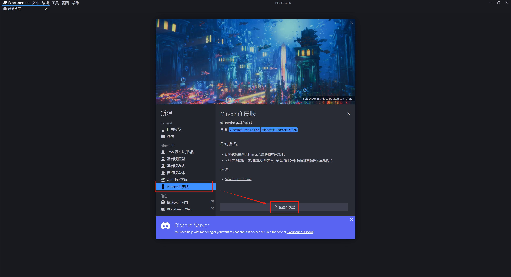
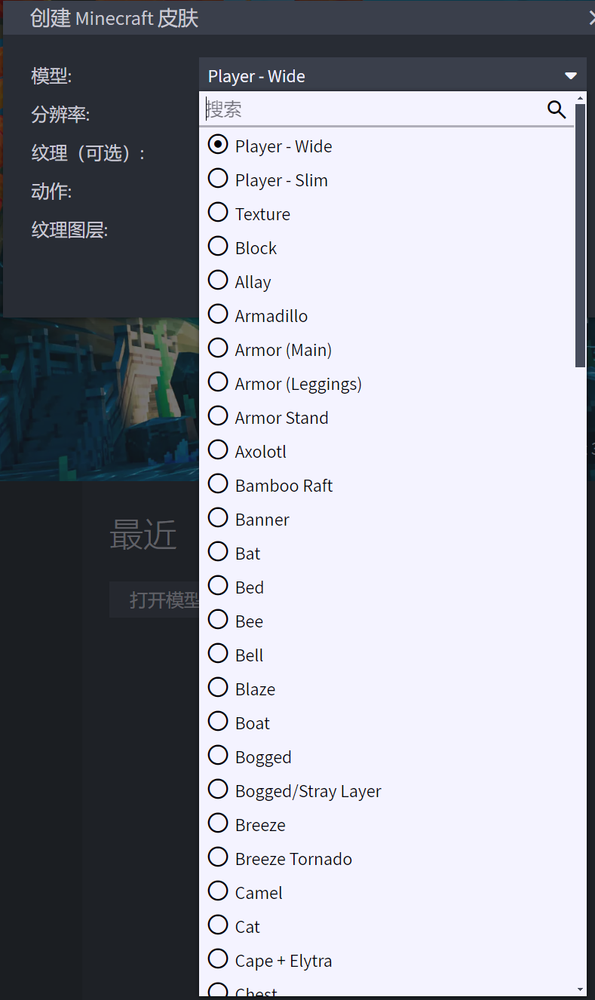
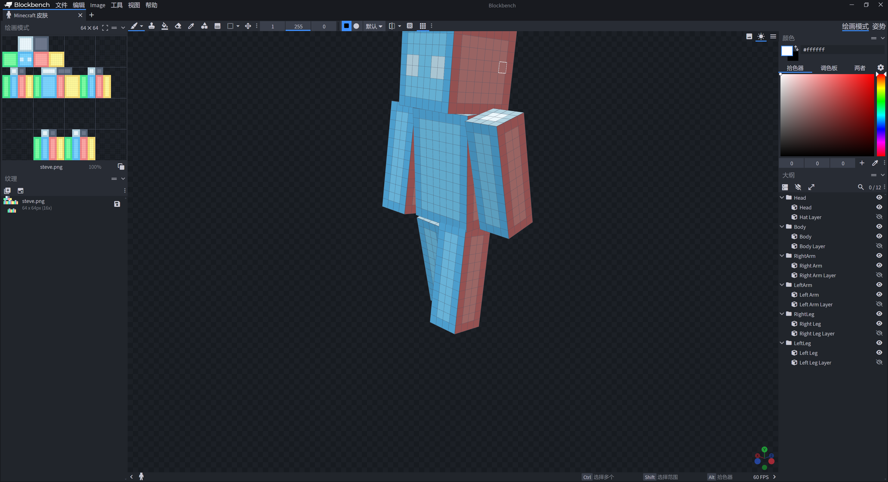
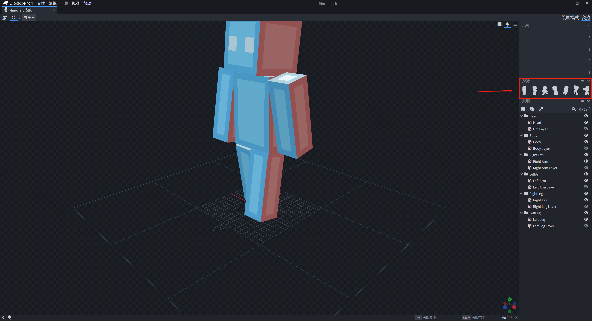

# Blockbench皮肤工具简介

Blockbench中也有一款自带的皮肤绘制工具。毕竟，Blockbench本身就具有模型制作和模型纹理绘制的功能。皮肤本身就是原版玩家模型的纹理，因此Blockbench特地支持了皮肤绘制的功能。

## 使用

打开Blockbench，找到“Minecraft皮肤”一项并创建新的项目。在创建时，需要你选取皮肤所适配的实体类型。“Player - Wide”代表史蒂夫的宽版皮肤。“Player - Slim”代表艾利克斯的窄版皮肤。当然，你也可以选择为其他种类的实体绘制皮肤，这实际上就是在绘制实体的纹理包（*材质包*）。

## 绘制

创建项目后，你会发现右上角只有两种模式：“绘画模式”和“姿势”。绘画模式便是我们传统制作模型时所接触的绘画模式，你之前所学习的绘画模式使用方法在这里全都适用。

在姿势模式下，你可以选择不同的姿势来预览你皮肤的效果。你也可以自行更改模型中每一个部位的旋转角来调整模型的姿势，摆出你想要的姿势来预览结果。

如果你已经掌握了Blockbench的基本使用方法，那么这一节的内容将对你而言非常简单。如果没有，你也可以温习之前学过的Blockbench内容，多加训练，争取更加熟练地掌握Blockbench！