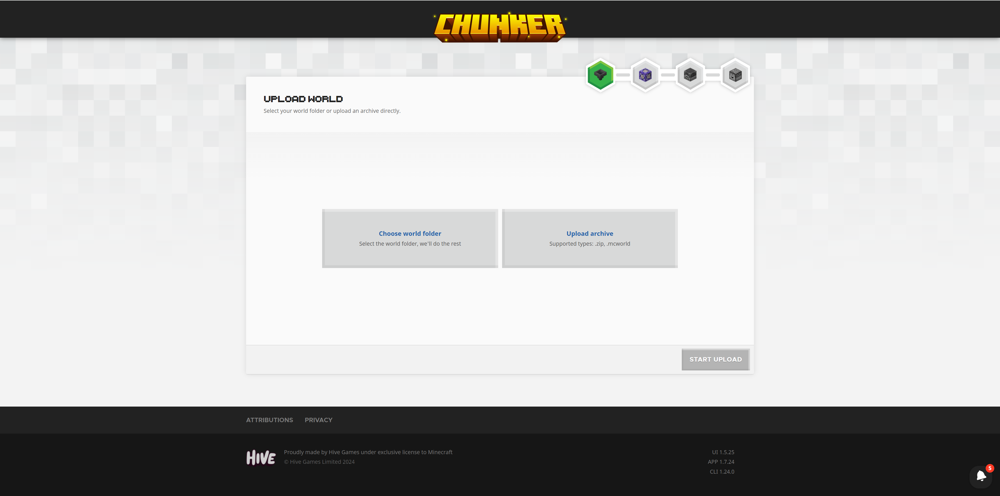
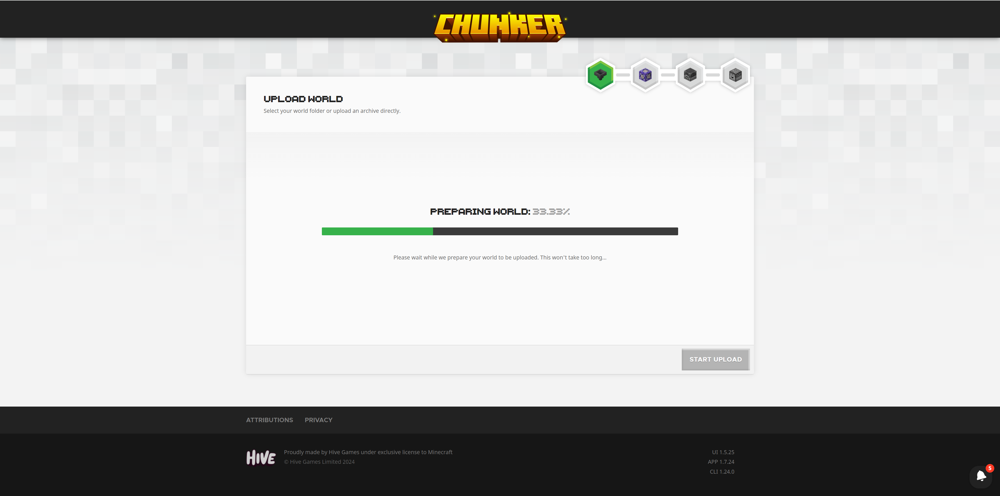
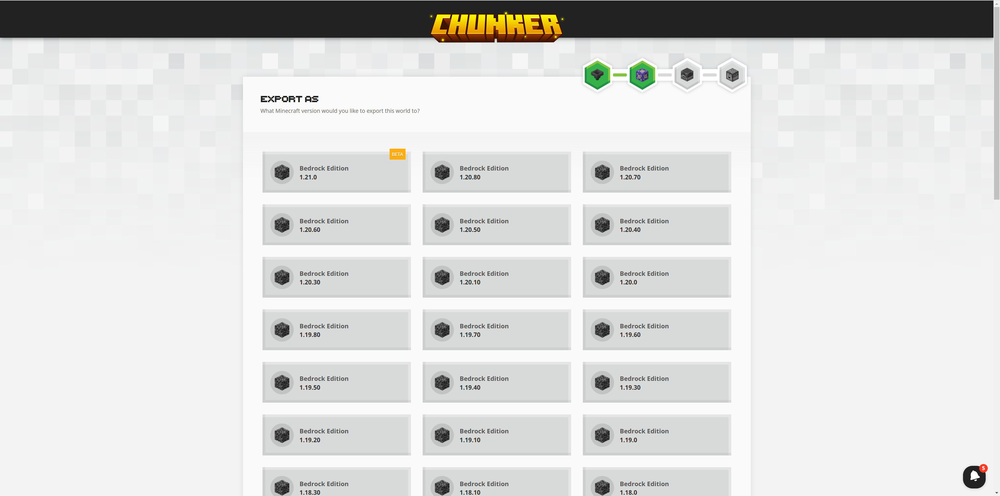
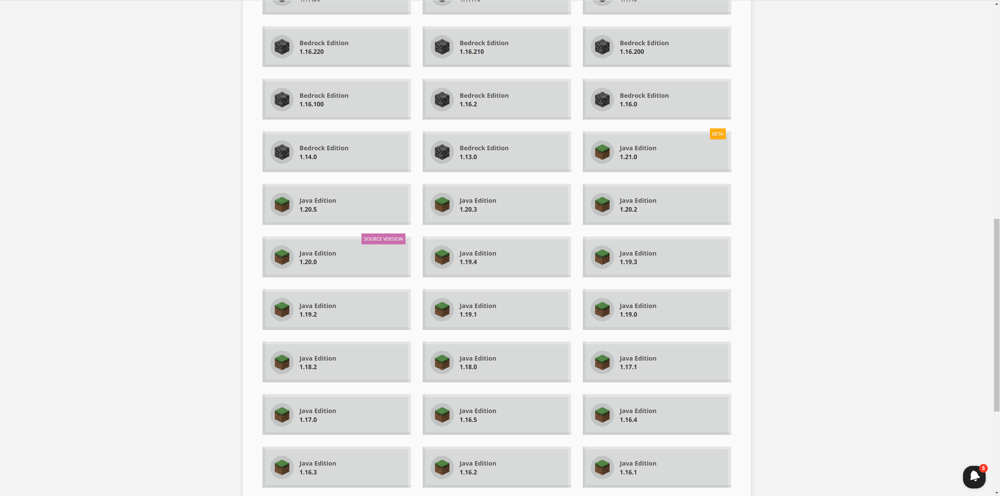
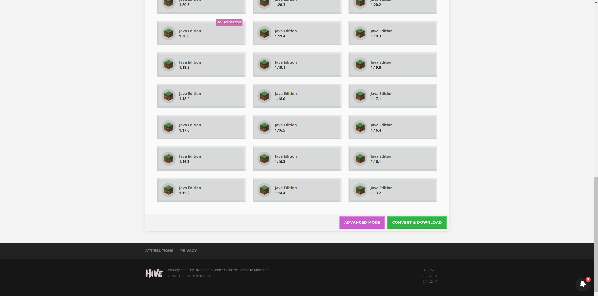
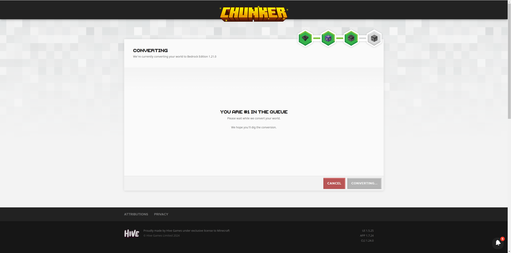
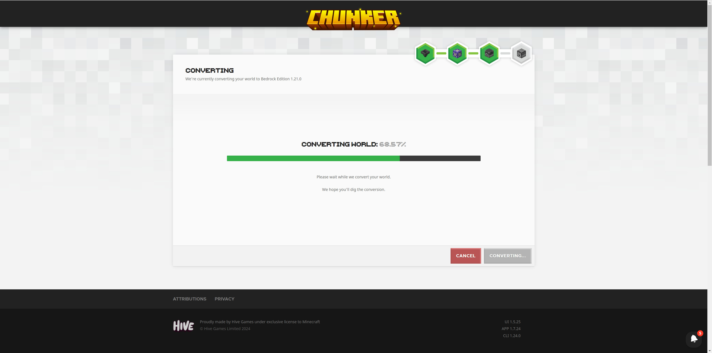
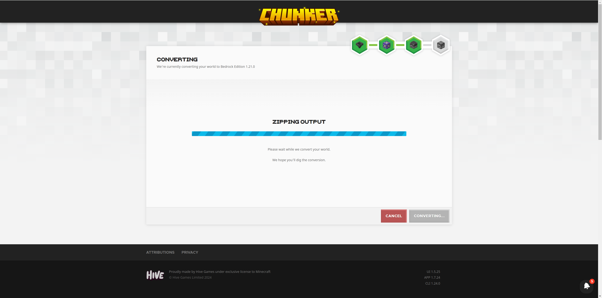
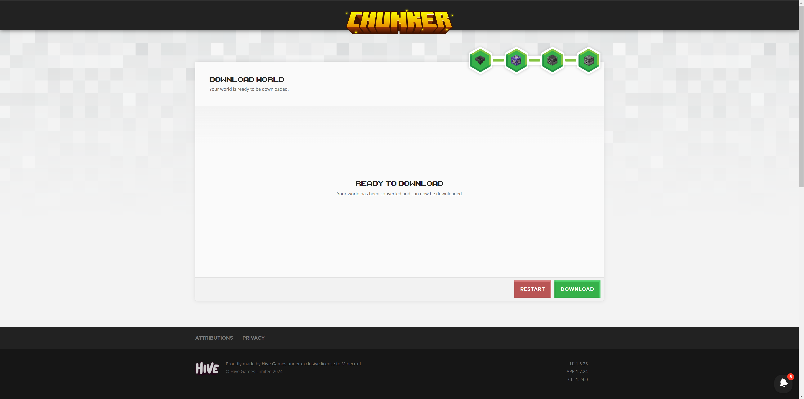

# Chunker简介

Chunker是Mojang联合Hive Games开发的一款在线JE、BE地图转换器，是一款WebApp。

## 访问

访问Chunker的网址：https://chunker.app/ 即可打开该WebApp。当你成功访问时，你将看到如下页面：

## 基本功能

Chunker的基本功能便是世界版本转换。你可以点击左侧按钮选择一个存档所在的文件夹开始，或点击右侧按钮选择一个存档压缩包以开始。

选择好存档之后，Chunker会开始上传：

如若上传顺利，上传完成后，会自动进入选择输出版本的页面：

他会标注哪些版本目前是测试版，以及你上传存档的源版本（图片的例子中是JE 1.20.0）：

选择好之后，在页面底部可以选择进入“ **Advanced Mode（高级模式）** ”或直接开始“ **Convert & Download（转换并下载）** ”。为了演示，我们这里直接开始转换，如果你想进入高级模式修改一些转换选项，你可以参考Microsoft Learn上的教程[高级模式](https://learn.microsoft.com/en-us/minecraft/creator/documents/chunkeradvancedmode?view=minecraft-bedrock-experimental)。

如果你之前有人正在使用该工具，你将进入排队模式。如图示例，我当前在队伍中的第一位，这意味着我前面的人处理完成之后就会开始处理我的存档。

开始处理存档后，将显示转换进度。

转换完成后，Chunker将开始压缩我们转换好的存档。将我们的存档压缩成压缩包供之后下载。

压缩完成后，“Download（下载）”按钮将可用，我们可以点击该按钮下载我们的存档。这样我们就完成了一次存档转换！

以上便是Chunker提供的基本功能。值得注意的是，Chunker支持转换的存档大小有限。如果你希望进行超大存档的转换，请使用上一课教授的工具Universal Minecraft Tool。