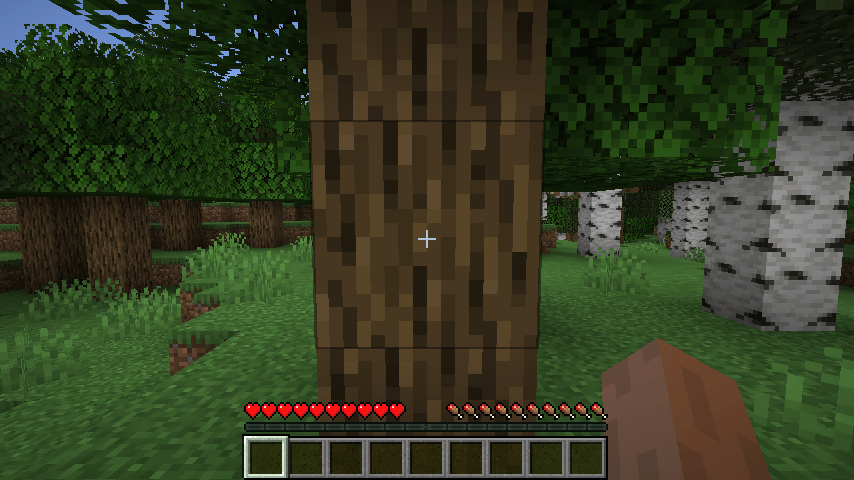
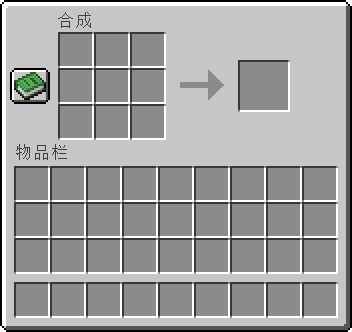

# 游戏的基本规则

《我的世界》是一款简单又复杂的游戏。说其简单，是因为游戏上手容易，能够迅速使人得到游玩的快乐；说其复杂，则是因为其规则众多，加之以官方和第三方的模组配合，组合起来的玩法更是无穷无尽。

下面我们将介绍游戏内的基本游玩规则。

## 破坏方块

初来乍到，你会发现你的物品栏里空无一物，不要担心，这是因为你需要通过 **破坏** 获取方块。破坏是游戏非常重要的规则之一，并且有很多衍生的机制。例如，有的方块被破坏后会掉落自身，有的方块被破坏后什么都不会掉落，有的方块则是固定或随机掉落一些其他的物品。通过破坏，你可以做到方块的获取，或物品的转换。一些工具也会加速方块破坏，或改变方块的掉落物。

参考资料：

- [挖掘](https://zh.minecraft.wiki/w/挖掘)

## 放置方块

有破坏就有放置。 **放置** 是你将手里的方块放在地上的方式。通过放置，你可以建造你自己的建筑和奇观，与这个世界深度交互。

## 配方

配方是你用来转换方块、物品的最主要途径，这包括 **合成** 、 **烧炼** 、 **烟熏** 、 **锻造** 、 **切石** 、 **酿造** 、 **制图** 、 **纺织** 等各类系统。以合成为例，你只需要将物品按照特定的顺序和位置摆放在物品栏的2x2网格或工作台的3x3网格上，你便可以得到新的物品。善用配方将有助于更好地进行发展。下图是工作台上的合成网格。

参考资料：

- [合成](https://zh.minecraft.wiki/w/合成)
- [烧炼](https://zh.minecraft.wiki/w/烧炼)
- [药水酿造](https://zh.minecraft.wiki/w/药水酿造)
- [锻造](https://zh.minecraft.wiki/w/锻造)

## 伤害

通过对实体 **攻击** ，便可以对其造成伤害，同理，一些敌对实体也会对你造成伤害。每个实体，包括你自己，都有一个被称为 **生命值** 的属性。俗话说得好，人被攻击，就会掉血。通过造成各种各样的伤害，你可以从实体身上搜集到各式各样的战利品，这有助于游玩进程的进一步发展。

参考资料：

- [伤害](https://zh.minecraft.wiki/w/%E4%BC%A4%E5%AE%B3)

- [近战攻击](https://zh.minecraft.wiki/w/近战攻击)
- [爆炸](https://zh.minecraft.wiki/w/爆炸)

## 饥饿

在《我的世界》中，无论你做什么，你都会有一个被称为 **饥饿值** 的属性在逐步降低。饥饿值反映了你当前的饱食情况，当饥饿值降低至0时，你的生命值便会开始损失。反之，当你的饥饿值回满时，你的生命值便开始增加，这是为数不多的生命值 **治疗** 方法。许多食物都可以回复你的饥饿值，这边是 **饮食** 系统的重要性。多做一些食物，这有助于你时刻保持饱腹的状态，以防血条归零而死亡。

参考资料：

- [饥饿](https://zh.minecraft.wiki/w/饥饿)
- [食物](https://zh.minecraft.wiki/w/食物)

## 更多

《我的世界》中的机制纷繁复杂，在后续的课程中，我们将介绍更多更高级或核心的机制，让你对《我的世界》游戏的理解更上层楼。

参考资料：

- [认识《我的世界》](https://mc.163.com/dev/mcmanual/mc-dev/mconline/100-历史归档教程/10-addon%E6%95%99%E7%A8%8B/%E7%AC%AC02%E7%AB%A0%EF%BC%9A%E8%AE%A4%E8%AF%86Minecraft%E4%B8%96%E7%95%8C/%E8%AF%BE%E7%A8%8B01.%E8%AE%A4%E8%AF%86Minecraft%E4%B8%96%E7%95%8C.html)
- [新版-认识《我的世界》](https://mc.163.com/dev/mcmanual/mc-dev/mconline/100-历史归档教程/15-%E7%8E%A9%E6%B3%95%E7%BB%84%E4%BB%B6%E6%95%99%E7%A8%8B%E3%80%90%E6%96%B0%E7%89%88%E3%80%91/1-%E8%AE%A4%E8%AF%86%E6%88%91%E7%9A%84%E4%B8%96%E7%95%8C/0-%E6%91%98%E8%A6%81.html)