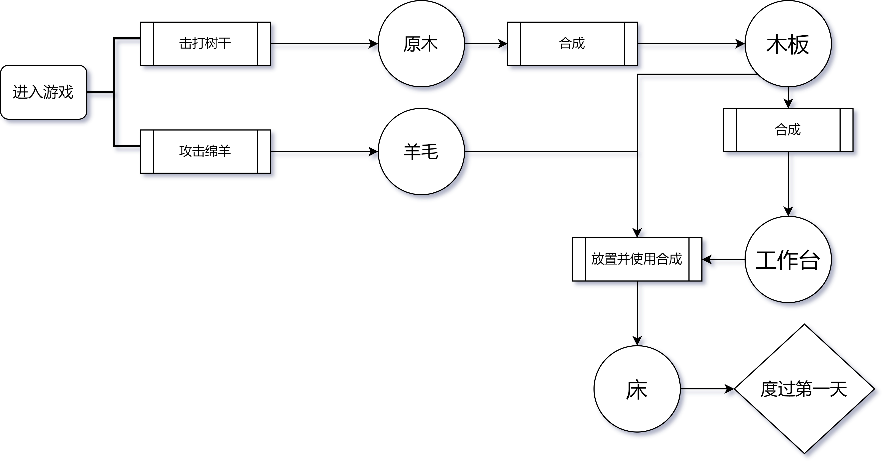
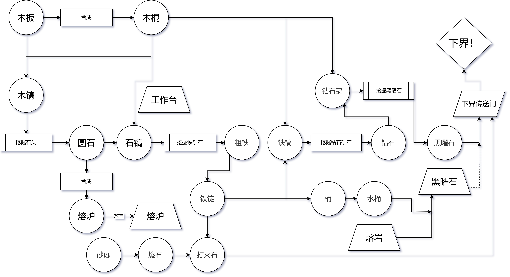

# 游戏流程与目标（前）

在本节中，我们将介绍《我的世界》游戏的核心游戏流程。虽然《我的世界》的游戏玩法非常自由，但是官方还是为你铺设了一条可以参考的游戏流程。通过理解这个流程，将有助于你理解整个游戏的大玩法以及开发团队的核心思想，从而更好地制作出模组作品。

## 度过第一天

当来到《我的世界》游戏之后，你所处的世界被称为主世界。刚开局的你自然是手无寸铁。游戏的夜晚会刷新怪物，为了在火力不足的游戏前期不和怪物针锋相对，最推荐的度过第一天的方法便是找一张床睡一觉。主世界中随处可见的绵羊是你的羊毛的主要来源。羊被击杀或者被剪羊毛时都会掉落羊毛，羊毛是制作床的主要材料。但是你此时并没有剪刀，因此你需要赤手和绵羊打一架。绵羊是友好生物，所以并不会反击，这点可以放心。

床的另一种材料是木板。木板可以由原木直接合成出来。因此接下来你需要收集木头。找到一棵树，破坏它的树干，你便可以得到一块原木。接下来，问题便来到了如何合成一张床。

床的合成需要3x3的网格，而你物品栏里自带的合成只有2x2，因此你需要首先合成一个支持3x3合成网格的工具——工作台。如果你已经阅读了上一课，那么刚才所述的内容你应该都已经了解该如何操作了。

现在，将床放置在地上，等到夜晚来临时，使用床度过夜晚吧。

## 前期

前期的主要目标便是前往下一个维度：下界。下界在一些玩家口中也会被称为地狱，这里确实如同地狱一般，到处都是熔岩和怪物。不过，这里也是你发展各种玩法的材料来源。为了去往下界，你需要一个下届传送门。下界传送门需要用黑曜石搭建一个立式门框，然后再在中间点火。之后，门框中间便会生成一个传送门。走进该门，便可以前往下界。

所以你的目标便是获取黑曜石。黑曜石来源于熔岩和水的碰撞，当熔岩源和水接触在一起时，便会在原地生成一块黑曜石取代熔岩源。在主世界的地下你可以找到大量的熔岩湖，在一些生物群系的地表，你也可以发现一些熔岩湖。用水泼在上面就好了。

黑曜石需要钻石镐才能正常挖掘，否则黑曜石被破坏后将不会掉落任何东西。所以你的次级目标是钻石。钻石矿也需要至少是铁镐才能正常采掘。所以你需要铁。挖掘铁矿则至少需要石镐，而挖掘石头则需要木镐。现在，用你手里的原木拆成木板，再把木板拆成木棍，然后在工作台上制作一把木镐吧。

挖掘到铁后，你得到的是粗铁，你需要熔炉烧炼才能获得铁镐的原材料——铁锭，这便是前文提到的烧炼的配方。同样，桶也需要铁锭来合成。有了桶，你才可以搬运液体，例如水和熔岩。你可以把水收纳到桶里，再浇到熔岩上。小心，熔岩很烫！

最后便是在黑曜石框架上点火了。点火需要打火石。打火石需要一块铁锭和一块燧石。不要担心，燧石来自于砂砾，破坏砂砾有低概率获得燧石，而砂砾你徒手就可以挖。你可以在河底、海底、一些生物群系的地表以及整个主世界的地下发现砂砾。

对着黑曜石框架点火，至此，你便创建了一个下界传送门。当然，你不必这么快就进入下界。在你发展下界传送门的期间，你也可以好好逛逛主世界。主世界物产丰富，你可以有很多地方可以游玩。当你进入下界传送门后，下界对应位置也会生成一个传送门，你随时可以回来。

## 后续

在理解了前期的流程之后，你可以开启下一节来继续认识中《我的世界》后期的游戏流程。
