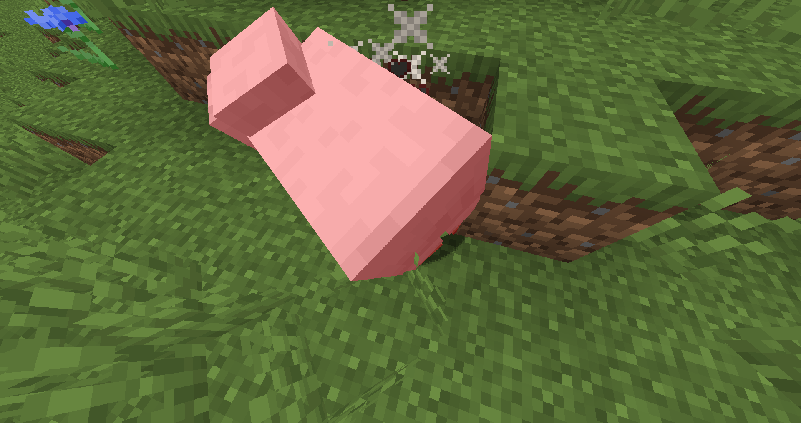
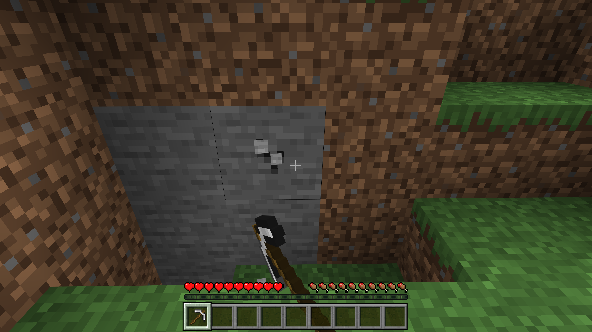
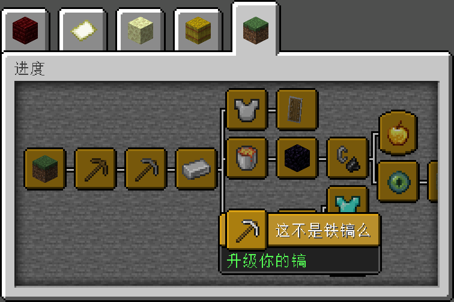

# 游戏的平衡性

在本节中，我们将一起了解游戏的平衡性，探讨《我的世界》中平衡性都存在于哪些方面，并思考如何维持平衡。

## 战斗力的平衡

《我的世界》中最主要的平衡性便是战斗力的平衡。一般而言，玩家的血量是不会变的，因此玩家需要穿戴盔甲来增加护甲值，也就相当于防御力。怪物的血量则随着游玩深度的增加而增加，相反，大部分怪物是没有护甲值的。玩家的武器在原版中可以随着游玩的深度的增加而最多提高到下界合金级。一把下界合金剑的伤害是8点血量（Java版）或9点血量（基岩版）。怪物的伤害也会随着深入而逐渐增加。末影龙最高可以一次打出15点血量伤害，凋灵一次最高可以打出22.5点伤害，当然，这些伤害是在计算玩家的护甲值和附魔的魔咒之前的数值。实际打在玩家身上并没有那么多。

原版的战斗力基本上是平衡的，当你拥有了钻石盔甲后就可以和Boss们硬碰硬了，下界合金盔甲更是使你的战斗更加安逸。与此相对的，高战斗力装备并不容易获取。钻石只有在地下深处零星分布，一个区块只会生成一簇。下界合金更是只能在下界的最高层和最底层以远古残骸的形式鲜有分布，四个远古残骸才能合成一块下界合金。这让玩家的战斗力不会过分膨胀。

我们在设计模组时，也要顾及到这些方面。高战斗力的材料不能太容易就获取到，与此同时，战斗力也不可以过分高涨。设想，一旦你设计出了一把一次可以打20点伤害的剑，原版的怪物就可以如杀鸡屠狗般被一刀毙命了。如果你的剑的材料非常廉价，那么这将是非常危险的设计。

## 生产力的平衡

在原版的设计中，工具存在挖掘等级。只有达到石质等级才可以挖铁，只有达到铁质等级才可以挖掘钻石，只有达到钻石等级才可以挖掘下界合金。并且，不同的方块有着不同的挖掘速度。往往后期才能接触到的方块挖掘起来也更加费时。随着工具等级的增加，挖掘同一种方块的速度也会逐渐变快。这些设计都是在限制你的生产力。

我们设计的模组也应遵循这套平衡机制。随着玩家游玩的深入，他们的生产速度才会逐步增加，同时他们也将遇到需要更高级生产力才能获取的资源，从而进一步激发他们继续游玩下去。这样，我们的模组才可以持续发展，并且得到玩家更多的青睐。

试想，如果玩家过于简单地得到了拥有极高挖掘速度的镐子，那么他今后游玩将与开启了创造模式无异，这在短期内可能会使玩家兴趣大增，但是长期而言玩家会很快失去兴趣，并离你的模组而去。毕竟，如果这么设计，我为什么不直接开启创造模式玩呢？

## 进度的平衡

最后一种平衡是游戏进度的平衡。游戏不要进展得过快，也不要进展得过慢。过快的进度会让玩家很快地结束你的模组的游玩，并不能使他们更好地体验你的模组。过慢的进度会让玩家如同坐牢，进而放弃继续游玩，甚至会在心底给你的模组贴上差评的标签，影响模组的风评。

当然，具体的进展速度还要依赖于你创作的内容而定。如果你本身就不打算创作长线模组，模组的进展也将不那么重要。

## 总结

游戏内的平衡性决定着玩家的依赖度、玩家的体验和评价等方方面面。为了使玩家有一个良好的游玩体验，也为了你的模组能够更加畅销，注意游戏的平衡将至关重要。