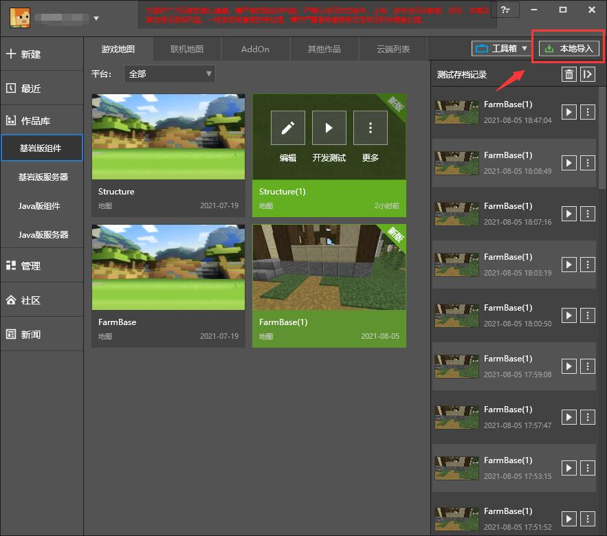
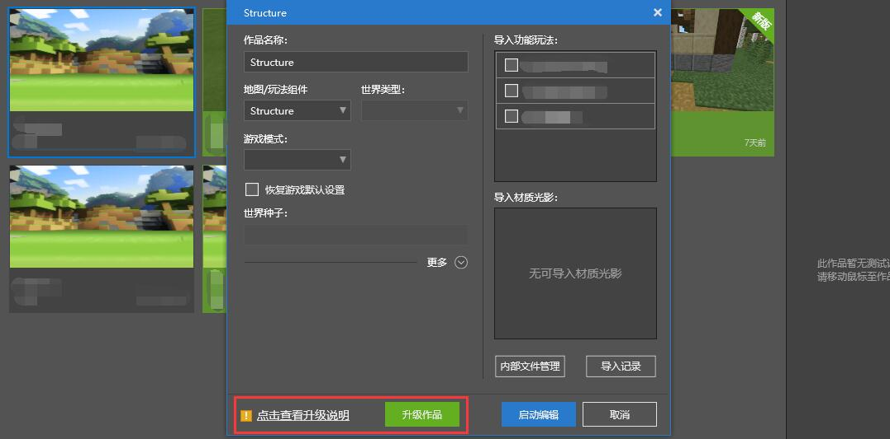
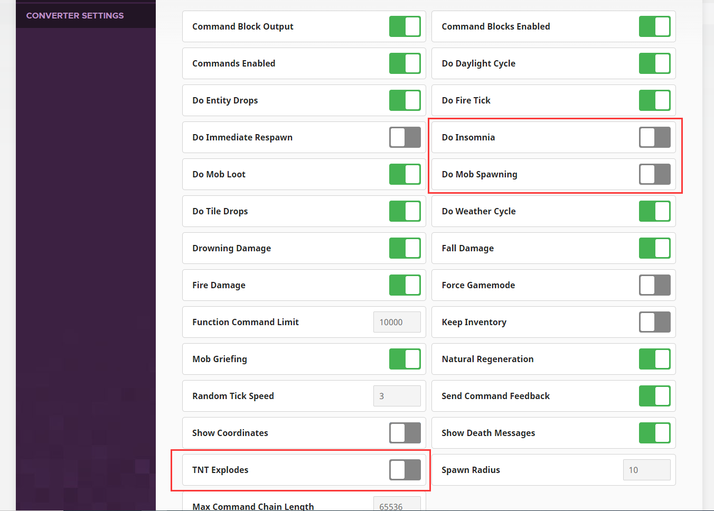
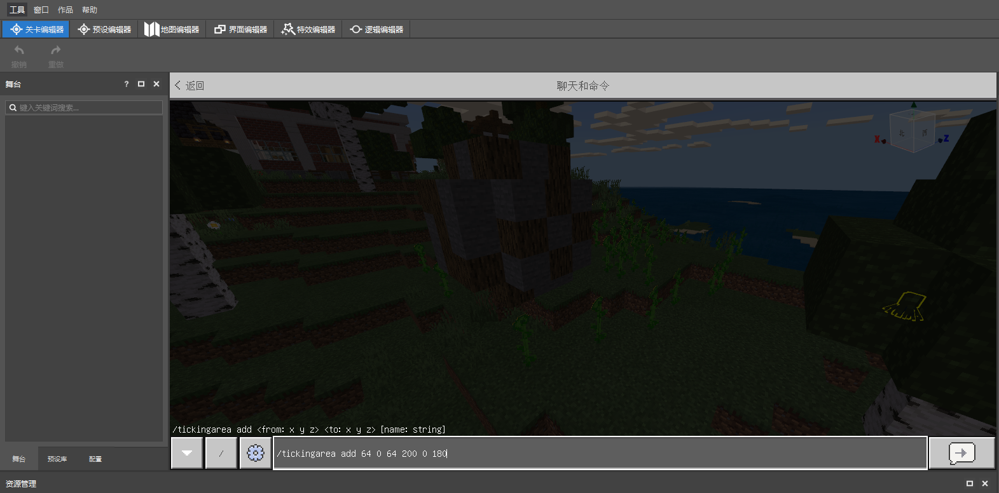

# 在MCSTUDIO内创建地图工程

玩法地图教程为您提前准备好了地图存档资源，包括**Structure存档**和**FarmWorld存档**。其中**Structure存档**是一张超平坦地图，此次所有的单个建筑都罗列在该地图的出生点周围。这么做的处理是因为在超平坦世界中建造独栋建筑时，不会受到**地形影响建筑建造**的困扰，同时可以更加直观地看到**所有建筑的风格和规模**，方便建筑师进行统一规划和调整。**FarmWorld存档**则是主题玩法地图的地形存档。我们将会使用这两张地图来合成出最终完整的地图大观。

## 本地导入地图资源

进入MCSTUDIO作品库，选择基岩版组件。点击右上角的本地导入，资源类型选择地图，并通过选择功能在窗口中选择**Structure存档**和**FarmWorld存档**，最后再点击导入按钮即可完成导入操作。



在未来，新版编辑器将多方位覆盖开发者的日常开发流程。我们推荐您将地图作品升级成新版格式，提前体验新版编辑器的魅力。



## 使用chunker改变地图的属性

为了降低《我的海滨农场》的开发上手难度，在这张地图内，我们只考虑玩家在**单人环境**中游玩的情况。因此我们选择不将玩家房间暴露在本地局域网或者联网环境中。

我们在对地图资源进行预处理的时候已经提前关闭了这些设定，但你也可以在未来对其他地图通过同样的方法再次重复这个操作。

您必须使用相关的地图处理工具去处理地图。这里推荐使用[chunker](https://chunker.app/)对地图进行NBT修改。NBT在基岩版中同样存在，并且在地图文件里会管理地图的一些基本设定。在将地图上传成功后，请选择右下角的Advance Settings，接着选择WORLD SETTINGS，手动关闭**Multiplayer Game Enabled**、**Visible to Multiplayer**、**LAN Broadcast Enabled**、**Visible to LAN Players**等开关。


我们同样需要关掉**Do Insomnia**、**Do Mob Spawning**与**TNT Explodes**，这样可以避免玩家在地图里遇到TNT爆炸、自然生物生成和幻翼的干扰。



接着点击CONVERT再次转换源文档，并DOWNLOAD下载到本地。

## 添加常加载区域

通常情况下，世界上正处于被加载的区域都围绕在玩家周围。在玩家移动的过程中，进入范围内的新区块区域会被加入区块更新的列表里，而离开范围内的旧区块则会停止更新。为了在后续教程中我们可以使用ModSDK获取加载区域内的方块与实体信息，在这里需要将主岛所横跨的区块都放进常加载区域里。使用**/tickingarea**指令可以帮助我们完成这个效果：

```
/tickingarea add 64 0 64 200 0 180
```

在关卡或地图编辑器里按下/键呼出输入框，即可插入这段指令。

