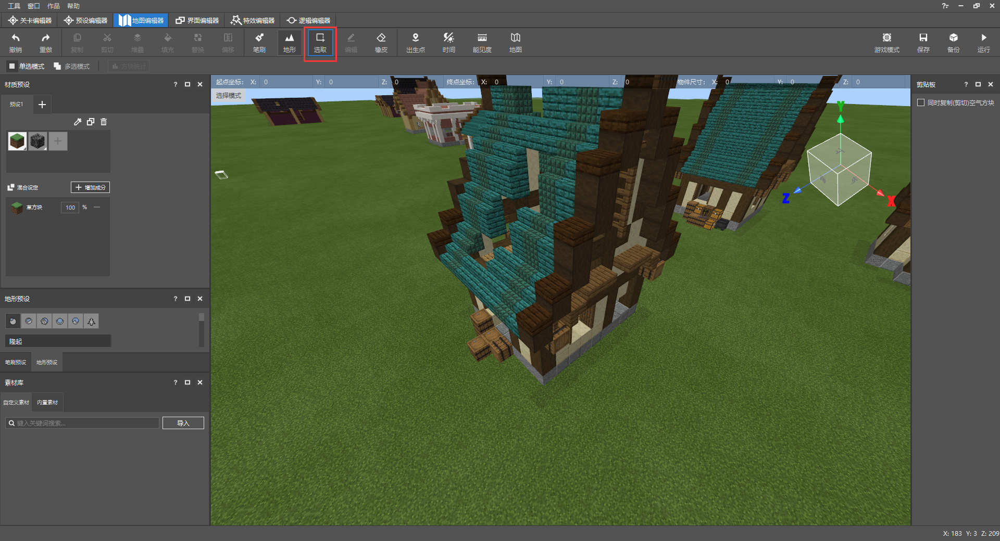
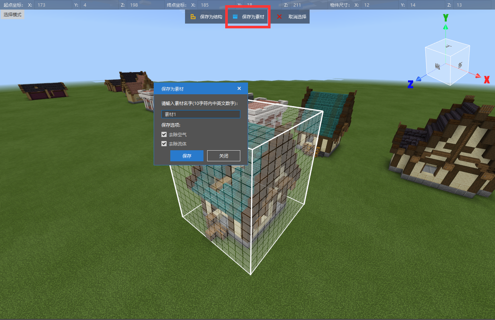

# 在地图工程中保存资源素材

由于独立建筑与地形大观分开在两张地图存档内，我们需要先通过地图编辑器将超平坦内的建筑导出成自定义素材，让我们看看应该怎么做吧！

## 导出自定义建筑素材

对新版格式的**Structure地图作品**点击编辑，进入编辑器世界。

使用选区工具，在超平台地形上对建筑底部进行框选。

通过点击框选格的上部面，使用鼠标拖拉可以抬高框选格的高度，将整个**玩家之家**与地下一格的草方块全部选中。

使用坐标轴对框选方格整体抬高一格，并点击上部方格面降低一格高度，以去除地下一格草方块的空间间隙。

点击**保存素材**，素材支持10字符内的中文、英文与数字组合，并且导出的mdl格式只支持在编辑器内流通，或者使用预设API在游戏内进行放置。默认选择下会勾选去除空气和**去除流体**，若建筑内带有流体，可以去掉**去除流体**的勾选。

保存的自定义素材会放在**素材库**的**自定义素材**下。**自定义素材**存放于公共的编辑器文件夹，不同地图的地图编辑器都可以检索到之前准备好的**自定义素材**。