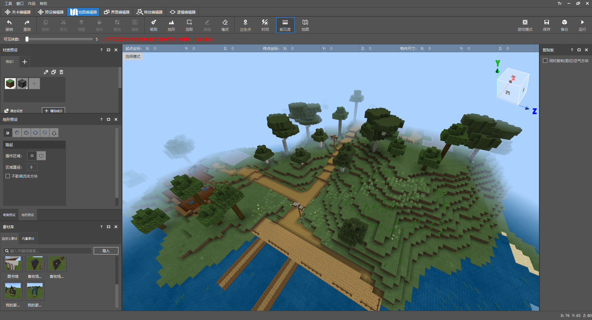

# 尝试熟悉基本的地图编辑器功能

进入**FarmWorld存档**作品时，地形中预放的地基为我们提供了素材的放置坐标。通过几个基础的编辑地图步骤，我们也能够轻松地将建筑装饰进世界当中。

## 调整能见度

原来的地图编辑器提供的能见度非常低，通过上帝视角俯瞰地形时，只有一小部分的地形会进入视野。我们使用**能见度功能**可以快速增加能够看见的区块的格数。

点击**能见度**可以拖拉可见区块的数量，进度越长，代表可以看到的范围越大。

**注意：请不要过度增加可见区块的数量，这将会对您的电脑设备造成极大的负荷压力！**

## 调整时间

地图编辑器中的世界也会随着时间流逝进行昼夜更替。您可以点击**时间功能**切换游戏时间，让世界一直保持白天。

## 放置自定义素材

我们通过单击素材选项后即可在游戏区域任意拖动。接着点击游戏任意坐标，并再次点击确认生成即可将素材建筑重新加入世界。若在改动后想要撤回，可以使用CRTL+Z快捷键撤回到前一次的操作步骤。

