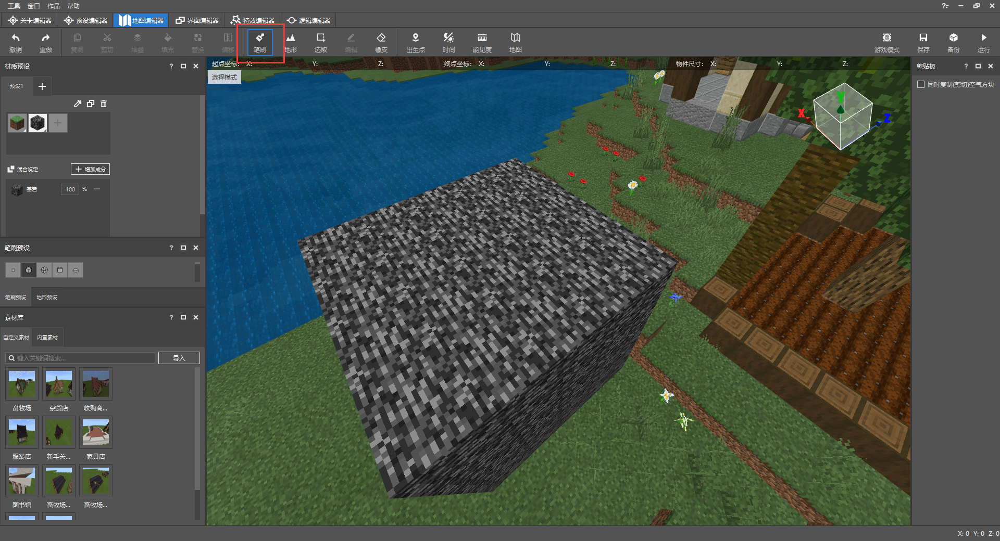
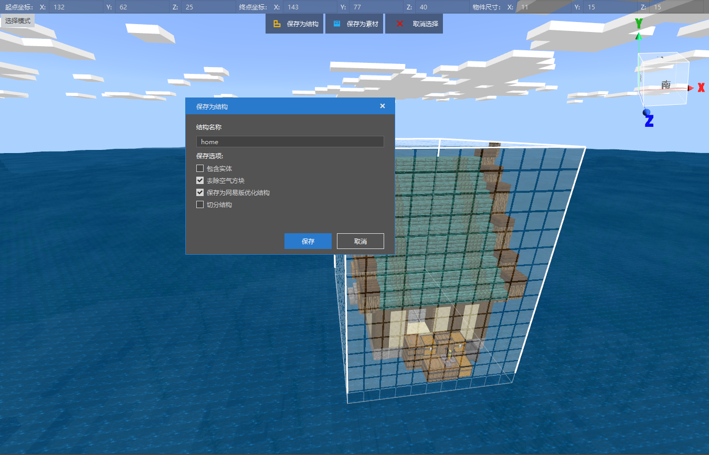

# 规划可轻微变动区域

小岛上的农场之家会为玩家提供一处开辟好的农田供玩家种植庄稼，同时地图还会涉及多个供玩家采集木头、石头、的资源点。它们可以帮助玩家有足够的材料修复农场设施。在上一章节中，我们为玩家提供了一个固定刷新的工具食物箱。借助原版游戏的玩法系统，我们初步为玩家营造了一个可持续生产的生产环境。但这里也同时存在一些问题：

- 锄头可以无视等级权限开垦所有泥土。
- 木头、石头资源点被玩家挖空后无法再生。
- 玩家需要通过回收资源解锁农场之家和畜牧场。

为了解决以上问题，使用ModSDK框架可以帮助我们非常迅速地解决以上问题。让我们来看看怎么做吧！

<iframe src="https://cc.163.com/act/m/daily/iframeplayer/?id=6152b923b8a81f8fa07dc899" height="600" width="800" allow="fullscreen" />

## 接入Mod环境

编辑器会在地图工程内新建Mod脚本文件夹，文件夹会以**Script_NeteaseMod**加上一串随机字符组成。


> - modMain.py文件是该Mod脚本的主入口，一个脚本文件夹的主目录下有且只能有一个入口文件，我们也只能在这里注册自定义的服务端与客户端系统。
> - 自定义系统是个类，在没有学习到Python编程中面向对象的环节前，您可以简单理解为自创一个系统入口。这个入口会依据跑在服务端还是客户端的环境下，被挂接到由@Mod.InitServer()或Mod.InitClient()装饰的函数里。在客户端上运行则使用clientApi.RegisterSystem接口，在服务端上运行则使用serverApi.RegisterSystem接口。
> - RegisterSystem接受3个参数，第一个参数是该Mod的唯一通信标识符。第二个是自定义系统名称。第三个是自定义系统类的路径。唯一通信标识符和自定义系统名称建议使用可读性强、令人印象深刻且独一无二的名字，这会帮助游戏引擎能够更好地分辨出来自不同Mod的各种系统入口。使用重复性高的名字可能会导致脚本引擎在注册自定义系统时无法辨识来源而造成Mod加载失败。路径参数会合并文件路径与系统类的名字，以下图代码为例：若系统类在py文件里用**Main**作名称，系统文件以**blockListene**r为py文件名，并且它还被包裹在Mod主目录的server文件夹内。则路径会以**Script_Netease{随机字符串}.server.blockListener.Main**来排序。

```python
# -*- coding: UTF-8 -*-
from mod.common.mod import Mod
import mod.server.extraServerApi as serverApi
import mod.client.extraClientApi as clientApi


@Mod.Binding(name="NeteaseModw7ijjGNn", version="0.1")
class NeteaseModw7ijjGNn(object):

    def __init__(self):
        pass

    @Mod.InitClient()
    def NeteaseModw7ijjGNnClientInit(self):
        # type: () -> None
        """Mod被挂载时，在这里注册自定义MOD客户端系统"""
        pass

    @Mod.InitServer()
    def NeteaseModw7ijjGNnServerInit(self):
        # type: () -> None
        """Mod被挂载时，在这里注册自定义MOD服务端系统"""
        serverApi.RegisterSystem("FarmMod", "ServerBlockListenerServer",
                                 "Script_NeteaseModw7ijjGNn.server.blockListener.Main")
        pass

    @Mod.DestroyClient()
    def NeteaseModw7ijjGNnClientDestroy(self):
        # type: () -> None
        """Mod被卸下时，销毁自定义MOD客户端系统"""
        pass

    @Mod.DestroyServer()
    def NeteaseModw7ijjGNnServerDestroy(self):
        # type: () -> None
        """Mod被卸下时，销毁自定义MOD客户端系统"""
        pass
```

> - 自定义系统内可以监听原版事件和自定义Mod事件。
> - 根据服务端与客户端的区别 ，我们在<a href="../../../mcdocs/1-ModAPI/事件/世界.html" rel="noopenner"> 模组SDK文档 </a>用相应的原版事件来定义一个回调函数。回调函数内会返回这个事件传递的数据信息，通过对数据的提取、类型判断、创建接口，可以实现丰富的玩法逻辑。
> - 在自定义系统类里，我们也可以将常用的代码块用函数封装，实现更高的开发效率。

## 阻止玩家对其他区域做出耕地行为

在地形大观里，一共有三种方块会被锄头耕耘，它们分别是**草地**、**泥土**和**土径**。其中**泥土**是允许玩家还耕的方块类型。

我们使用**ServerBlockUseEvent**事件来监听玩家交互方块的行为，并在玩家手持石锄时阻止他们进一步操作。


为了阻止玩家能够任意翻弄草地和土径，我们需要将他们加入监听方块被交互的白名单里，并在事件中取消石锄与方块的交互行为。完整代码如下：

```python
# -*- coding: UTF-8 -*-
from mod.server.system.serverSystem import ServerSystem
from mod.common.minecraftEnum import ItemPosType
import mod.server.extraServerApi as serverApi

# 自定义Mod服务端系统类
class Main(ServerSystem):

    def __init__(self, namespace, system_name):
		# 继承父类
        ServerSystem.__init__(self, namespace, system_name)
        namespace = serverApi.GetEngineNamespace()
        system_name = serverApi.GetEngineSystemName()
        # 监听交互方块事件
        self.ListenForEvent(namespace, system_name,
                            'ServerBlockUseEvent', self, self.using_item)
        # 根据文档描述，原版方块需要通过添加进交互方块的白名单内才能触发ServerBlockUseEvent
        block_comp = serverApi.GetEngineCompFactory().CreateBlockUseEventWhiteList(serverApi.GetLevelId())
        # 在地图的方块结构里，一共受到锄头影响的两种地形方块是
        self.blocked_list = ["minecraft:grass", "minecraft:grass_path"]
        for block_name in self.blocked_list:
            # 加入白名单
            block_comp.AddBlockItemListenForUseEvent(block_name)

    # 交互方块事件
    def using_item(self, event):
        # 获取玩家ID
        player_id = event['playerId']
        # 创建玩家的物品接口
        item_comp = serverApi.GetEngineCompFactory().CreateItem(player_id)
        # 获取玩家手持物品信息
        carried_item = item_comp.GetPlayerItem(ItemPosType.CARRIED, 0)
        # 获取事件里交互的方块类型
        block_name = event['blockName']
        # 判断方块类型是否是土径或草地，并判断玩家手持物品是否是石锄
        if carried_item and carried_item['newItemName'] == 'minecraft:stone_hoe' and block_name in self.blocked_list:
            # 取消交互
            event['cancel'] = True
```

最后，我们将编辑器界面切换至地图编辑器，通过游戏模式功能进入内嵌的游戏环境。现在使用锄头无法耕耘泥土和土径，但玩家还能将泥土还原成耕地！


## 循环可再生的资源点

获取金币是玩家解锁更多家具、衣服、扩大农业规模的重要途径。直接的经济来源来自玩家进行农业生产活动的收益。但农产品的成熟存在着一个客观地生长周期，作物会随着游戏随机刻的递进而提升生长阶段，这可能会使玩家觉得时间过得很枯燥。因此，加入木头与石材的资源点设定，是一种改变玩家游戏节奏的方式。我们为玩家提供额外的金币获取渠道的同时，也让他们能够更加有充实感地利用时间。

首先是使用地图编辑器预制资源区域。点击笔刷功能。



若**笔刷预设面板**处于折叠状态，可以点击与其他面板的连接区域进行拉伸。这里我们使用**圆预设**，默认使用高度5，长度5，宽度5的大小。


在**混合设置**里对**笔刷**的立体区域方块进行成分设置。点击**添加成分**按钮，将设定调整为笔刷形状会混合50%石头和50%木头。


在教程里，我们只设置5个资源点，并用选取工具资源点的最左下角的坐标记录下来。最后再通过保存结构的方式将资源点保存至本地行为包内，并使用ModSDK定时重置它们。

> **结构**与**素材**的区别在于：前者是我的世界基岩版的通用格式，而后者是MCSTUDIO所保存的模板格式。开发者和玩家可以通过分享结构，在游戏里或者使用ModSDK生成出来。而素材大多情况下是围绕着MCSTUDIO去使用的。但两者功能都是将地图建筑作为模板，方便我们在改变场景方块的时候能够直接调用它们。

```python
# -*- coding: UTF-8 -*-
from mod.server.system.serverSystem import ServerSystem
from mod.common.minecraftEnum import ItemPosType
import mod.server.extraServerApi as serverApi


class Main(ServerSystem):

    def __init__(self, namespace, system_name):
        # 继承父类
        ServerSystem.__init__(self, namespace, system_name)
        namespace = serverApi.GetEngineNamespace()
        system_name = serverApi.GetEngineSystemName()
        # 监听交互方块事件
        # ...........
        self.resources_pos = [
        	# 资源点1的起始坐标
            (73, 64, 57),
            # 资源点2的起始坐标
            (51, 63, 101),
            # 资源点3的起始坐标
            (82, 68, 136),
            # 资源点4的起始坐标
            (198, 65, 102),
            # 资源点5的起始坐标
            (82, 68, 136)
        ]
        # 结构名称，以行为包根目录/structures内的[文件夹名称:结构名称]为格式
        self.resource_identifier = 'design:resource'
        # 添加一个60秒重置资源点的定时任务
        game_comp = serverApi.GetEngineCompFactory().CreateGame(serverApi.GetLevelId())
        game_comp.AddRepeatedTimer(60.0, self.resource_placed)

    # 交互方块事件
    def using_item(self, event):
        # .....
        pass

    def resource_placed(self):
        # 创建放置结构的接口
        game_comp = serverApi.GetEngineCompFactory().CreateGame(serverApi.GetLevelId())
        for pos in self.resources_pos:
            # 放置资源点结构
            game_comp.PlaceStructure(None, pos, self.resource_identifier)

```


## 加入农场之家和畜牧场的修复方案

首先，在海面上拖出完整的农场之家和畜牧场建筑模板，并将它们保存成结构并去除空气方块。之后使用Delete快捷键直接删除。这么做可以最大程度减少临时建筑对地形造成的影响（如吃掉部分方块，把草地退回成泥土）。




接着，我们使用地图编辑器，在两个待修复的独立建筑旁利用游戏模式放置木牌，为木牌写上单独的文字提示。


接下来我们就可以用ModSDK来监听玩家点击木牌，根据玩家的资源储量和木牌内容来决定是否有条件修复相应建筑！以下是详细代码与注释：

```python
# -*- coding: UTF-8 -*-
from mod.server.system.serverSystem import ServerSystem
from mod.common.minecraftEnum import ItemPosType
import mod.server.extraServerApi as serverApi


class Main(ServerSystem):

    def __init__(self, namespace, system_name):
        # 继承父类
        ServerSystem.__init__(self, namespace, system_name)
        namespace = serverApi.GetEngineNamespace()
        system_name = serverApi.GetEngineSystemName()
        # 监听交互方块事件
        self.ListenForEvent(namespace, system_name,
                            'ServerBlockUseEvent', self, self.using_item)
        # 根据文档描述，原版方块需要通过添加进交互方块的白名单内才能触发ServerBlockUseEvent
        block_comp = serverApi.GetEngineCompFactory().CreateBlockUseEventWhiteList(serverApi.GetLevelId())
        # 在地图的方块结构里，一共受到锄头影响的两种地形方块是
        self.blocked_list = ["minecraft:grass", "minecraft:grass_path"]
        for block_name in self.blocked_list:
            # 加入白名单
            block_comp.AddBlockItemListenForUseEvent(block_name)
        # 非常重要！告示牌的方块实体ID是minecraft:standing_sign而不是minecraft:sign
        block_comp.AddBlockItemListenForUseEvent("minecraft:standing_sign:*")
        # 储存资源点坐标
        self.resources_pos = [
            (73, 64, 57),
            (51, 63, 101),
            (82, 68, 136),
            (198, 65, 102),
            (82, 68, 136)
        ]
        # 结构名称
        self.resource_identifier = 'design:resource'
        # 添加一个60秒重置资源点的定时任务
        game_comp = serverApi.GetEngineCompFactory().CreateGame(serverApi.GetLevelId())
        game_comp.AddRepeatedTimer(60.0, self.resource_placed)

    # 交互方块事件
    def using_item(self, event):
        # 获取玩家ID
        player_id = event['playerId']
        # 创建玩家的物品接口
        item_comp = serverApi.GetEngineCompFactory().CreateItem(player_id)
        # 获取玩家手持物品信息
        # .....
        # 获取事件里交互的方块类型
        block_name = event['blockName']
        x = event['x']
        y = event['y']
        z = event['z']
        # 判断方块类型是否是土径或草地，并判断玩家手持物品是否是石锄
        # ......
        # 判断是否是木牌
        if block_name == 'minecraft:standing_sign':
            # 创建方块信息接口
            block_comp = serverApi.GetEngineCompFactory().CreateBlockInfo(player_id)
            # 获取文告示牌字
            text = block_comp.GetSignBlockText((x, y, z))
            if '升级小屋' not in text:
                return
            # 木头数量
            log_count = 10
            # 石头数量
            stone_count = 5
            # 获取玩家背包的全部物品
            item_dict_list = item_comp.GetPlayerAllItems(ItemPosType.INVENTORY)
            # 通过枚举列表内的信息，遍历列表下标与物品信息
            for index, item_dict in enumerate(item_dict_list):
                # 如果物品是木头且剩余量大于0
                if item_dict and item_dict['itemName'] == 'minecraft:log' and log_count > 0:
                    # 将木头数量赋值一个临时变量
                    temp = item_dict['count']
                    # 该槽的木头数量扣去余额数量
                    temp -= log_count
                    # 如果该槽的木头数量不足以吃掉全部的木头剩余量
                    if temp < 0:
                        # 设置该槽的木头数量为0，即代表该槽为空
                        item_dict['count'] = 0
                        # 扣去临时贮存的木头数量
                        log_count -= temp
                        # 直接跳过后面代码进入下一次循环
                        continue
                    # 否则，扣除对应槽位的木头数量
                    item_dict['count'] = temp
                    # 清零木头所需剩余量
                    log_count = 0
                # 如果物品是石头且剩余量大于0
                if item_dict and item_dict['itemName'] == 'minecraft:stone' and stone_count > 0:
                    # 将木头数量赋值一个临时变量
                    temp = item_dict['count']
                    # 该槽的石头数量扣去余额数量
                    temp -= log_count
                    # 如果该槽的石头数量不足以吃掉全部的木头剩余量
                    if temp < 0:
                        # 扣去临时贮存的木头数量
                        item_dict['count'] = 0
                        # 扣去临时贮存的石头数量
                        stone_count -= temp
                        # 直接跳过后面代码进入下一次循环
                        continue
                    # 否则，扣除对应槽位的石头数量
                    item_dict['count'] = temp
                    # 清零石头所需剩余量
                    stone_count = 0
            # 如果log_count非0且stone_count非0，则放置修复的农场之家，并将木牌清除
            if not log_count and not stone_count:
                """
                使用字典推导式，下方等价于
                item_dict_map = {}
                for index in range(len(item_dict_list)):
                    item_dict_map[(ItemPosType.INVENTORY, index)] = item_dict_list[index]
                """
                item_dict_map = {(ItemPosType.INVENTORY, index): item_dict_list[index] for index in range(len(item_dict_list))}
                # 设置玩家的全部槽内物品
                item_comp.SetPlayerAllItems(item_dict_map)
                game_comp = serverApi.GetEngineCompFactory().CreateGame(serverApi.GetLevelId())
                # 放置家
                game_comp.PlaceStructure(None, (76, 66, 80), 'design:home')
                # 清除木牌
                block_comp.SetBlockNew((x, y, z), {
                    'name': 'minecraft:air'
                }, 0)

    def resource_placed(self):
        # 创建放置结构的接口
        # ...
        pass

```

可以看到，同样在下次判断玩家点击升级方块时是否满足升级要钱时，如果将判定代码块用函数封装起来，可以使得代码更加简洁，减少重复代码。这里我们用函数对一部分代码进行封装。

```python
# -*- coding: UTF-8 -*-
from mod.server.system.serverSystem import ServerSystem
from mod.common.minecraftEnum import ItemPosType
import mod.server.extraServerApi as serverApi


class Main(ServerSystem):

    def __init__(self, namespace, system_name):
        # ....
        pass

    # 交互方块事件
    def using_item(self, event):
        # .....
        pass

    def resource_placed(self):
        # ...
        pass

    def can_upgrade_structure(self, player_id, requirement):
        # type: (str, dict) -> (bool, list)
        """
        :param player_id: 玩家ID
        :param requirement: 物品需求，例->{"minecraft:log": 10, "minecraft:stone": 5}
        :return (bool, list): 是否可以升级建筑，玩家背包信息
        """
        # 创建玩家的物品接口
        item_comp = serverApi.GetEngineCompFactory().CreateItem(player_id)
        # 获取玩家背包的所有物品
        item_dict_list = item_comp.GetPlayerAllItems(ItemPosType.INVENTORY)
        # 通过枚举列表内的信息，遍历列表下标与物品信息
        for index, item_dict in enumerate(item_dict_list):
            # 如果该槽存在物品且物品在所需物品字典内，并且所需物品对应的数量大于0时
            if item_dict and item_dict['itemName'] in requirement and requirement[item_dict['itemName']] > 0:
                temp = item_dict['count']
                # 该槽物品数量扣去所需物品剩余数量
                temp -= requirement[item_dict['itemName']]
                # 如果该槽的物品数量不足以吃掉所需物品剩余数量
                if temp < 0:
                    # 设置该槽的物品数量为0，即代表该槽为空
                    item_dict['count'] = 0
                    # 扣去临时贮存的物品数量
                    requirement[item_dict['itemName']] -= temp
                    # 直接跳过后面代码进入下一次循环
                    continue
                # 否则，扣除对应槽位的物品数量
                item_dict['count'] = temp
                # 清零所需物品
                requirement[item_dict['itemName']] = 0
        # 返回是否满足升级条件，以及清零所需物品后的背包情况
        return not all(requirement.values()), item_dict_list

```

最后附上完整代码：

```python
# -*- coding: UTF-8 -*-
from mod.server.system.serverSystem import ServerSystem
from mod.common.minecraftEnum import ItemPosType
import mod.server.extraServerApi as serverApi


class Main(ServerSystem):

    def __init__(self, namespace, system_name):
        # 继承父类
        ServerSystem.__init__(self, namespace, system_name)
        namespace = serverApi.GetEngineNamespace()
        system_name = serverApi.GetEngineSystemName()
        # 监听交互方块事件
        self.ListenForEvent(namespace, system_name,
                            'ServerBlockUseEvent', self, self.using_item)
        # 根据文档描述，原版方块需要通过添加进交互方块的白名单内才能触发ServerBlockUseEvent
        block_comp = serverApi.GetEngineCompFactory().CreateBlockUseEventWhiteList(serverApi.GetLevelId())
        # 在地图的方块结构里，一共受到锄头影响的两种地形方块是
        self.blocked_list = ["minecraft:grass", "minecraft:grass_path"]
        for block_name in self.blocked_list:
            # 加入白名单
            block_comp.AddBlockItemListenForUseEvent(block_name)
        # 非常重要！告示牌的方块实体ID是minecraft:standing_sign而不是minecraft:sign
        block_comp.AddBlockItemListenForUseEvent('minecraft:standing_sign:*')
        # 储存资源点坐标
        self.resources_pos = [
            (73, 64, 57),
            (51, 63, 101),
            (82, 68, 136),
            (198, 65, 102),
            (82, 68, 136)
        ]
        # 结构名称
        self.resource_identifier = 'design:resource'
        # 添加一个60秒重置资源点的定时任务
        game_comp = serverApi.GetEngineCompFactory().CreateGame(serverApi.GetLevelId())
        game_comp.AddRepeatedTimer(60.0, self.resource_placed)

    # 交互方块事件
    def using_item(self, event):
        # 获取玩家ID
        player_id = event['playerId']
        # 创建玩家的物品接口
        item_comp = serverApi.GetEngineCompFactory().CreateItem(player_id)
        # 获取玩家手持物品信息
        carried_item = item_comp.GetPlayerItem(ItemPosType.CARRIED, 0, True)
        # 获取事件里交互的方块类型
        block_name = event['blockName']
        x = event['x']
        y = event['y']
        z = event['z']
        # 判断方块类型是否是土径或草地，并判断玩家手持物品是否是石锄
        if carried_item and carried_item['newItemName'] == 'minecraft:stone_hoe' and block_name in self.blocked_list:
            # 取消交互
            event['cancel'] = True
        # 判断是否是告示牌
        if block_name == 'minecraft:standing_sign':
            block_comp = serverApi.GetEngineCompFactory().CreateBlockInfo(player_id)
            text = block_comp.GetSignBlockText((x, y, z))
            # 需求列表
            requirement = {}
            # 结构名称
            structure_name = ''
            # 结构放置位置
            structure_pos = ()
            # 小屋升级方块坐标
            if '升级小屋' in text:
                requirement = {'minecraft:log': 10, 'minecraft:stone': 5}
                structure_name = 'design:home'
                structure_pos = (76, 66, 80)
            # 畜牧场升级方块坐标
            elif '升级畜牧场' in text:
                requirement = {'minecraft:log': 20, 'minecraft:stone': 10}
                structure_name = 'design:farm'
                structure_pos = (169, 66, 83)
            result, items = self.can_upgrade_structure(player_id, requirement)
            # 是否满足要求
            if result and structure_pos and structure_name and requirement:
                """
                使用字典推导式，下方等价于
                item_dict_map = {}
                for index in range(len(item_dict_list)):
                    item_dict_map[(ItemPosType.INVENTORY, index)] = item_dict_list[index]
                """
                item_dict_map = {(ItemPosType.INVENTORY, index): items[index] for index in range(len(items))}
                item_comp = serverApi.GetEngineCompFactory().CreateItem(player_id)
                # 设置玩家的全部槽内物品
                item_comp.SetPlayerAllItems(item_dict_map)
                game_comp = serverApi.GetEngineCompFactory().CreateGame(serverApi.GetLevelId())
                # 放置家
                game_comp.PlaceStructure(None, structure_pos, structure_name)
                # 清除木牌
                block_comp.SetBlockNew((x, y, z), {
                    'name': 'minecraft:air'
                }, 0, 0)

    def resource_placed(self):
        # 创建放置结构的接口
        game_comp = serverApi.GetEngineCompFactory().CreateGame(serverApi.GetLevelId())
        for pos in self.resources_pos:
            # 放置资源点结构
            game_comp.PlaceStructure(None, pos, self.resource_identifier)

    def can_upgrade_structure(self, player_id, requirement):
        # type: (str, dict) -> (bool, list)
        """
        :param player_id: 玩家ID
        :param requirement: 物品需求，例->{"minecraft:log": 10, "minecraft:stone": 5}
        :return (bool, list): 是否可以升级建筑，玩家背包信息
        """
        # 创建玩家的物品接口
        item_comp = serverApi.GetEngineCompFactory().CreateItem(player_id)
        # 获取玩家背包的所有物品
        item_dict_list = item_comp.GetPlayerAllItems(ItemPosType.INVENTORY)
        # 通过枚举列表内的信息，遍历列表下标与物品信息
        for index, item_dict in enumerate(item_dict_list):
            # 如果该槽存在物品且物品在所需物品字典内，并且所需物品对应的数量大于0时
            if item_dict and item_dict['itemName'] in requirement and requirement[item_dict['itemName']] > 0:
                temp = item_dict['count']
                # 该槽物品数量扣去所需物品剩余数量
                temp -= requirement[item_dict['itemName']]
                # 如果该槽的物品数量不足以吃掉所需物品剩余数量
                if temp < 0:
                    # 设置该槽的物品数量为0，即代表该槽为空
                    item_dict['count'] = 0
                    # 扣去临时贮存的物品数量
                    requirement[item_dict['itemName']] -= temp
                    # 直接跳过后面代码进入下一次循环
                    continue
                # 否则，扣除对应槽位的物品数量
                item_dict['count'] = temp
                # 清零所需物品
                requirement[item_dict['itemName']] = 0
        # 返回是否满足升级条件，以及清零所需物品后的背包情况
        return not all(requirement.values()), item_dict_list

```

