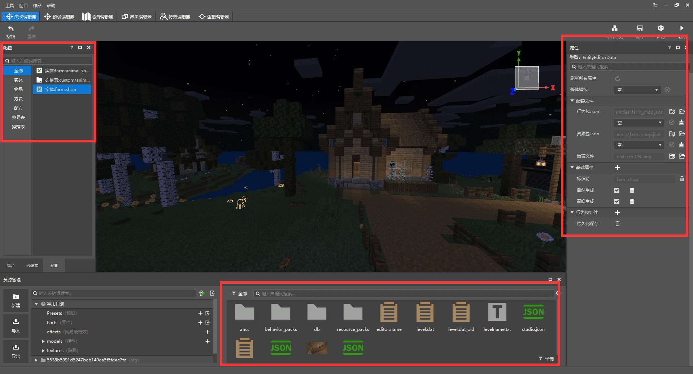

#  自定义NPC的基本行为

现在，已经基本具备海滨小岛的内容，不过还缺乏生机，岛上只有玩家自己是不行的，所以让我们来给小岛上添加各种各样的NPC吧。在添加NPC前，需要了解什么是[自定义生物](../../10-addon教程/第07章：自定义生物/课程01.认识自定义生物.md)，当我们创建一个基本的自定义生物后，就该把它变换一个“形态”，让其成为可以闲逛、交易、且生机勃勃的海滨岛民。


## 创建一个自定义生物

我们打开这个实体的行为文件，添加一些最基本的行为，让他们可以出现在地图上。除了基本的跳跃、开门、行走、碰撞体积、移动速度、闲逛外，还添加了一些稍微特殊的行为：

- 继承原版村民的特性，使其更加“真实”。
- 给NPC命名并且永久显示在头上。
- 让NPC永远不会消失。


> 如果对自定义生物完全不了解，建议点击文章开头的“自定义生物”超链接 深入了解。

```json
{
	"format_version": "1.13.0",
	"minecraft:entity": {
		"description": {
			"identifier": "farm:animal_shop",
			"is_spawnable": true,
			"is_summonable": true,
			"is_experimental": false,
			"runtime_identifier": "minecraft:villager" //可以理解为继承某一个生物的特性，这里指向原版村民（攻击生物会飘出生气的粒子），如果你想完全自定义一个生物，不建议添加，直接删除此行即可。
		},
		"components": {
			"minecraft:nameable": {
				"allow_name_tag_renaming":true, //是否可用命名牌改名
				"always_show":true //是否永久显示
			},
			"minecraft:annotation.open_door": {
			},
			"minecraft:jump.static": {
			},
			"minecraft:can_climb": {
			},
			"minecraft:persistent":{}, //使生物永远不会消失
			"minecraft:collision_box": {
			  "width": 0.8,
			  "height": 2
			},
			"minecraft:movement": {
				"value": 0.25
			  },
			  "minecraft:navigation.walk": {
				"can_path_over_water": true,
				"can_pass_doors": true,
				"can_open_doors": true,
				"avoid_water": true
			  },
			"minecraft:movement.basic": {
			},
			"minecraft:health": {
			  "value": 5,
			  "max": 5
			},
			"minecraft:behavior.random_stroll": {
			  "priority": 7,
			  "speed_multiplier": 1
			},
			"minecraft:behavior.look_at_player": {
			  "priority": 8,
			  "look_distance": 6,
			  "probability": 0.02
			},
			"minecraft:behavior.random_look_around": {
			  "priority": 9
			},
			"minecraft:physics": {
			}
		  },
		  "component_groups": {
		},
		"events": {
		}
	}
}
```

除了打开行为文件修改，还可以从**新版关卡编辑器**中直接添加，比起修改文件，后者更方便直观，所有的行为都有详细的介绍。为了更好且便利的使用，接下来简单介绍一下基本功能


图中用红色框出的部分从左至右依次是：**资源配置**、**资源管理**和**属性窗口**，所有创建的自定义内容都可以在配置中找到，点击配置就可以在右侧属性中自由修改，也可以在下方资源管理窗口找到相应的文件查看。



点击左下角资源管理中选择新建-配置-实体，可以选择覆盖一个原版生物的模板，也可以创建空生物，所有的行为都由我们自己来添加，这里我们选择 "空"。


新建一个实体后，在左侧的配置窗口就可以看到了，点击打开并修改其属性，这里重点介绍。


- 整体模板：选择一个原版生物并继承其所有的行为和资源
- 配套文件 - 行为包json：仅继承某一原版生物的行为部分（行为、AI等）
- 配套文件 - 资源包json：仅继承某一原版生物的资源部分（模型、动画等）
- 配套文件 - 语言文件：修改生物、物品等的文字描述
- 基础属性 - 标识符：用此来定义生物，不可以与其它生物重复（前缀：名称）
- 基础属性 - 自然生成：生物是否可在世界中自然生成
- 基础属性 - 召唤生成：在创造物品栏中出现该生物的刷怪蛋
- 行为包组件：创建生物的行为，可添加多个组件（主要使用）


因为我们创建的是空，所以整体模板遗迹配套文件都为空，跳过这些，直接添加行为包组件


添加需要基本行为组件后，点击某个组件的加号，还可以继续添加或修改更精细的行为，以“可被命名”举例，点击后面的加号，添加可以被命名且永久显示。


基本的行为添加完后，在编辑器中点击**开发测试**进入到游戏，这里需要注意，如果点击开发测试进入游戏修改内容，地图是不会有变化的，点击**编辑**进入地图编辑器才行，如果有特殊需要，也可以把修改后的测试存档导出再重新导入到编辑器中。


把NPC生成到地图中并且使用命名牌改名试一下，这里有个小细节，改完名字后可以回到行为包中，将**可以被命名牌修改名称**改为**False**，这样NPC的名字就锁定为目前修改的名称了。


