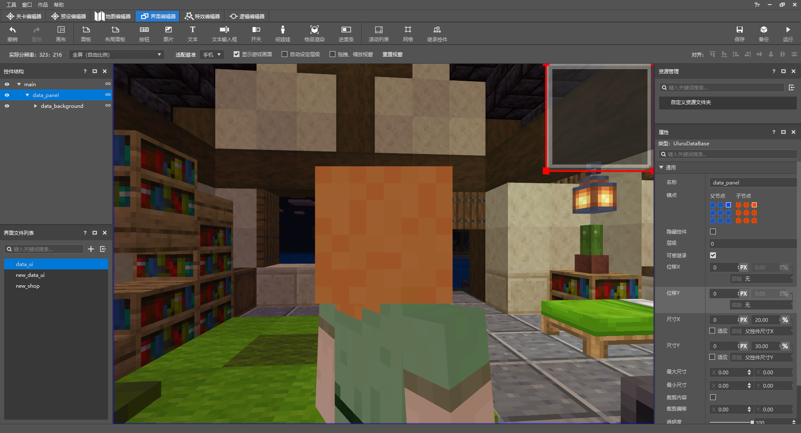

# 使用编辑器制作计分板界面

打开界面编辑器，创建一个计分板UI，在main画布下创建合适大小的面板并新增背景：



接下来在背景下分别创建显示钱数、天数和家具数量的图片和文字并修改至合适的位置：


<iframe src="https://cc.163.com/act/m/daily/iframeplayer/?id=6152ba3eb647e504b523d398" height="600" width="800" allow="fullscreen" />

制作完UI界面以后，打开UI文件，将这三个label通过装饰器绑定到ScreenNode：

```json
{
    "coin_label" : {
      "text" : "#text",
      "bindings" : [
         {
            "binding_name":"#coin_text", //绑定名称
            "binding_name_override":"#text", //绑定的回调,返回的参数将给到上方的#text
            "binding_condition" : "always_when_visible" //绑定条件：总是可见
         }
      ]
   },
   "day_label" : {
       "text" : "#text",
      "bindings" : [
         {
            "binding_name":"#day_text",
            "binding_name_override":"#text",
            "binding_condition" : "always_when_visible"
         }
      ]
   },
   "furniture_label" : {
      "text" : "#text",
      "bindings" : [
         {
            "binding_name":"#furniture_text",
            "binding_name_override":"#text",
            "binding_condition" : "always_when_visible"
         }
      ]
   }
}
```

```python
class FarmUIScreen(ScreenNode):
    def __init__(self, namespace, name, param):
        ScreenNode.__init__(self, namespace, name, param)

    # 绑定字符串，返回self.coin（coin变化时通过创建ui实例修改参数）
    @ViewBinder.binding(ViewBinder.BF_BindString, "#coin_text")
    def player_coin_text(self):
        return str(self.coin)

	# 绑定字符串，使用Molang直接返回天数
    @ViewBinder.binding(ViewBinder.BF_BindString, "#day_text")
    def player_day_text(self):
        return str(int(
            clientApi.GetEngineCompFactory().CreateQueryVariable(clientApi.GetLocalPlayerId()).GetMolangValue(
                'query.day')))

    # 绑定字符串，返回self.furniture（furniture变化时通过创建ui实例修改参数）
    @ViewBinder.binding(ViewBinder.BF_BindString, "#furniture_text")
    def player_furniture_text(self):
        return str(self.furniture)
```

我们在新手引导结束的函数中创建这个UI，并且将数据给予UI：

```python
leveldatacomp = serverApi.GetEngineCompFactory().CreateExtraData(serverApi.GetLevelId())
class FarmServerSystem(ServerSystem):
    def __init__(self, namespace, systemName):
        ServerSystem.__init__(self, namespace, systemName)
	# 设置新手引导结束会触发的函数
    def start_game_data(self, playerid):
        # 使用ExtraData存放数据
        leveldatacomp.SetExtraData("player_coin", 100)
        leveldatacomp.SetExtraData("player_furniture", 0)
        leveldatacomp.SetExtraData("player_day", 0)
        # 将初始数据作为参数传到ClientSystem
        event = {"playerid": playerid, "player_data_coin": leveldatacomp.GetExtraData("player_coin"),
                 "player_data_furniture": leveldatacomp.GetExtraData("player_furniture")}
        self.NotifyToClient(self.playername, "create_data_ui", event)
```

```python
class FarmClientSystem(ClientSystem):

    def __init__(self, namespace, systemName):
        super(FarmClientSystem, self).__init__(namespace, systemName)
        # 监听由ServerSystem发送过来的事件
        self.ListenForEvent("FarmMod", "ServerSystem", "create_data_ui",
                            self, self.CreateDataUI)

    def CreateDataUI(self,event):
        # 创建UI
        clientApi.CreateUI("Farm","data_ui",{"isHud":1})
        # 执行更新UI数据的函数
        self.Re_DataUI(event)

    def Re_DataUI(self,event):
        # 获取UI实例
        self.data_ui = clientApi.GetUI("Farm","data_ui")
        # 如果传过来的参数有player_data_coin则更新UI中的coin
        if "player_data_coin" in event:
            self.data_ui.coin = event["player_data_coin"]
        # 如果传过来的参数有player_data_furniture则更新UI中的furniture
        if "player_data_furniture" in event:
            self.data_ui.furniture = event["player_data_furniture"]
```

这样，在完成新手引导的时候，数据的计分板UI就可以正常创建了，我们使用编辑器的**开发测试**功能尝试一下：


## 将追踪玩家的数据更新在UI上

在本章的第一节中，我们已经完成了对玩家数据存取的功能，但是这些数据只存在于地图中，并不会直接显示在UI上，所以我们需要在数据存取的同时给客户端发送事件，修改UI实例的变量使数据可视化。

首先是玩家的钱数，我们只需要在有钱变动的地方（买商品和被回收商人收走商品）发送一个事件给客户端即可：

```python
leveldatacomp = serverApi.GetEngineCompFactory().CreateExtraData(serverApi.GetLevelId())
class FarmServerSystem(ServerSystem):
    def __init__(self, namespace, systemName):
        ServerSystem.__init__(self, namespace, systemName)

    # 玩家通过交易表购买商品后 发货的函数（在第五章和本章的第一节都有出现过）
    def PlayerBuyItem(self, args):
        # 将买完商品后的钱 存进数据player_coin
        leveldatacomp.SetExtraData("player_coin", args["coin"])
        # 传过来的玩家id
        player_id = args['playerid']
        # 传过来的实际商品名称
        item_name = args['buy_item']
        # 将玩家id和买完商品后剩下的钱作为参数传给客户端的re_dataui（更新ui的数据）
        event = {"playerid": player_id, "player_data_coin": args['coin'], }
        self.NotifyToClient(player_id, "re_dataui", event)
        # 发放物品
        serverApi.GetEngineCompFactory().CreateItem(player_id).SpawnItemToPlayerInv(
            {
                'newItemName': item_name,
                'count': 1
            },
            player_id
        )

    # 回收商人到达地点的回调函数，同时也是回收箱子内物品的函数（本章的第一节出现过）
    def acquirer_callback(self, entityid, result):
        print result
        if result == 0:
            # 循环箱子内的每个物品并算出其价格之和
            chestitemcomp = serverApi.GetEngineCompFactory().CreateItem(serverApi.GetLevelId())
            chestslotcomp = serverApi.GetEngineCompFactory().CreateChestBlock(serverApi.GetLevelId())
            count = 0
            add_price = 0
            for item in range(0, 27):
                itemdict = chestitemcomp.GetContainerItem((72, 66, 81), count, 0)
                if itemdict:
                    if itemdict["newItemName"] in self.goods_list:
                        add_price += itemdict["count"] * self.goods_list.get(itemdict["newItemName"])
                        chestslotcomp.SetChestBoxItemNum(None, (72, 66, 81), count, 0, 0)
                count += 1
            # 获取玩家当前的钱数
            now_coin = leveldatacomp.GetExtraData("player_coin")
            # 将当前钱数和箱子内物品价格的钱数相加并存储数据
            leveldatacomp.SetExtraData("player_coin", now_coin + add_price)
            # 将玩家新的钱数作为参数传送给客户端的re_dataui（更新ui的数据）
            event = {"player_data_coin": now_coin + add_price}
            self.NotifyToClient(leveldatacomp.GetExtraData("player_id"), "re_dataui", event)
            # 用寻路组件让回收商人回家
            movecomp = serverApi.GetEngineCompFactory().CreateMoveTo(self.acquirer_id)
            movecomp.SetMoveSetting((132, 71, 96), 1.5, 2000, self.acquirer_callback_home)
```

需要实时更新的数据还有家具的放置，同样在第一节我们已经做好了这部分功能，只需要在此基础上添加即可：

```python
leveldatacomp = serverApi.GetEngineCompFactory().CreateExtraData(serverApi.GetLevelId())
class FarmServerSystem(ServerSystem):
    def __init__(self, namespace, systemName):
        ServerSystem.__init__(self, namespace, systemName)
        # 监听玩家放置方块和破坏方块
        self.ListenForEvent(serverApi.GetEngineNamespace(), serverApi.GetEngineSystemName(),
                            'EntityPlaceBlockAfterServerEvent',
                            self, self.Place_Furniture)
        self.ListenForEvent(serverApi.GetEngineNamespace(), serverApi.GetEngineSystemName(),
                            'ServerPlayerTryDestroyBlockEvent',
                            self, self.Destroy_Furniture)


    def Place_Furniture(self, args):
        # 通过事件获取方块的坐标、名称
        x = args['x']
        y = args['y']
        z = args['z']
        blockname = args['fullName']
        blockstatecomp = serverApi.GetEngineCompFactory().CreateBlockState(serverApi.GetLevelId())
        blockstate = blockstatecomp.GetBlockStates((x, y, z), 0)
        # 如果不是家具则返回
        if "farm:rotation" not in blockstate and blockname not in self.netease_block_list:
            return
        # 获取现在的家具数量并+=1
        leveldatacomp.SetExtraData("player_furniture", leveldatacomp.GetExtraData("player_furniture") + 1)
        # 将新的家具数量作为参数传送给客户端的re_dataui（更新ui的数据）
        event = {"player_data_furniture": leveldatacomp.GetExtraData("player_furniture")}
        self.NotifyToClient(leveldatacomp.GetExtraData("player_id"), "re_dataui", event)

    def Destroy_Furniture(self, args):
        # 通过事件获取方块的坐标、名称
        x = args['x']
        y = args['y']
        z = args['z']
        blockname = args['fullName']
        player_id = args['playerId']
        blockstatecomp = serverApi.GetEngineCompFactory().CreateBlockState(serverApi.GetLevelId())
        blockstate = blockstatecomp.GetBlockStates((x, y, z), 0)
        # 如果不是家具则返回
        if "farm:rotation" not in blockstate and blockname not in self.netease_block_list:
            return
         # 获取现在的家具数量并-=1
        leveldatacomp.SetExtraData("player_furniture", leveldatacomp.GetExtraData("player_furniture") - 1)
        # 将新的家具数量作为参数传送给客户端的re_dataui（更新ui的数据）
        event = {"player_data_furniture": leveldatacomp.GetExtraData("player_furniture")}
        self.NotifyToClient(leveldatacomp.GetExtraData("player_id"), "re_dataui", event)
```

无论是钱数还是家具数量的变化都将通过事件传送到客户端的re_dataui中：

```python
class FarmClientSystem(ClientSystem):

    def __init__(self, namespace, systemName):
        super(FarmClientSystem, self).__init__(namespace, systemName)
        # 监听由ServerSystem发送的事件re_dataui
        self.ListenForEvent("FarmMod", "ServerSystem", "re_dataui",
                            self, self.Re_DataUI)


    def Re_DataUI(self,event):
        # 获取ui实例
        self.data_ui = clientApi.GetUI("Farm","data_ui")
        # 如果传送过来的参数中有player_data_coin则更新ui的参数
        if "player_data_coin" in event:
            self.data_ui.coin = event["player_data_coin"]
        # 如果传送过来的参数中有player_data_furniture则更新ui的参数
        if "player_data_furniture" in event:
            self.data_ui.furniture = event["player_data_furniture"]


```

接下来使用编辑器的**开发测试**功能进入到游戏中依次测试一下。

回收箱子内的物品：


通过交易表购买商品：


摆放和破坏家具：


