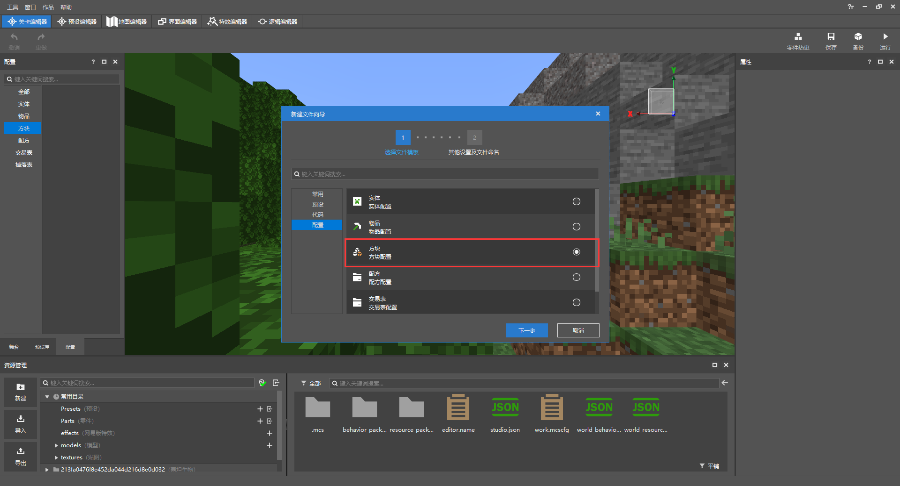
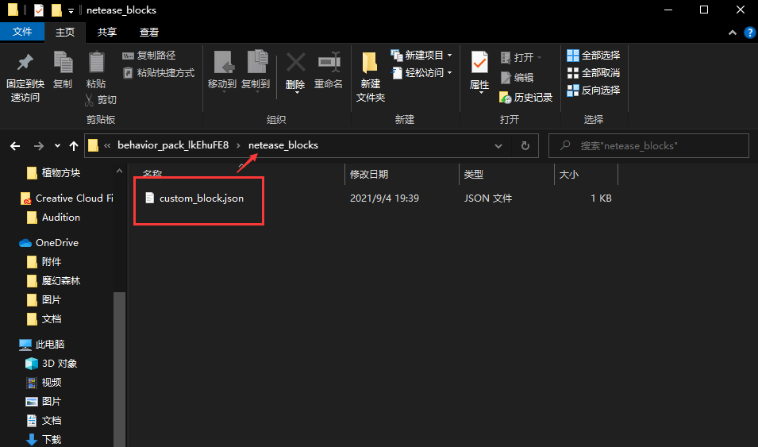

# 开始接触新自定义方块

打开MCStudio，使用关卡编辑器就可以直接新建一个自定义方块，非常的方便；但是，我们打开文件可以看到，方块的行为放在**netease_blocks**文件夹内，这里主要存放中国版特色的自定义方块，随着版本的更新，原版Add-on的自定义方块也可以实现很多有趣的功能，所以本章将全面展开介绍新自定义方块的概念的用法并制作地图的农作物、家具。

[认识自定义方块](../../10-addon教程/第09章：自定义方块/课程01.认识自定义方块.md)



中国版特色的自定义方块存放在netease_blocks文件夹内，而1.16+的新自定义方块写法需要放在微软的blocks文件夹内。



## 什么是方块属性

方块属性是1.16版本后新写法的“特色”之一：**properties**，里面可以存放很多属性，其实属性就是数组，用于引擎判断，利用方块属性可以做的很多有趣的功能，比如将方块做成农作物并判断其生长年龄；图中的**farm:age**和**farm:growth**就是判断农作物的。

```json
{
    "format_version": "1.16.100",
	"minecraft:block": {
		"description": {
			"identifier": "farm:whiteradish",
			"properties": { //方块属性
				"farm:age": [0, 1, 2],
                "farm:growth": [0, 1, 2, 3, 4, 5]
			}
		},
        "permutations": [···],
        "events": {···},
        "components": {···}
	}
}
```

使用**query.block_property**可以获取方块的属性值

```json
"query.block_property('farm:age') == 0"
```

## 什么是方块事件

想要灵活的修改方块的行为，需要事件的配合：**events**。比如当玩家站在方块上的时候，修改方块的掉落物；我们就需要在方块的组件里添加**触发器**，并且在events内添加响应的事件。

```json
{
	"format_version": "1.16.100",
	"minecraft:block": {
		"description": {
			"identifier": "farm:my_block"
		},
		"components": { //方块组件
			"minecraft:on_step_on": { //触发器，当站在方块上的时候
				"event": "farm:drop_loot", //触发此事件
				"target": "self"
			}
		},
		"events": { //方块事件
			"farm:drop_loot": { //上方触发器触发的事件
				"spawn_loot": { //添加方块的掉落物
					"table": "loot_tables/blocks/my_loot_table.json"
				}
			}
		}
	}
}
```

## 什么是方块组合

方块组合可以根据不同的条件应用于具有MoLang表达式的方法，可以非常自由的调配方块的各种组件，实现很多功能；图中的组合分别添加了不同的MoLang表达式条件，就是当方块属性的**farm:age**为特定值的时候，将下方**components**里的组件加到这个方块中。

```json
{
    "format_version": "1.16.100",
	"minecraft:block": {
		"description": {
			"identifier": "farm:whiteradish",
			"properties": {···}
		},
        "permutations": [ //方块组合
	  		{
				"condition": "query.block_property('farm:age') == 0",
				"components": {···}
	  		},
            {
				"condition": "query.block_property('farm:age') == 1",
				"components": {···}
	  		},
            {
				"condition": "query.block_property('farm:age') == 2",
				"components": {···}
	  		}
        ],
        "events":{···},
        "components":{···}
    }
}
```


## 什么是方块标签

方块标签可以将不同的方块分组归类，并通过标签获取使用；我将**"tag:farm_plant"**这个标签添加到不同的方块上，当我想要在其它文件中使用或查询的时候，就可以应用这个标签。

```json
{
    "format_version": "1.16.100",
	"minecraft:block": {
		"description": {
			"identifier": "farm:whiteradish",
			"properties": {
				"farm:age": [0, 1, 2],
                "farm:growth": [0, 1, 2, 3, 4, 5]
			}
		},
        "permutations": [···],
        "components": {
            "tag:farm_plant":{} //方块标签
		},
        "events": {···}
	}
}
```

可以获取方块标签的表达式：

- query.all_tags
- query.any_tag
- query.block_has_all_tags
- query.block_has_any_tag
- query.relative_block_has_all_tags
- query.relative_block_has_any_tag

## 新增了哪些方块组件

### minecraft:unit_cube

设定方块为普通的立方体

```json
{
	"minecraft:unit_cube": {}
}
```

### minecraft:crafting_table

设定方块为工作台

```json
{
	"minecraft:crafting_table": {
		"custom_description": "Example Crafting Table", // Name shown in GUI
		"grid_size": 3, // Currently only supports 3
		"crafting_tags": ["crafting_table", "custom_crafting_tag"]
	}
}
```

### minecraft:material_instances

方块的材质贴图和渲染方式

```json
{
	"minecraft:material_instances": {
		"*": {
			"texture": "texture_name",
			"render_method": "blend",
			"face_dimming": true,
			"ambient_occlusion": true
		}
	}
}
```

### minecraft:geometry

方块模型

```json
{
	"minecraft:geometry": "geometry.wiki"
}
```

### minecraft:on_step_on

触发器，配合事件使用：站在方块上时

```json
{
	"minecraft:on_step_on": {
		"event": "block_event",
		"target": "self",
		"condition": "query.block_property('wiki:block_property') == true"
	}
}
```

### minecraft:on_step_off

触发器，配合事件使用：离开方块上时

```json
{
	"minecraft:on_step_off": {
		"event": "block_event",
		"target": "self",
		"condition": "query.block_property('wiki:block_property') == true"
	}
}
```

### minecraft:on_fall_on

触发器，配合事件使用：方块坠落时

```json
{
	"minecraft:on_fall_on": {
		"event": "block_event",
		"target": "self",
		"condition": "query.block_property('wiki:block_property') == true",
		"min_fall_distance": 5
	}
}
```

### minecraft:on_placed

触发器，配合事件使用：方块被放置时

```json
{
	"minecraft:on_placed": {
		"event": "block_event",
		"target": "self",
		"condition": "query.block_property('wiki:block_property') == true"
	}
}
```

### minecraft:on_player_placing

触发器，配合事件使用：玩家放置方块时

```json
{
	"minecraft:on_player_placing": {
		"event": "block_event",
		"target": "self",
		"condition": "query.block_property('wiki:block_property') == true"
	}
}
```

### minecraft:on_player_destroyed

触发器，配合事件使用：玩家破坏方块时

```json
{
	"minecraft:on_player_destroyed": {
		"event": "block_event",
		"target": "self",
		"condition": "query.block_property('wiki:block_property') == true"
	}
}
```

### minecraft:on_interact

触发器，配合事件使用：玩家与方块交互时

```json
{
	"minecraft:on_interact": {
		"event": "block_event",
		"target": "self",
		"condition": "query.block_property('wiki:block_property') == true"
	}
}
```

### minecraft:ticking

触发器，配合事件使用：设置特定值的刻

```json
{
	"minecraft:ticking": {
		"looping": true,
		"range": [4, 4],
		"on_tick": {
			"event": "block_event",
			"target": "self",
			"condition": "query.block_property('wiki:block_property') == true"
		}
	}
}
```

### minecraft:random_ticking

触发器，配合事件使用：设置随机刻

```json
{
	"minecraft:random_ticking": {
		"on_tick": {
			"event": "block_event",
			"target": "self",
			"condition": "query.block_property('wiki:block_property') == true"
		}
	}
}
```

### minecraft:entity_collision

方块实体的碰撞箱

```json
{
	"minecraft:entity_collision": {
		"origin": [-8, 0, -8],
		"size": [16, 16, 16]
	}
}
```

```json
{
	"minecraft:entity_collision": false
}
```

### minecraft:pick_collision

选择方块时的碰撞箱

```json
{
	"minecraft:pick_collision": {
		"origin": [-8, 0, -8],
		"size": [16, 16, 16]
	}
}
```

```json
{
	"minecraft:pick_collision": false
}
```

### minecraft:breakonpush

设定被活塞推动时会破碎

```json
{
	"minecraft:breakonpush": true
}
```

### minecraft:display_name

设定方块名称

```json
{
	"minecraft:display_name": "Name"
}
```

### minecraft:breathability

设定方块的透气性，作为固体或是空气

```json
{
	"minecraft:breathability": "solid" // Also accepts 'air'
}
```

### minecraft:immovable

设定能否被活塞推动

```json
{
	"minecraft:immovable": true
}
```

### minecraft:onlypistonpush

设定方块是否会跟随粘性活塞移动

```json
{
	"minecraft:onlypistonpush": true
}
```

### minecraft:placement_filter

设定方块在什么条件下可以放置

```json
{
	"minecraft:placement_filter": {
		"conditions": [
			{
				"block_filter": ["minecraft:dirt"],
				"allowed_faces": ["up"]
			}
		]
	}
}
```

### minecraft:preventsjumping

设定踩在方块上时是否可以跳跃

```json
{
	"minecraft:preventsjumping": true
}
```

### minecraft:rotation

设定方块的旋转角度

```json
{
	"minecraft:rotation": [90, 180, 0]
}
```

### minecraft:unwalkable

设定踩在方块上时是否可以行走

```json
{
	"minecraft:unwalkable": true
}
```
