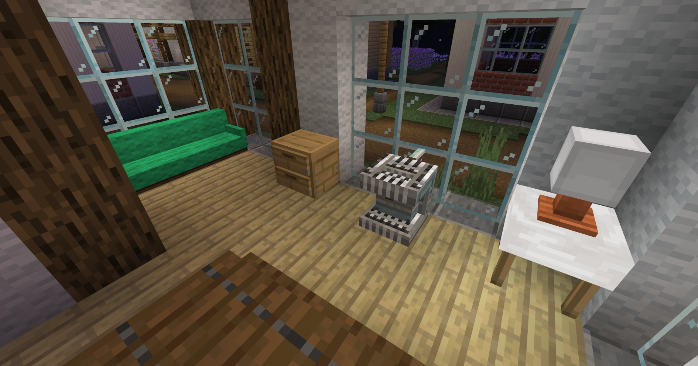
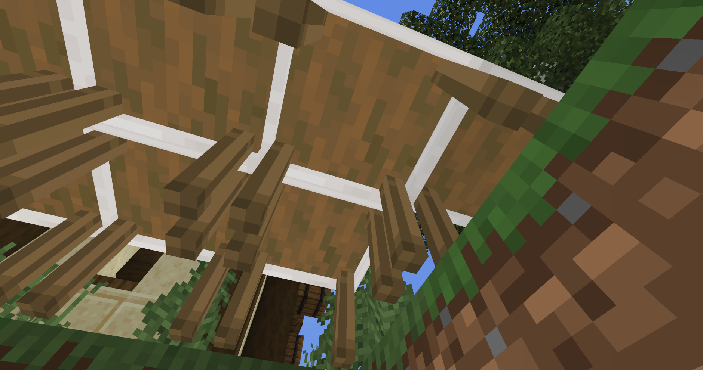
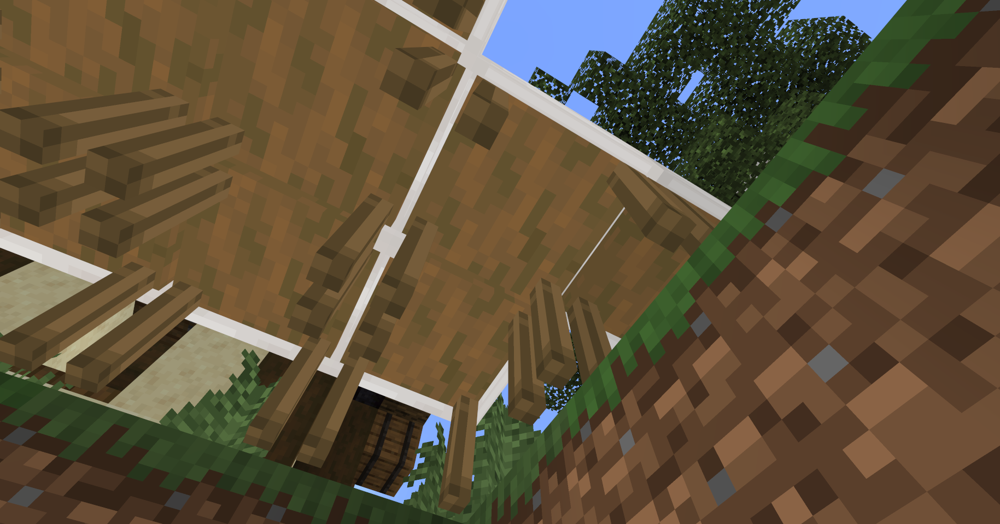
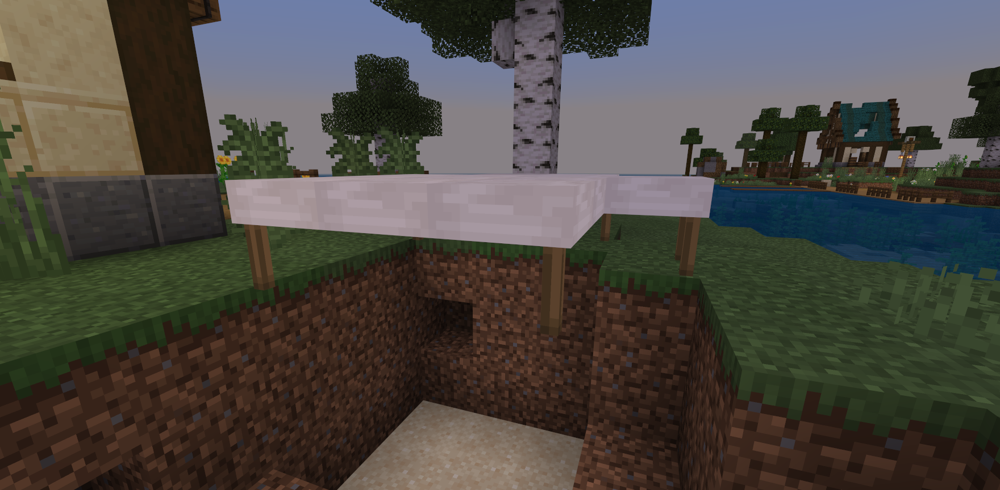

# 开始添加家具方块

除了农作物外，我们还需要继续制作家具，也是地图中重要的玩法之一；同样使用新自定义方块的方法，不过需要额外给不同的家具添加不同的功能。



## 学会设置方块的转向

当我们制作自定义方块的时候，如果方块模型的四个方向都是一样的，那方块在什么方向放置就不重要了；但如果是家具方块，如沙发，当玩家放下的时候，沙发的靠背朝前那就不太合适了，所以我们需要设置方块的转向，使每次放置都能保证方块的正面是适合的；

我们需要在方块中添加rotation的属性[0,1,2,3]对应四个方向：东南西北。然后添加四个组合，利用**"minecraft:rotation"**组件对应这四个方向的旋转角度，并且在放置方块的时候获取玩家朝向的角度，然后根据角度的不同修改方块的rotation属性，以rotation属性为条件添加组合，代码如下：

```json
{
    "format_version": "1.16.100",
	"minecraft:block": {
		"description": {
			"identifier": "farm:water_tap",
            "properties": {
                "farm:rotation":[0,1,2,3] //旋转属性
			}
		},
        "permutations": [
            {
              "condition": "query.block_property('farm:rotation') == 0", //当下方获取到的玩家角度是2时（2-2=0）North
              "components": {
                "minecraft:rotation": [ //设置方块旋转角度
                  0,
                  180,
                  0
                ]
              }
            },
            {
              "condition": "query.block_property('farm:rotation') == 1", //当下方获取到的玩家角度是2时（3-2=1）South
              "components": {
                "minecraft:rotation": [ //设置方块旋转角度
                  0,
                  0,
                  0
                ]
              }
            },
            {
              "condition": "query.block_property('farm:rotation') == 2", //当下方获取到的玩家角度是2时（4-2=2）West
              "components": {
                "minecraft:rotation": [ //设置方块旋转角度
                  0,
                  270,
                  0
                ]
              }
            },
            {
              "condition": "query.block_property('farm:rotation') == 3", //当下方获取到的玩家角度是2时（5-2=3）East
              "components": {
                "minecraft:rotation": [ //设置方块旋转角度
                  0,
                  90,
                  0
                ]
              }
            }
          ],
        "components": {
			"minecraft:loot": "loot_tables/blocks/water_tap.json",
			"minecraft:explosion_resistance": 1,
            "minecraft:pick_collision": {
                "origin": [-8, 0, -8],
                "size": [16, 10, 16]
            },
            "minecraft:geometry": "geometry.water_tap",
            "minecraft:block_light_absorption": 0,
            "minecraft:material_instances": {
                 "*": {
                    "texture": "farm:water_tap",
                    "render_method": "alpha_test",
                    "ambient_occlusion": false
                 }
            },
            "minecraft:on_player_placing": { //玩家放置方块的时候触发事件
                "event": "farm:set_rotation"
              },
            "minecraft:entity_collision": {
                "origin": [-8, 0, -8],
                "size": [16, 10, 16]
            }
		},
        "events": {
            "farm:set_rotation": {
                "set_block_property": { //设置方块属性
                  "farm:rotation": "query.cardinal_facing_2d-2"
                    //使用表达式获取玩家的方向(North=2.0, South=3.0, West=4.0, East=5.0, Undefined=6.0)
                    //因为上方的方块属性是从0开始的，所以获取到的数字需要-2，才能对应上方的方块属性
                }
            }
        }

	}
}
```


## 制作可以拼在一起的桌子

这里需要用到中国版自定义模型方块的写法，微软的1.16+自定义方块写法暂时还无法制作此功能；[认识中国版自定义方块](../../10-addon教程/第09章：自定义方块/课程01.认识自定义方块.md)

给桌子方块添加基本的组件后，还需要用到**"netease:connection"**用来定义这个方块的拼接属性。

```json
{
  "format_version": "1.10.0",
  "minecraft:block": {
   "description": {
     "identifier": "farm:connect_table"
   },
   "components": {
	  "minecraft:block_light_absorption":{
		"value": 0
	  },
	  "netease:render_layer": {
	    "value": "alpha"
	  },
	  "netease:solid": {
	    "value": false
	  },
	  "netease:connection": {
		"blocks": ["farm:connect_table"]
	  }
    }
  }
}
```

然后打开桌子的模型文件，我们需要进行修改以实现桌子拼接时，部分模型块会消失，如桌子四周的挡板：

```json
{
    "cubes": [···],
    "enable": "!query.is_connect(2)", //用表达式判断方块连接面的方向（连接面为北时启用这个部分的模型，因为前面加了！，所以为不启用这部分的模型）
    								  // 0-down面，1-up面，2-north面，3-south面，4-west面，5-east面
    "name": "n", //这个部分是桌子的背面挡板
    "parent": "table",
    "pivot": [···],
    "rotation": [···]
},
```

使用上面的方法依次将东南西北四个方向的挡板都添加，点击编辑器的**开发测试**进入游戏，就可以从下方看到当桌子连接起来的时候，侧面的挡板消失了；





相比桌子的挡板，桌角并不是在某一侧，而是两个方向的夹角，所以只判断某一个方向的连接是不行的，需要两个方向都有桌子进行链接的时候才消失：

```json
{
    "cubes": [···],
    "enable": "!query.is_connect(5) && !query.is_connect(3)", //桌子的东面和南面都有桌子时这个部分的模型不启用
    														  // 0-down面，1-up面，2-north面，3-south面，4-west面，5-east面
    "name": "east_south", //东面和南面夹角的桌角
    "parent": "table",
    "pivot": [···],
    "rotation": [···]
},
```

把所有的桌脚都设置好后，进入游戏是这样的



## 制作带有开关的装饰方块

开关可以添加方块属性来进行判断，给台灯和电视都添加一个属性，值为[0,1]，对应开和关，然后利用MODSDK来切换方块属性：

```json
{
	"format_version": "1.16.100",
	"minecraft:block": {
		"description": {
			"identifier": "farm:acacia_table_lamp", //台灯
			"properties": {
				"farm:open_light" : [0, 1] //添加属性用作开灯的判断
			}
		},
		"permutations": [
			{
				"condition": "query.block_property('farm:open_light') == 1", //当属性open_light为1时
				"components": {
					"minecraft:block_light_emission": 1 //方块发光

				}
			}
		],
		"components": {···},
		"events": {···}

	}
}
```

```python
import time
class Main(ServerSystem):

    def __init__(self, namespace, system_name):
        ServerSystem.__init__(self, namespace, system_name)
        self.interact_cooldown = {} #创建一个时间戳变量，用于控制玩家交互方块的冷却时间，以免造成极短时间内多次交互的情况
        self.ListenForEvent(namespace, system_name,'ServerBlockUseEvent', self, self.using_item)

    def using_item(self, event):
        # 获取玩家ID
        player_id = event['playerId']
        # 获取事件里交互的方块类型
        block_name = event['blockName']
        # 创建获取方块信息的接口
        blockstatecomp = serverApi.GetEngineCompFactory().CreateBlockState(serverApi.GetLevelId())
        # 获取交互方块的坐标
        x = event['x']
        y = event['y']
        z = event['z']
		# 所有台灯的列表
        table_lamp_list = ["farm:acacia_table_lamp", "farm:bigoak_table_lamp", "farm:birch_table_lamp",
                           "farm:crimson_table_lamp", "farm:jungle_table_lamp", "farm:oak_table_lamp",
                           "farm:spruce_table_lamp", "farm:warped_table_lamp"]

        #如果交互的方块在台灯列表呢
        if block_name in table_lamp_list:
            #获取交互的方块信息
            state = blockstatecomp.GetBlockStates((x, y, z), 0)
            #如果玩家id不在时间戳变量内
            if player_id not in self.interact_cooldown:
                #给时间戳变量添加一个玩家id和时间戳的键值
                self.interact_cooldown[player_id] = time.time()
                #如果方块的属性open_light等于0，台灯还没有打开
                if state['farm:open_light'] == 0:
                    #修改台灯的open_light属性为1
                    state['farm:open_light'] = 1
                    #设置修改后的台灯属性
                    blockstatecomp.SetBlockStates((x, y, z), state, 0)
                #反之，方块属性open_light等于1，台灯如果已经时开启的了
                else:
                    #修改台灯的open_light属性为0
                    state['farm:open_light'] = 0
                    #设置修改后的台灯属性
                    blockstatecomp.SetBlockStates((x, y, z), state, 0)

			#如果当前的时间减去存储在时间戳变量内的时间大于0.1
            elif time.time() - self.interact_cooldown[player_id] > 0.1:
                #逻辑与上方的if一致
                if state['farm:open_light'] == 0:
                    state['farm:open_light'] = 1
                    blockstatecomp.SetBlockStates((x, y, z), state, 0)
                else:
                    state['farm:open_light'] = 0
                    blockstatecomp.SetBlockStates((x, y, z), state, 0)
            #更新时间戳变量中的时间
            self.interact_cooldown[player_id] = time.time()
```


电视和台灯同理，只需要简单修改一些判断条件即可：

```json
{
	"format_version": "1.16.100",
	"minecraft:block": {
		"description": {
			"identifier": "farm:logo_tv", //电视
			"properties": {
				"farm:open_tv": [0,1] //添加属性用作开电视的判断
			}
		},
		"permutations": [
			{
				"condition": "query.block_property('farm:open_tv') == 1", //当属性open_tv为1时
				"components": {
					"minecraft:material_instances": { //修改方块的贴图
						"*": {
							"texture": "farm:logo_tv_open",
							"render_method": "alpha_test",
							"ambient_occlusion": false
						}
					}
				}
			}
		],
		"components": {···},
		"events": {···}

	}
}
```

```python
class Main(ServerSystem):
    def __init__(self, namespace, system_name):
        ServerSystem.__init__(self, namespace, system_name)
        self.ListenForEvent(namespace, system_name,'ServerBlockUseEvent', self, self.using_item)

    def using_item(self, event):
        if block_name == "farm:logo_tv":
            state = blockstatecomp.GetBlockStates((x, y, z), 0)
            if player_id not in self.interact_cooldown:
                self.interact_cooldown[player_id] = time.time()
                print state
                if state['farm:open_tv'] == 0:
                    state['farm:open_tv'] = 1
                    blockstatecomp.SetBlockStates((x, y, z), state, 0)
                else:
                    state['farm:open_tv'] = 0
                    blockstatecomp.SetBlockStates((x, y, z), state, 0)
            elif time.time() - self.interact_cooldown[player_id] > 0.1:
                if state['farm:open_tv'] == 0:
                    state['farm:open_tv'] = 1
                    blockstatecomp.SetBlockStates((x, y, z), state, 0)
                else:
                    state['farm:open_tv'] = 0
                    blockstatecomp.SetBlockStates((x, y, z), state, 0)
            self.interact_cooldown[player_id] = time.time()
```

## 制作自定义床方块

自定义床方块比较复杂，因为床需要和史蒂夫一样长，也就是两格方块左右，但是自定义方块的碰撞箱最大就是16x16，所以需要两个方块拼接成一个床，我们需要使用modsdk来控制床的放置和破坏：

```python
class Main(ServerSystem):
    def __init__(self, namespace, system_name):
        ServerSystem.__init__(self, namespace, system_name) # 监听玩家放置方块前后和破坏方块的事件
        self.ListenForEvent(namespace, system_name,'EntityPlaceBlockAfterServerEvent', self, self.place_block)
        self.ListenForEvent(namespace, system_name,'ServerPlayerTryDestroyBlockEvent', self, self.player_destroy_block
        self.ListenForEvent(namespace, system_name,'ServerEntityTryPlaceBlockEvent', self, self.try_place_block)

    # 玩家放置方块成功后触发
    def place_block(self, args):
        # 现代床的下半部分
        modern_bed_tail = {
            'name': 'farm:modern_bed_tail',
            'aux': 0
        }
        # 通过事件获取到放置的方块名、方块坐标、玩家id、放置方块的世界id、
        x = args["x"]
        y = args["y"]
        z = args["z"]
        blockname = args["fullName"]
        playerid = args["entityId"]
        worldid = args["dimensionId"]
        # 创建方块相关的接口
        blockstatecomp = serverApi.GetEngineCompFactory().CreateBlockState(serverApi.GetLevelId())
        blockcomp = serverApi.GetEngineCompFactory().CreateBlockInfo(serverApi.GetLevelId())
        # 如果放置的方块是farm:modern_bed_head(现代床的上半部分)
        if blockname == "farm:modern_bed_head":
            # 获取这个方块的属性
            block_state = blockstatecomp.GetBlockStates((x, y, z), worldid)
            # 通过坐标获取到这个方块东西南北的方块信息
            east_block_state = blockstatecomp.GetBlockStates((x + 1, y, z), worldid)
            west_block_state = blockstatecomp.GetBlockStates((x - 1, y, z), worldid)
            south_block_state = blockstatecomp.GetBlockStates((x, y, z + 1), worldid)
            north_block_state = blockstatecomp.GetBlockStates((x, y, z - 1), worldid)
		 	# 通过if判断上半部分的放置方向
            if block_state["farm:rotation"] == 0:
                # 在上半部分的方块方向的反方向放置下半部分方块
                blockcomp.SetBlockNew((x, y, z + 1), modern_bed_tail, 0, worldid)
                block_state['farm:rotation'] = 0
                blockstatecomp.SetBlockStates((x, y, z + 1), block_state, worldid)
            elif block_state["farm:rotation"] == 1:
                blockcomp.SetBlockNew((x, y, z - 1), modern_bed_tail, 0, worldid)
                block_state['farm:rotation'] = 1
                blockstatecomp.SetBlockStates((x, y, z - 1), block_state, worldid)
            elif block_state["farm:rotation"] == 2:
                blockcomp.SetBlockNew((x + 1, y, z), modern_bed_tail, 0, worldid)
                block_state['farm:rotation'] = 2
                blockstatecomp.SetBlockStates((x + 1, y, z), block_state, worldid)
            elif block_state["farm:rotation"] == 3:
                blockcomp.SetBlockNew((x - 1, y, z), modern_bed_tail, 0, worldid)
                block_state['farm:rotation'] = 3
                blockstatecomp.SetBlockStates((x - 1, y, z), block_state, worldid)

    # 玩家破坏方块时触发
    def player_destroy_block(self, args):
        # 方块信息字典（空气）
        air = {
            'name': 'minecraft:air',
            'aux': 0
        }
        # 方块列表（现代床的上半部和下半部分）
        block_list = ['farm:modern_bed_head', 'farm:modern_bed_tail']
        # 通过事件获取破坏的方块名称、坐标、玩家id和世界id
        blockname = args['fullName']
        x = args['x']
        y = args['y']
        z = args['z']
        blockname = args['fullName']
        playerid = args['playerId']
        worldid = args['dimensionId']
        # 创建方块相关的接口
        blockstatecomp = serverApi.GetEngineCompFactory().CreateBlockState(serverApi.GetLevelId())
        blockcomp = serverApi.GetEngineCompFactory().CreateBlockInfo(serverApi.GetLevelId())
		# 如果方块名是farm:modern_bed_head（现代床的上半部分）
        if blockname == "farm:modern_bed_head":
            # 获取这个方块的属性
            block_state = blockstatecomp.GetBlockStates((x, y, z), worldid)
            # 用if判断方块的旋转属性并同时破坏反方向一格的方块（反方向就是下半部分）
            if block_state['farm:rotation'] == 0:
                blockcomp.SetBlockNew((x, y, z + 1), air, 0, worldid)
            elif block_state['farm:rotation'] == 1:
                blockcomp.SetBlockNew((x, y, z - 1), air, 0, worldid)
            elif block_state['farm:rotation'] == 2:
                blockcomp.SetBlockNew((x + 1, y, z), air, 0, worldid)
            elif block_state['farm:rotation'] == 3:
                blockcomp.SetBlockNew((x - 1, y, z), air, 0, worldid)
        # 如果方块名是farm:modern_bed_tail（现代床的下半部分）
        elif blockname == "farm:modern_bed_tail":
            # 获取这个方块的属性
            block_state = blockstatecomp.GetBlockStates((x, y, z), worldid)
            # 用if判断方块的旋转属性并同时破坏反方向一格的方块（反方向就是上半部分）
            if block_state['farm:rotation'] == 0:
                blockcomp.SetBlockNew((x, y, z - 1), air, 0, worldid)
            elif block_state['farm:rotation'] == 1:
                blockcomp.SetBlockNew((x, y, z + 1), air, 0, worldid)
            elif block_state['farm:rotation'] == 2:
                blockcomp.SetBlockNew((x - 1, y, z), air, 0, worldid)
            elif block_state['farm:rotation'] == 3:
                blockcomp.SetBlockNew((x + 1, y, z), air, 0, worldid)

    # 玩家尝试放置方块时触发
    def try_place_block(self,args):
        # 通过事件获取方块的坐标、名称、玩家id、世界id
        x = args["x"]
        y = args["y"]
        z = args["z"]
        blockname = args["fullName"]
        playerid = args["entityId"]
        worldid = args["dimensionId"]
        # 创建方块相关接口
        blockinfocomp = serverApi.GetEngineCompFactory().CreateBlockInfo(serverApi.GetLevelId())
        # 获取getplayerrot的返回值
        playerrot = self.getplayerrot(playerid)
        # 获取消息相关的接口
        msgcomp = serverApi.GetEngineCompFactory().CreateMsg(playerid)
        # 如果放置的方块时farm:modern_bed_head（现代床的上半部分）
        if blockname == "farm:modern_bed_head":
            # 如果玩家的视角是2
            if playerrot == 2:
                # 获取视角方向的方块信息字典
                south_block = blockinfocomp.GetBlockNew((x,y,z+1), worldid)
                # 如果方块的名字不是空气（说明有方块阻挡）
                if south_block['name'] != "minecraft:air":
                    # 取消放置方块
                    args['cancel'] = True
                    # 给尝试放置的玩家提醒
                    msgcomp.NotifyOneMessage(playerid, "附近有方块遮挡，无法放置方块", "§c")
            # 下面的if分支同上，只是获取的玩家视角角度不同
            elif playerrot == 3:
                west_block = blockinfocomp.GetBlockNew((x - 1,y,z), worldid)
                if west_block['name'] != "minecraft:air":
                    args['cancel'] = True
                    msgcomp.NotifyOneMessage(playerid, "附近有方块遮挡，无法放置方块", "§c")
            elif playerrot == 0:
                north_block = blockinfocomp.GetBlockNew((x,y,z-1), worldid)
                if north_block['name'] != "minecraft:air":
                    args['cancel'] = True
                    msgcomp.NotifyOneMessage(playerid, "附近有方块遮挡，无法放置方块", "§c")
            elif playerrot == 1:
                east_block = blockinfocomp.GetBlockNew((x+1,y,z), worldid)
                if east_block['name'] != "minecraft:air":
                    args['cancel'] = True
                    msgcomp.NotifyOneMessage(playerid, "附近有方块遮挡，无法放置方块", "§c")

    # 获取玩家视角角度的函数
    def getplayerrot(self,playerid):
        # 获取玩家角度
        rot = serverApi.GetEngineCompFactory().CreateRot(playerid).GetRot()
        # 根据不同角度返回不同的数字用于判断
        if 135.0 < rot[1] <= 180.0:
            return 2
        elif 90.0 < rot[1] <= 135.0:
            return 1
        elif 45.0 < rot[1] <= 90.0:
            return 1
        elif 0.0 < rot[1] <= 45.0:
            return 0
        elif -45.0 < rot[1] <= 0.0:
            return 0
        elif -90.0 < rot[1] <= -45.0:
            return 3
        elif -135.0 < rot[1] <= -90.0:
            return 3
        elif -180.0 < rot[1] <= -135.0:
            return 2
        else:
            return 0

```

床方块的放置和破坏逻辑写完后，我们还需要对其进行交互功能相关的逻辑，使玩家可以设置出生点并睡在床上跳过一段时间：

```python
class Main(ServerSystem):

    def __init__(self, namespace, system_name):
        ServerSystem.__init__(self, namespace, system_name)
        # 监听方块交互时间
        self.ListenForEvent(namespace, system_name,'ServerBlockUseEvent', self, self.using_item)
        # 时间戳变量
        self.interact_cooldown = {}


    def using_item(self, event):
        # 创建 计时器接口
        timercomp = serverApi.GetEngineCompFactory().CreateGame(serverApi.GetLevelId())
        # 创建玩家行为的接口
        playercomp = serverApi.GetEngineCompFactory().CreatePlayer(player_id)
        # 创建获取方块信息的接口
        blockstatecomp = serverApi.GetEngineCompFactory().CreateBlockState(serverApi.GetLevelId())
        # 创建使用指令的接口
        commandcomp = serverApi.GetEngineCompFactory().CreateCommand(serverApi.GetLevelId())
        # 如果交互的方块是现代床
        if block_name == "farm:modern_bed_head":
            # 获取方块属性
            state = blockstatecomp.GetBlockStates((x, y, z), 0)
            # 存储一些需要的参数
            camera_event = {'state': state, 'x': x, 'y': y, 'z': z, 'playerid': player_id}
            # 设置玩家重生点
            commandcomp.SetCommand("spawnpoint @s ~ ~ ~")
            # 如果方块的旋转属性为2（判断方块的放置方向并且根据方向设置玩家的视角）
            if state['farm:rotation'] == 2:
                # 使用指令播放玩家睡觉的动画
                commandcomp.SetCommand("playanimation @s east_sleep")
                # 使用指令将玩家传送到床上
                commandcomp.SetCommand("tp @s {} {} {}".format(x,y+0.5,z))
                # 设置玩家无法移动
                playercomp.SetPlayerMovable(False)
                # 传输事件到客户端，锁定玩家视角到固定位置
                self.NotifyToClient(player_id, "camera_lock", camera_event)
                # 添加一个4秒的计时器
                timercomp.AddTimer(4.0,self.standup,player_id,)
            #同上if，只是判断不同的旋转角度播放不同方向的玩家动画和视角
            elif state['farm:rotation'] == 0:
                commandcomp.SetCommand("tp @s {} {} {}".format(x,y+0.5,z))
                commandcomp.SetCommand("playanimation @s west_sleep humanoid_base_pose 0")
                playercomp.SetPlayerMovable(False)
                self.NotifyToClient(player_id, "camera_lock", camera_event)
                timercomp.AddTimer(4.0,self.standup,player_id,)
            elif state['farm:rotation'] == 1:
                commandcomp.SetCommand("tp @s {} {} {}".format(x,y+0.5,z))
                commandcomp.SetCommand("playanimation @s north_sleep humanoid_base_pose 0")
                playercomp.SetPlayerMovable(False)
                self.NotifyToClient(player_id, "camera_lock", camera_event)
                timercomp.AddTimer(4.0,self.standup,player_id,)
            elif state['farm:rotation'] == 3:
                commandcomp.SetCommand("tp @s {} {} {}".format(x,y+0.5,z))
                commandcomp.SetCommand("playanimation @s south_sleep humanoid_base_pose 0")
                playercomp.SetPlayerMovable(False)
                self.NotifyToClient(player_id, "camera_lock", camera_event)
                timercomp.AddTimer(4.0,self.standup,player_id,)

    # 计时器触发的函数
    def standup(self,player_id):
        # 获取相关接口
        timecomp = serverApi.GetEngineCompFactory().CreateTime(serverApi.GetLevelId())
        playercomp = serverApi.GetEngineCompFactory().CreatePlayer(player_id)
        # 设置玩家可以移动
        playercomp.SetPlayerMovable(True)
        # 从游戏开始经过的总帧数
        passedTime = timecomp.GetTime()
        # 当前游戏天内的帧数
        timeOfDay = passedTime % 24000
        # 从游戏开始经过的游戏天数
        day = passedTime / 24000
        # 使用时间戳，避免多次执行的情况
        if player_id not in self.interact_cooldown:
            self.interact_cooldown[player_id] = time.time()
            # 根据当前时间+12000
            timecomp.SetTime(passedTime + 12000)
            print day
        elif time.time() - self.interact_cooldown[player_id] > 1:
            timecomp.SetTime(passedTime + 12000)
            self.interact_cooldown[player_id] = time.time()
            print day
```

```python
class FarmClientSystem(ClientSystem):
    def __init__(self, namespace, systemName):
        super(FarmClientSystem, self).__init__(namespace, systemName)
		# 监听由服务端传输过来的事件
        self.ListenForEvent("FarmMod", "ServerBlockListenerServer", "camera_lock",self, self.Camera_Lock)

    def Camera_Lock(self,event):
        # 获取传输过来的参数：方块的坐标和属性
        x = event['x']
        y = event['y']
        z = event['z']
        state = event['state']
        # 判断方块的旋转属性
        if state['farm:rotation'] == 0:
            # 锁定玩家视角到特定的位置
            cameracomp.LockCamera((x,y+1,z), (-40, 0))
            # 添加一个4s的计时器
            timercomp.AddTimer(4.0, self.Camera_UnLock, event, )
        elif state['farm:rotation'] == 2:
            cameracomp.LockCamera((x,y+1,z), (-40, -90))
            timercomp.AddTimer(4.0, self.Camera_UnLock, event, )
        elif state['farm:rotation'] == 3:
            cameracomp.LockCamera((x,y+1,z), (-40, -270))
            timercomp.AddTimer(4.0, self.Camera_UnLock, event, )
        elif state['farm:rotation'] == 1:
            cameracomp.LockCamera((x,y+1,z), (-40, -180))
            timercomp.AddTimer(4.0, self.Camera_UnLock, event, )

	# 计时器触发的函数
    def Camera_UnLock(self,event):
        # 解锁玩家的视角
        cameracomp.UnLockCamera()

```

现在，我们已经有了一个较完整的现代床，在编辑器中点击**开发测试**进入到游戏中试一下：


## 制作可以回收道具的垃圾桶

这个功能只需要使用MODSDK即可做到，不需要对自定方块的组件进行复杂修改，代码如下：

```python
class Main(ServerSystem):
    def __init__(self, namespace, system_name):
        ServerSystem.__init__(self, namespace, system_name)
        self.ListenForEvent(namespace, system_name,
                            'ServerItemUseOnEvent', self, self.using_block) #监听ServerItemUseOnEvent事件


    def using_block(self,args):
        trash_can_list = ['farm:acacia_trash_can', 'farm:bigoak_trash_can', 'farm:birch_trash_can',
                          'farm:crimson_trash_can', 'farm:jungle_trash_can', 'farm:oak_trash_can',
                          'farm:spruce_trash_can', 'farm:warped_trash_can'] #所有的垃圾桶方块
        playerid = args['entityId'] #事件中获取到的玩家id
        blockname = args['blockName'] #事件中获取到的玩家交互方块的identifier
        itemname = args['itemDict'] #事件中获取到的物品信息字典
        item_comp = serverApi.GetEngineCompFactory().CreateItem(playerid) #创建CreateItem接口

        if blockname in trash_can_list and itemname: #如果交互的方块在trash_can_list的列表中并且玩家手里有物品
            args['ret'] = True #取消手中物品的使用（这个可以防止玩家手里的物品或方块被放置到地上从而无法清除）
            carried_item = item_comp.GetPlayerItem(ItemPosType.CARRIED, 0, True) #获取玩家手中的物品信息
            carried_item['count'] = 0 #将获取到的物品的数量设置为0
            item_comp.SetPlayerAllItems({(ItemPosType.CARRIED, 0): carried_item}) #重新设置玩家手里的物品


```

在ServerSystem中只需要监听**ServerItemUseOnEvent**事件，并且添加一些简单的逻辑即可，不过这个事件建议在客户端同时监听并取消物品的使用，所以在ClientSystem中也需要一些代码：

```python
class FarmClientSystem(ClientSystem):

    def __init__(self, namespace, systemName):
        super(FarmClientSystem, self).__init__(namespace, systemName)
        self.ListenForEvent(namespace, system_name,
                            'ClientItemUseOnEvent', self, self.using_item) #监听事件

    def using_item(self,args):
        trash_can_list = ['farm:acacia_trash_can', 'farm:bigoak_trash_can', 'farm:birch_trash_can',
                          'farm:crimson_trash_can', 'farm:jungle_trash_can', 'farm:oak_trash_can',
                          'farm:spruce_trash_can', 'farm:warped_trash_can'] #所有的垃圾桶方块
        blockname = args['blockName'] #事件中获取到的玩家交互方块的identifier
        itemname = args['itemDict'] #事件中获取到的物品信息字典
        if blockname in trash_can_list and itemname: #如果交互的方块在trash_can_list的列表中并且玩家手里有物品
            args['ret'] = True #取消手中物品的使用

```


## 制作可以榨取果汁的榨汁机

榨汁机工作需要用到我们收获的农作物：柠檬、菠菜、玉米，分别对应：柠檬汁、菠菜汁和玉米汁

给榨汁机添加多个属性分别代表 “判断榨汁机运行”、“榨玉米汁“、”榨柠檬汁“、”榨菠菜汁“；然后添加对应的组合，通过事件来进行调控，不过仅用自定义方块的组件内容无法制作全部的功能，我们还需要使用MODSDK；

```json
{
	"format_version": "1.16.100",
	"minecraft:block": {
		"description": {
			"identifier": "farm:juicer",
			"properties": {
				"farm:run":[0,1], //判断榨汁机有没有在运行中
				"farm:juicer_has_corn":[0,1,2], //榨玉米汁的过程
				"farm:juicer_has_lemon":[0,1,2], //榨柠檬汁的过程
				"farm:juicer_has_spinach":[0,1,2] //榨菠菜汁的过程
			}
		},
		"permutations": [
			{
				"condition": "query.block_property('farm:juicer_has_corn') == 1", //满足条件，添加下方组件(此时榨汁机在榨汁中：玉米)
				"components": {
					"minecraft:material_instances": { //修改榨汁机的贴图
						"*": {
							"texture": "farm:juicer_corn",
							"render_method": "alpha_test",
							"ambient_occlusion": false
						}
					},
					"minecraft:ticking": { //添加计时器，3秒后运行下方事件（不重复运行）
						"range": [3.0, 3.0],
						"looping": false,
						"on_tick": {
							"event": "farm:corn_juice_start",
							"target": "self"
						}
					}
				}
			},
			{
				"condition": "query.block_property('farm:juicer_has_corn') == 2", //满足条件，添加下方组件(此时榨汁机榨完了：玉米)
				"components": {
					"minecraft:material_instances": { //修改榨汁机贴图
						"*": {
							"texture": "farm:juicer_corn_bottle",
							"render_method": "alpha_test",
							"ambient_occlusion": false
						}
					}
				}
			},
			{
				"condition": "query.block_property('farm:juicer_has_spinach') == 1", //满足条件，添加下方组件(此时榨汁机在榨汁中：菠菜)
				"components": {
					"minecraft:material_instances": { //修改榨汁机贴图
						"*": {
							"texture": "farm:juicer_spinach",
							"render_method": "alpha_test",
							"ambient_occlusion": false
						}
					},
					"minecraft:ticking": { //添加计时器，3秒后运行下方事件（不重复运行）
						"range": [3.0, 3.0],
						"looping": false,
						"on_tick": {
							"event": "farm:spinach_juice_start",
							"target": "self"
						}
					}
				}
			},
			{
				"condition": "query.block_property('farm:juicer_has_spinach') == 2", //满足条件，添加下方组件(此时榨汁机榨完了：菠菜)
				"components": {
					"minecraft:material_instances": { //修改榨汁机贴图
						"*": {
							"texture": "farm:juicer_spinach_bottle",
							"render_method": "alpha_test",
							"ambient_occlusion": false
						}
					}
				}
			},
			{
				"condition": "query.block_property('farm:juicer_has_lemon') == 1", //满足条件，添加下方组件(此时榨汁机在榨汁中：柠檬)
				"components": {
					"minecraft:material_instances": { //修改榨汁机贴图
						"*": {
							"texture": "farm:juicer_lemon",
							"render_method": "alpha_test",
							"ambient_occlusion": false
						}
					},
					"minecraft:ticking": { //添加计时器，3秒后运行下方事件（不重复运行）
						"range": [3.0, 3.0],
						"looping": false,
						"on_tick": {
							"event": "farm:lemon_juice_start",
							"target": "self"
						}
					}
				}
			},
			{
				"condition": "query.block_property('farm:juicer_has_lemon') == 2", //满足条件，添加下方组件(此时榨汁机榨完了：柠檬)
				"components": {
					"minecraft:material_instances": { //修改榨汁机贴图
						"*": {
							"texture": "farm:juicer_lemon_bottle",
							"render_method": "alpha_test",
							"ambient_occlusion": false
						}
					}
				}
			}
		],
		"components": {
			"minecraft:loot": "loot_tables/blocks/juicer.json",
			"minecraft:explosion_resistance": 1,
			"minecraft:pick_collision": {
				"origin": [-8, 0, -8],
				"size": [16, 16, 16]
			},
			"minecraft:material_instances": { //榨汁机普通情况下的贴图
				"*": {
					"texture": "farm:juicer",
					"render_method": "alpha_test",
					"ambient_occlusion": false
				}
			},
			"minecraft:geometry": "geometry.juicer", //榨汁机的模型
			"minecraft:block_light_absorption": 0,
			"minecraft:entity_collision": {
				"origin": [-8, 0, -8],
				"size": [16, 16, 16]
			}
		},
		"events": {
			"farm:corn_juice_start":{
				"set_block_property": { //设置属性juicer_has_cron为2(从运行榨汁机到榨完汁)
					"farm:juicer_has_corn": 2
				}
			},
			"farm:spinach_juice_start":{ //设置属性juicer_has_spinach为2(从运行榨汁机到榨完汁)
				"set_block_property": {
					"farm:juicer_has_spinach": 2
				}
			},
			"farm:lemon_juice_start":{ //设置属性juicer_has_lemon为2(从运行榨汁机到榨完汁)
				"set_block_property": {
					"farm:juicer_has_lemon": 2
				}
			}
		}

	}
}
```

上面的自定义方块内容，可以实现榨汁的过程（3秒）并且根据状态切换榨汁机的贴图，开始榨汁并且拿走果汁的功能就需要MODSDK来实现：

```python
class Main(ServerSystem):

    def __init__(self, namespace, system_name):
        ServerSystem.__init__(self, namespace, system_name)
        self.ListenForEvent(namespace, system_name,
                            'ServerBlockUseEvent', self, self.using_item)

    def using_item(self, event):
        # 获取玩家ID
        player_id = event['playerId']
        # 创建玩家的物品接口
        item_comp = serverApi.GetEngineCompFactory().CreateItem(player_id)
        # 获取玩家手持物品信息
        carried_item = item_comp.GetPlayerItem(ItemPosType.CARRIED, 0, True)
        # 获取事件里交互的方块类型
        block_name = event['blockName']
        # 创建获取方块信息的接口
        blockstatecomp = serverApi.GetEngineCompFactory().CreateBlockState(serverApi.GetLevelId())
        # 创建生成掉落物的接口
        drop_comp = serverApi.GetEngineCompFactory().CreateItem(serverApi.GetLevelId())
        # 获取交互方块的坐标
        x = event['x']
        y = event['y']
        z = event['z']
        # 创建一个存储果汁物品信息的变量
        juice = [
            {
                'newItemName': 'farm:corn_juice',
                'count': 1,
                'newAuxValue': 0,
            },
            {
                'newItemName': 'farm:lemon_juice',
                'count': 1,
                'newAuxValue': 0,
            },
            {
                'newItemName': 'farm:spinach_juice',
                'count': 1,
                'newAuxValue': 0,
            }
        ]


        #如果交互的方块是榨汁机
        if block_name == "farm:juicer":
            #获取坐标位置方块的属性
            state = blockstatecomp.GetBlockStates((x, y, z), 0)
            #如果手里有东西
            if carried_item:

                #如果方块的属性 has_corn和run都为0 并且手里的是玉米
                if state['farm:juicer_has_corn'] == 0 and state['farm:run'] == 0 and carried_item['newItemName'] == "farm:corn_item":
                    #将has_corn和run改为1，并且将手里的玉米-1
                    state['farm:juicer_has_corn'] = 1
                    state['farm:run'] = 1
                    blockstatecomp.SetBlockStates((x, y, z), state, 0)
                    carried_item['count'] -= 1
                    item_comp.SetPlayerAllItems({(ItemPosType.CARRIED, 0): carried_item})

                #如果方块的属性 has_lemon和run都为0 并且手里的是柠檬
                elif state['farm:juicer_has_lemon'] == 0 and state['farm:run'] == 0 and carried_item['newItemName'] == "farm:lemon_item":
                    #将has_lemon和run改为1，并且将手里的柠檬-1
                    state['farm:juicer_has_lemon'] = 1
                    state['farm:run'] = 1
                    blockstatecomp.SetBlockStates((x, y, z), state, 0)
                    carried_item['count'] -= 1
                    item_comp.SetPlayerAllItems({(ItemPosType.CARRIED, 0): carried_item})

                #如果方块的属性 has_spinach和run都为0 并且手里的是菠菜
                elif state['farm:juicer_has_spinach'] == 0 and state['farm:run'] == 0 and carried_item['newItemName'] == "farm:spinach_item":
                    #将has_spinach和run改为1，并且将手里的菠菜-1
                    state['farm:juicer_has_spinach'] = 1
                    state['farm:run'] = 1
                    blockstatecomp.SetBlockStates((x, y, z), state, 0)
                    carried_item['count'] -= 1
                    item_comp.SetPlayerAllItems({(ItemPosType.CARRIED, 0): carried_item})

                #当手里有东西时并且榨玉米汁工作完
                elif state['farm:juicer_has_corn'] == 2:
                    #生成掉落物并且将has_corn和run恢复为0
                    drop_comp.SpawnItemToLevel(juice[0], 0, (x, y+1, z))
                    state['farm:juicer_has_corn'] = 0
                    state['farm:run'] = 0
                    blockstatecomp.SetBlockStates((x, y, z), state, 0)

                #当手里有东西时并且榨柠檬汁工作完
                elif state['farm:juicer_has_lemon'] == 2:
                    #生成掉落物并且将has_lemon和run恢复为0
                    drop_comp.SpawnItemToLevel(juice[1], 0, (x, y+1, z))
                    state['farm:juicer_has_lemon'] = 0
                    state['farm:run'] = 0
                    blockstatecomp.SetBlockStates((x, y, z), state, 0)

                #当手里有东西时并且榨菠菜汁工作完
                elif state['farm:juicer_has_spinach'] == 2:
                    #生成掉落物并且将has_spinach和run恢复为0
                    drop_comp.SpawnItemToLevel(juice[2], 0, (x, y+1, z))
                    state['farm:juicer_has_spinach'] = 0
                    state['farm:run'] = 0
                    blockstatecomp.SetBlockStates((x, y, z), state, 0)

            #如果手里没东西
            else:
                #如果榨玉米汁工作完
                if state['farm:juicer_has_corn'] == 2:
                    drop_comp.SpawnItemToLevel(juice[0], 0, (x, y+1, z))
                    state['farm:juicer_has_corn'] = 0
                    state['farm:run'] = 0
                    blockstatecomp.SetBlockStates((x, y, z), state, 0)

                # 如果榨柠檬汁工作完
                elif state['farm:juicer_has_lemon'] == 2:
                    #生成掉落物并且将has_lemon和run恢复为0
                    drop_comp.SpawnItemToLevel(juice[1], 0, (x, y+1, z))
                    state['farm:juicer_has_lemon'] = 0
                    state['farm:run'] = 0
                    blockstatecomp.SetBlockStates((x, y, z), state, 0)

                #如果榨菠菜汁工作完
                elif state['farm:juicer_has_spinach'] == 2:
                    #生成掉落物并且将has_spinach和run恢复为0
                    drop_comp.SpawnItemToLevel(juice[2], 0, (x, y+1, z))
                    state['farm:juicer_has_spinach'] = 0
                    state['farm:run'] = 0
                    blockstatecomp.SetBlockStates((x, y, z), state, 0)
        else:
            pass
```

MODSDK和自定义方块组件的相互配合，完成这个榨汁机的全部功能，点击编辑器的**开发测试**进入到游戏中测试一下：


## 制作可以坐的方块

可以坐下的椅子和前面的现代床实现的方法差不多，并且没有那么的复杂，我们只需要传送玩家到椅子上并且播放坐下的动画即可，不过我们可以添加更多有意思的功能，比如在玩家坐下的时候可以每三秒回复玩家的半格血量：

```python
class Main(ServerSystem):

    def __init__(self, namespace, system_name):
        ServerSystem.__init__(self, namespace, system_name)
        # 判断坐下的变量
        self.sit = 0
        # 时间戳变量
        self.interact_cooldown = {}
        # 监听方块交互的事件
        self.ListenForEvent(namespace, system_name,'ServerBlockUseEvent', self, self.using_item)

    def using_item(self, event):
        # 创建 计时器接口
        timercomp = serverApi.GetEngineCompFactory().CreateGame(serverApi.GetLevelId())
        # 创建使用指令的接口
        commandcomp = serverApi.GetEngineCompFactory().CreateCommand(serverApi.GetLevelId())
        # 创建使用指令的接口
        commandcomp = serverApi.GetEngineCompFactory().CreateCommand(serverApi.GetLevelId())
        # 事件获取的方块名称和坐标
        block_name = event['blockName']
        x = event['x']
        y = event['y']
        z = event['z']
        # 所以椅子名称的列表
        chair_list = ["farm:acacia_chair","farm:bigoak_chair","farm:birch_chair","farm:crimson_chair",
                      "farm:jungle_chair","farm:oak_chair","farm:spruce_chair","farm:warped_chair"]

        # 如果交互的方块名称给列表内
        if block_name in chair_list:
            # 通过时间戳避免短时间内多次交互的情况
            if player_id not in self.interact_cooldown:
                self.interact_cooldown[player_id] = time.time()
                # 如果sit为0（说明玩家未坐下）
                if self.sit == 0:
                    # 使用指令播放玩家坐下的动画
                    commandcomp.SetCommand("playanimation @s sit_chair")
                    # 传送玩家到椅子上
                    commandcomp.SetCommand("tp @s {} {} {}".format(x,y-0.1,z))
                    # 设置玩家无法移动
                    playercomp.SetPlayerMovable(False)
                    # 创建消息接口并提醒玩家再次点击可以站起
                    msgcomp = serverApi.GetEngineCompFactory().CreateMsg(player_id)
                    msgcomp.NotifyOneMessage(player_id, "再次点击椅子以站起", "§f")
                    # 创建一个3秒的循环计时器
                    self.healtimer = timercomp.AddRepeatedTimer(3.0,self.player_heal,player_id)
                    # 修改坐下的变量为1
                    self.sit = 1
                # 如果变量为1（此时玩家在坐着）
                elif self.sit == 1:
                    # 设置玩家可以移动
                    playercomp.SetPlayerMovable(True)
                    # 取消循环的计时器
                    timercomp.CancelTimer(self.healtimer)
                    # 播放玩家普通
                    commandcomp.SetCommand("playanimation @s humanoid_base_pose")
                    # 修改坐下的变量为0
                    self.sit = 0

            # 时间戳判断，与上方if逻辑一致
            elif time.time() - self.interact_cooldown[player_id] > 0.5:
                if self.sit == 0:
                    commandcomp.SetCommand("playanimation @s sit_chair")
                    commandcomp.SetCommand("tp @s {} {} {}".format(x,y-0.1,z))
                    playercomp.SetPlayerMovable(False)
                    msgcomp = serverApi.GetEngineCompFactory().CreateMsg(player_id)
                    msgcomp.NotifyOneMessage(player_id, "再次点击椅子以站起", "§f")
                    self.healtimer = timercomp.AddRepeatedTimer(3.0, self.player_heal, player_id)
                    self.sit = 1
                elif self.sit == 1:
                    playercomp.SetPlayerMovable(True)
                    timercomp.CancelTimer(self.healtimer)
                    commandcomp.SetCommand("playanimation @s humanoid_base_pose")
                    self.sit = 0
                self.interact_cooldown[player_id] = time.time()

    # 计时器循环触发的函数
    def player_heal(self,playerid):
        # 获取玩家属性的接口
        attcomp = serverApi.GetEngineCompFactory().CreateAttr(playerid)
        # 获取玩家当前的血量
        playerheal = attcomp.GetAttrValue(serverApi.GetMinecraftEnum().AttrType.HEALTH)
        # 设置玩家当前的血量并+1
        attcomp.SetAttrValue(serverApi.GetMinecraftEnum().AttrType.HEALTH, playerheal+1)

```

椅子的逻辑相对简单，我们点击编辑器的**开发测试**，进入到游戏中测试一下：


## 制作其它装饰方块

接下来我们继续填充装饰性的方块家具：马克杯、床头柜、水龙头、熊玩偶（纯装饰），马桶、沙发、浴缸（重复功能）。纯装饰的家具方块只需要添加属性使其可以跟随玩家视角旋转即可，一些重复功能的家具只需要利用上方的逻辑进行简单的修改即可。

马桶模仿椅子的逻辑，在判断方块的部分修改为马桶方块即可：

```python
class Main(ServerSystem):
    def __init__(self, namespace, system_name):
        ServerSystem.__init__(self, namespace, system_name)
        self.ListenForEvent(namespace, system_name,'ServerBlockUseEvent', self, self.using_item)

    def using_item(self, event):
        # 如果交互的方块是farm:close_stool（马桶）
        if block_name == "farm:close_stool":
            if player_id not in self.interact_cooldown:
                self.interact_cooldown[player_id] = time.time()
                if self.sit == 0:
                    commandcomp.SetCommand("tp @s {} {} {}".format(x, y - 0.1, z))
                    commandcomp.SetCommand("playanimation @s sit_chair")
                    playercomp.SetPlayerMovable(False)
                    msgcomp = serverApi.GetEngineCompFactory().CreateMsg(player_id)
                    msgcomp.NotifyOneMessage(player_id, "再次点击马桶以站起", "§f")
                    self.sit = 1
                elif self.sit == 1:
                    playercomp.SetPlayerMovable(True)
                    commandcomp.SetCommand("playanimation @s humanoid_base_pose")
                    self.sit = 0
            elif time.time() - self.interact_cooldown[player_id] > 0.5:
                if self.sit == 0:
                    commandcomp.SetCommand("tp @s {} {} {}".format(x, y - 0.1, z))
                    commandcomp.SetCommand("playanimation @s sit_chair")
                    playercomp.SetPlayerMovable(False)
                    msgcomp = serverApi.GetEngineCompFactory().CreateMsg(player_id)
                    msgcomp.NotifyOneMessage(player_id, "再次点击马桶以站起", "§f")
                    self.sit = 1
                elif self.sit == 1:
                    playercomp.SetPlayerMovable(True)
                    commandcomp.SetCommand("playanimation @s humanoid_base_pose")
                    self.sit = 0
                self.interact_cooldown[player_id] = time.time()
```

沙发坐下的逻辑也与椅子、马桶相似，不过需要设置沙发在同行摆放的时候使其可以拼接，参照桌子的拼接方法，在沙发的两侧添加拼接：

```json
{
    "cubes": [···],
    "enable": "!query.is_connect(4)",
    "name": "left",
    "parent": "sofa",
    "pivot": [···],
    "rotation": [···]
},
{
    "cubes": [···],
    "enable": "!query.is_connect(5)",
    "name": "right",
    "parent": "sofa",
    "pivot": [···],
    "rotation": [···]
}
```

浴缸的功能也是大同小异：放置和破坏同时对上半、下半部分生效，交互可以泡澡，每隔3秒增加玩家经验值。需要进行修改的也就只有方块的判断以及循环计时器的触发函数：

```python
class Main(ServerSystem):
    def __init__(self, namespace, system_name):
        ServerSystem.__init__(self, namespace, system_name)
        self.ListenForEvent(namespace, system_name,'ServerBlockUseEvent', self, self.using_item)

    def using_item(self, event):
        # 如果交互的方块是浴缸上半部分或下半部分
        # 判断内的逻辑和现代床、椅子、沙发类似（传送玩家到方块位置、设置玩家无法移动、播放动画、添加循环触发的计时器）
        if block_name == "farm:bathtub_head" or block_name == "farm:bathtub_tail":
            # 循坏触发的计时器，每三秒触发一次player_exp函数
            # ···
            self.healtimer = timercomp.AddRepeatedTimer(3.0,self.player_exp,player_id,)

    def player_exp(self,playerid):
        # 创建玩家经验接口
        expcomp = serverApi.GetEngineCompFactory().CreateExp(playerid)
        # 给玩家添加10点经验
        expcomp.AddPlayerExperience(10)

```

到此，所以的家具都已经制作完成，用它们来装饰地图吧：


