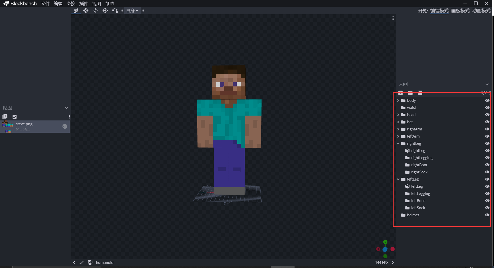

# 通过attchables和自定义物品添加新的装扮

接下来为地图添加多种多样的装饰装备，让玩家可以购买并自由搭配；装备共分为四个部位：头、身、腿、脚；中国版的自定义物品和微软1.16+的自定义物品都可以制作，本节会把两种方法都进行演示。


## 使用中国版自定义物品制作

在行为包下的**netease_items_beh**中新建一个json文件，为自定义物品添加行为组件：

```json
{
    "format_version": "1.10",
    "minecraft:item": {
      "description": {
        "identifier": "farm:denim",
        "custom_item_type": "armor" //自定义物品类型：盔甲
      },
      "components": {
        "netease:armor":{ //定义物品为盔甲
          "defense": 1, //防御值
          "enchantment":1, //附魔能力
          "armor_slot":2 //盔甲槽位（0-头盔,1-胸甲,2-护腿,3-鞋子）
        }
      }
    }
  }
```

在资源包下的**netease_items_res**中同样新建一个json文件，定义这个自定义物品的图标：

```json
{
    "format_version": "1.10",
    "minecraft:item": {
      "description": {
        "identifier": "farm:denim",
        "category": "Equipment" //在创造栏中的类别：装备
      },
      "components": {
        "minecraft:icon": "farm:denim" //自定义物品的图标，对应item_texture文件
      }
    }
  }
```

创建一个自定义物品后，继续在资源包的**attachables**文件中创建json文件，定义自定义装备的模型、贴图等：

```json
{
    "format_version": "1.8.0",
    "minecraft:attachable": {
      "description": {
        "identifier": "farm:denim",
        "materials": {
          "default": "armor",
          "enchanted": "armor_enchanted"
        },
        "textures": { //贴图
          "default": "textures/models/denim", //正常状态时
          "enchanted": "textures/misc/enchanted_item_glint" //含有附魔时
        },
        "geometry": {
          "default": "geometry.denim" //模型
        },
        "scripts": {
          "parent_setup": "variable.leg_layer_visible = 0.0;" //定义装备的部位
            //variable.helmet_layer_visible 头盔
            //variable.chest_layer_visible 胸甲
            //variable.leg_layer_visible 护腿
            //variable.boot_layer_visible 靴子
        },
        "render_controllers": [ "controller.render.armor" ] //渲染控制器
      }
    }
  }
```

## 使用微软自定义物品制作

**attachables**内的json文件无需做任何修改，和中国版是一样的；微软自定义物品的json文件放在**items**里：

```json
{
	"format_version": "1.16.100",
	"minecraft:item": {
		"description": {
			"identifier": "farm:denim_new",
			"category": "equipment"
		},
		"components": {
			"minecraft:creative_category": { //在创造栏中的类别：装备
				"parent": "itemGroup.name.equipment"
			},
			"minecraft:icon": { //自定义物品的图标，同样对应item_texture文件
				"texture": "farm:denim"
			},
			"minecraft:enchantable": { //附魔等级
				"value": 1, //值
				"slot": "armor_legs" //附魔装备类型（护腿）
			},
			"minecraft:armor": {
				"protection": 1 //防御值
			},
			"minecraft:wearable": { //定义物品可穿戴
				"slot": "slot.armor.legs" //装备在腿部的格子上
			}
		}
	}
}
```

微软自定义物品的创造栏类别和自定义物品图标都放在行为包的文件内，无需在资源包另外添加；

## 装扮装备的模型

装备的模型有一些部分需要特别注意，因为玩家在走动、转视角的时候，各个部位都有不同的动作，身上的装备也需要跟着部位动，所以装备模型的骨骼要设定好，以**blockbench**为例：




装备模型和原版史蒂夫模型的很多组名（Group）都一样，这个牛仔裤模型的块都在leftLeg和rightLeg下，分别对应左腿和右腿，这里的组名就是和史蒂夫绑定的骨骼；

如果我们把rightleg的组名随意修改会发生什么？


左腿的装备是跟随玩家的腿移动的，不过右腿的装备就固定在原地，所以骨骼的绑定是非常重要的，建议装备的模型都严格的命名，更直观、高效。


