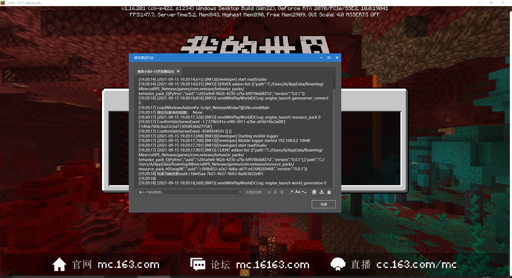

# 使用编辑器的开发测试功能

<iframe src="https://cc.163.com/act/m/daily/iframeplayer/?id=6152bac9b647e504b523d39c" height="600" width="800" allow="fullscreen" />


在开发的过程中，免不了发生各种奇怪的问题，而为了解决这些问题，我们需要先发现他们；在编辑器的作品框中有开发测试功能，我们可以点击进入到游戏中测试。


与游戏一起打开的还有脚本测试日志窗口，通过这个我们可以得到很多反馈，进而帮助我们判断问题。在开发测试的过程中，密切关注日志可以第一时间发现并解决BUG。



## 常规的Python报错处理

在python文件发生错误的时候，日志通常会发生报错，我们可以根据报错来排查和解决问题。

这是一个常规的python报错，倒数第二行，报错已经指出了问题所在，在404行的Create_Shop_UI函数中，最后一行也提示了问题：属性错误：FarmClientSystem工程中没有属性furniture_shop_item_button_tex


于是，我们找到FarmClientSystem中的Create_Shop_UI函数：

```python
class FarmClientSystem(ClientSystem):

    def __init__(self, namespace, systemName):
        super(FarmClientSystem, self).__init__(namespace, systemName)
        self.furniture_shop_item_button_text = [
            #···
        ]
        # ···

    def Create_Shop_UI(self,event):
        # ···
        # 404行,furniture_shop_item_button_text变量的名字写错(少了一个t)
        self.ui.item_button_text = self.furniture_shop_item_button_tex
```

根据这个规律来排查问题，常规的python报错都可以很快的解决！
