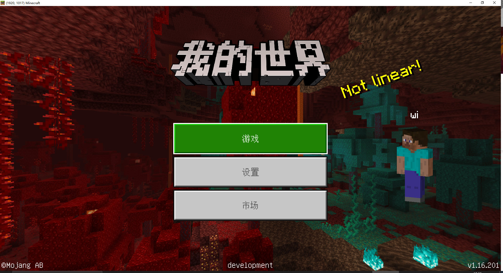

# 利用代码热更新提高开发效率

当我们在开发过程中遇到代码相关的问题时，不需要先退出游戏再进行修改，在游戏中修改代码并保存后点击一下脚本测试日志就可以看到“正在重载”，这是代码热更新在重载py文件，所以利用这个功能可以很好的提高开发效率。

如果是对一些贴图、模型进行修改，我们不得不重新启动**开发测试**的话，也有相对的解决方案：

我们不再像平时一样点击作品的开发测试，而是点击编辑器右上角工具箱中的MOD PC开发包打开客户端，进入后可以看到开发测试功能创建的存档，只需要在这里进入、退出即可，不用完全将游戏关闭再启动开发测试功能。

