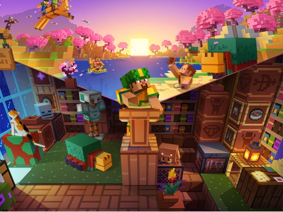
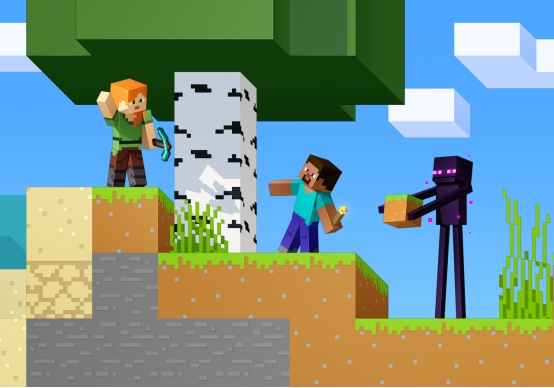
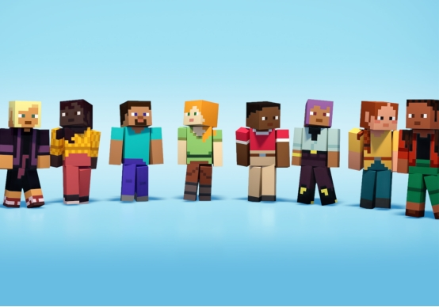

# **《史蒂夫的方块秘境》**

您将通过绘制一款冒险家主题的皮肤来了解整个皮肤制作流程；同时我们希望这篇教程能让您体验到绘制皮肤的乐趣。

## **为什么要制作皮肤**

每位《我的世界》的新玩家都会从选择史蒂夫或艾利克斯的经典皮肤开始他们的冒险旅程。这位像素风格的角色不仅是游戏的标志性人物，也是探索这个无限广阔世界的忠实伙伴。然而当你与朋友们一同联机游玩时，可能会遇到一个小小的难题：所有玩家看起来都一模一样。在相同的区域内，找到彼此变得异常困难——这就像在一个满是双胞胎的派对上试图认出你的朋友一样。

为了解决这个问题，《我的世界》提供了更改皮肤的功能，允许玩家选择不同的外观。虽然游戏中和社区里有许多现成的皮肤可供选择，但这些皮肤终究可能会被其他人使用，导致“撞衫”。为了确保你的角色在人群中脱颖而出，并且能够完全符合你个人的品味，最佳的选择就是亲自设计一款独一无二的皮肤。

事实上，制作皮肤的过程并不复杂。只需跟随本教程的指导，你就可以轻松地创造出一款只属于自己的独特皮肤。从选择颜色到细节的设计，每一步都将让你感受到创作的乐趣，并最终呈现出一个充满个性的角色形象。

## **如何让自己的皮肤与众不同**

之前我们提到要制作一款与众不同的皮肤，尽管皮肤的像素数量是固定的，但我们可以通过赋予它独特的故事情节和个人理解来实现这一目标。当皮肤的每一部分都承载了自己的故事和意义时，它就成为了一个独一无二的存在。

接下来，请跟着我们的教程，一步步地了解并尝试制作属于自己的冒险者皮肤吧！
