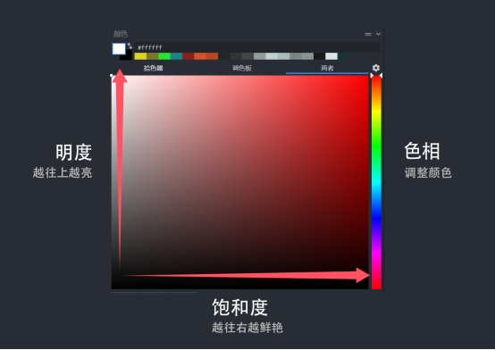
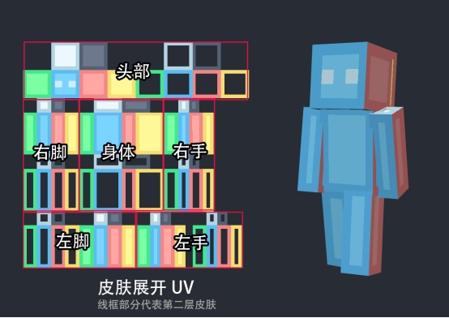
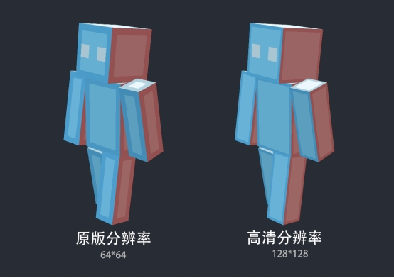
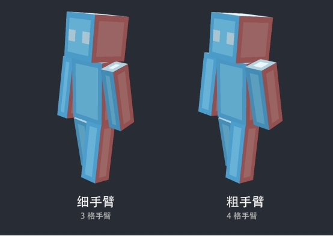
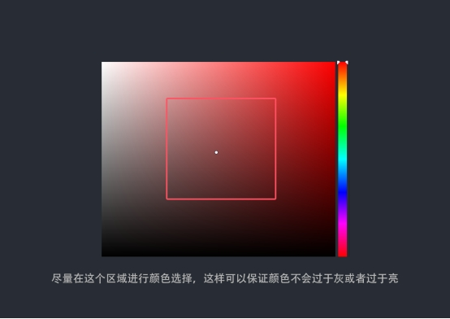

# **了解基础**

## **设计的基础概念**

首先，我们需要了解一些像素艺术的基础规则。像素艺术是通过基础颜色块来表达创意的，颜色之间的过渡不需要非常平滑，否则会失去像素艺术的独特质感。

接下来，学习一些颜色理论可以帮助我们更好地理解和运用颜色：

- 色相：指颜色的基本类型，即我们常说的颜色名称，如红、橙、黄、绿、蓝、紫等。在色彩环上，色相按照一定顺序排列形成连续的光谱。色相反映了颜色的纯度或本质特征，决定了颜色的基本外观。

- 饱和度：也称纯度，表示颜色的鲜艳程度或颜色与灰色之间的距离。高度饱和的颜色显得非常鲜艳和强烈，而低饱和度的颜色则更接近灰色。通过在颜色中添加不同程度的灰度可以调整饱和度，从而改变颜色的强度。

- 明度：也称亮度，表示颜色的明亮和灰暗程度。亮度越高的颜色越接近白色，亮度越低的颜色越接近黑色。通过控制颜色的亮度可以达到区分明暗的效果。

## **UV区域代表什么**

下面展示的是一张皮肤的展开图。皮肤实际上就是由这样一张贴图构成的，我们只需修改其中的像素点，整个皮肤就会随之发生变化。

## **尺寸和粗细手臂的区别**

在《我的世界》中，有两种皮肤尺寸标准：

- **原版皮肤**：64×64像素

- **高清皮肤**：128×128像素

高清皮肤的分辨率是原版皮肤的两倍，这意味着在相同的皮肤区域上，高清皮肤可以使用的像素点数量是原版皮肤的四倍，从而能够展现更多细节。

原版皮肤更精炼且易于上手，而高清皮肤更适合追求写实风格的设计，能够展现更多细节。

在开始绘制之前，还需要确定手臂的粗细：原版模型的手臂宽度为4个像素，细版模型的手臂宽度则为3个像素。由于需要绘制阴影和细节，因此手臂的粗细选择应在设计之初就决定。

## **色彩搭配推荐**

我建议新手选择饱和度适中的中间色调进行搭配，即颜色既不过于鲜艳也不过于灰暗。

在绘制明暗关系时，不仅要调整颜色的亮度，还应该适当改变颜色的色相，使过渡效果更加丰富和有趣。