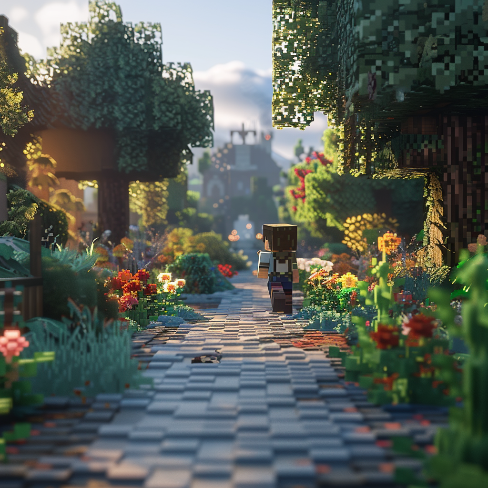

# 寻找失落的配方 - 总览

完成从零开始创建一张皮肤后，您已经掌握在MC Studio内导入并自测作品所需的基础。

在本模块结束时，您将会为自己的探险家角色准备一套配方。帮助他面对接下来的冒险。

您将学习如何使用MC Studio和编辑器来创建和修改组件，特别是如何合成和恢复那些不再存在的游戏配方，并作出适当修改后添加一些额外属于自己原创的新配方。

你将学习：

- 如何查找与分析已被移除的原版配方。
- 如何在编辑器里还原并尝试微调配方。
- 如何运行测试新修改的配方，确保它们的功能性。

和更多。

## 如何跟上教程

本课程包含分步教程。在每节课中，您都应该按照教程在创建的空白项目中重现每个步骤。我们会告诉您应该创建哪个项目以及如何开始。

本课程包含以下两个内容：

1. 按照分步说明进行操作。
2. 课后练习。

现在，我们准备开始了。前往下一课来设置项目并开始创作吧！
