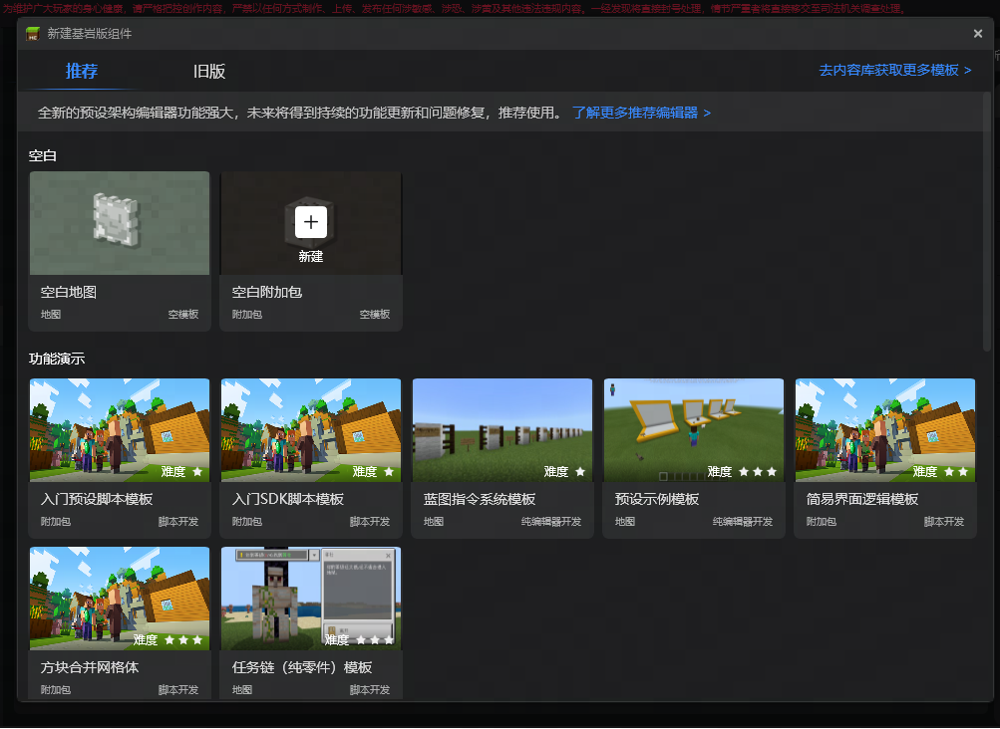
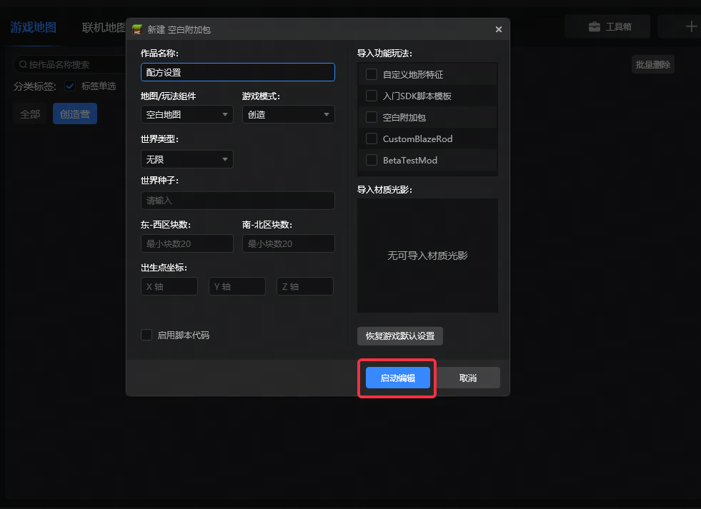
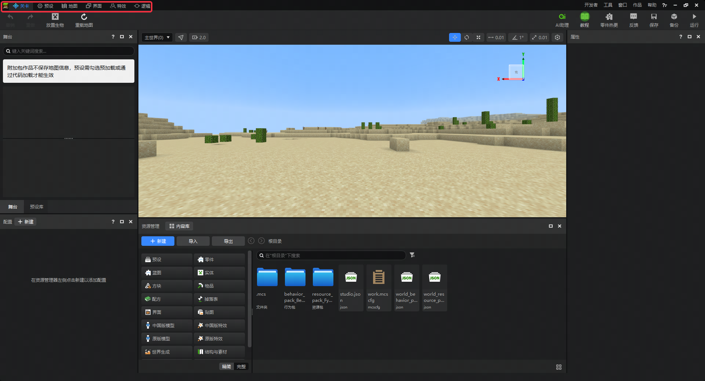
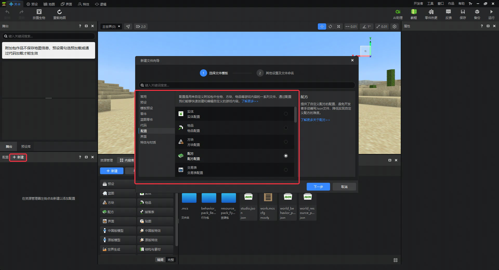
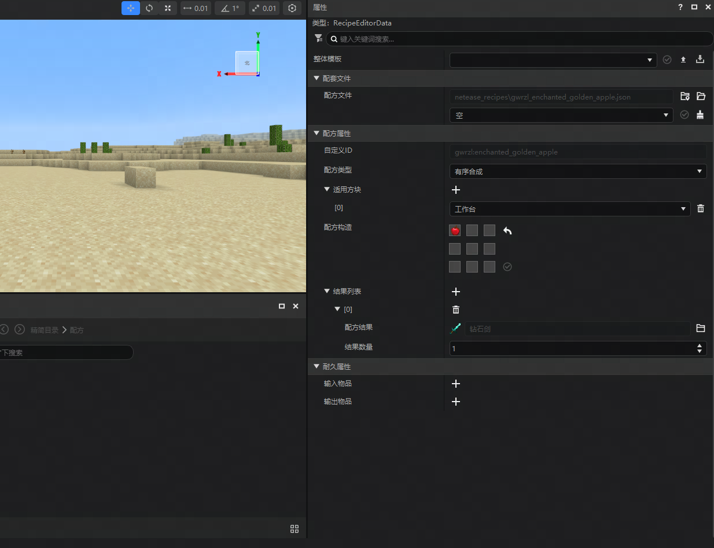
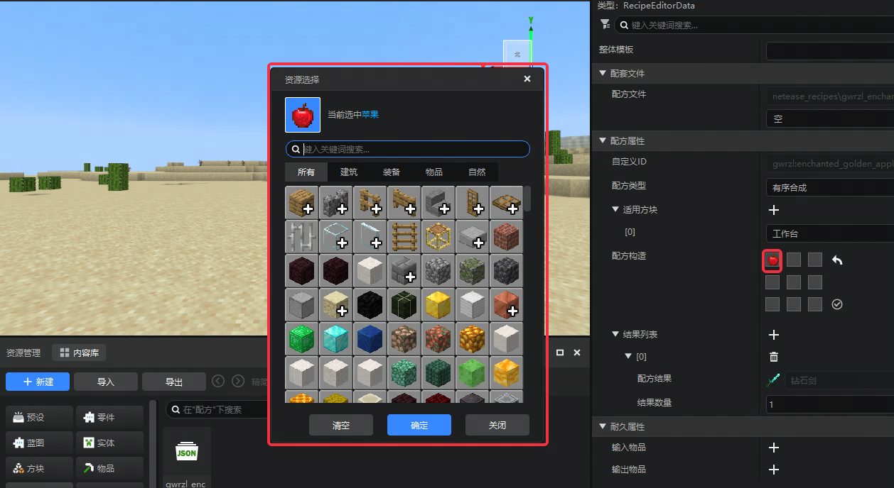
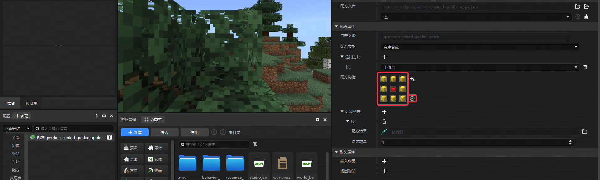
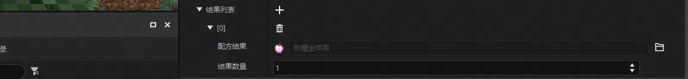

# 编辑器中的配方实战

在本课中，我们将从头开始创建一个空白Add-on项目。并还原出一些被移除游戏的配方。接着，我们在此基础上对它们稍作改动。

在本课中，我们需要：

- 创建一个空白Add-on项目。
- 使用关卡编辑器配方配置功能还原配方。
- 微调原版配方使其变成一个新配方

## 创建一个空白Add-on项目

进入 **作品库** ，选择 **基岩版组件** ，点击右上角 **新建** 。对空白附加包选 **新建** 。

自定义作品名称，点击 **启动编辑** 。

进入 **编辑器** ，确认当前 **编辑器** 切换为 **关卡编辑器** ，否则点击 **上方顶部工具栏** 进行切换。

## 还原配方

点击 **配置面板 **的 **新建** ， **直接创建** 一个配方并命名为 **enchanted_golden_apple** 。

您的右侧属性面板应该如图所示：

点击配方构造的 **灰色图片槽位** ，可以唤起 **资源选择框** 。

我们给上、左上、右上、左、右、下、左下、右下新增 **金块** ，中间添加 **苹果** 。接着勾选 **确认** 按钮。

在结果列表中，将钻石剑用同样的步骤设置为附魔金苹果。

## 微调配方

我们将8个金块改成蜜脾块，将配方结果改成蜂蜜瓶，所得到的结果也如预期一致。

## 结论

恭喜您成功了！配方是在我的世界中很常见的游戏机制，它的应用非常广泛。未来，你也将在自己的作品中多次重复使用这种技术。

在下一课中，我们将在此内容的基础上游戏进行自测！
