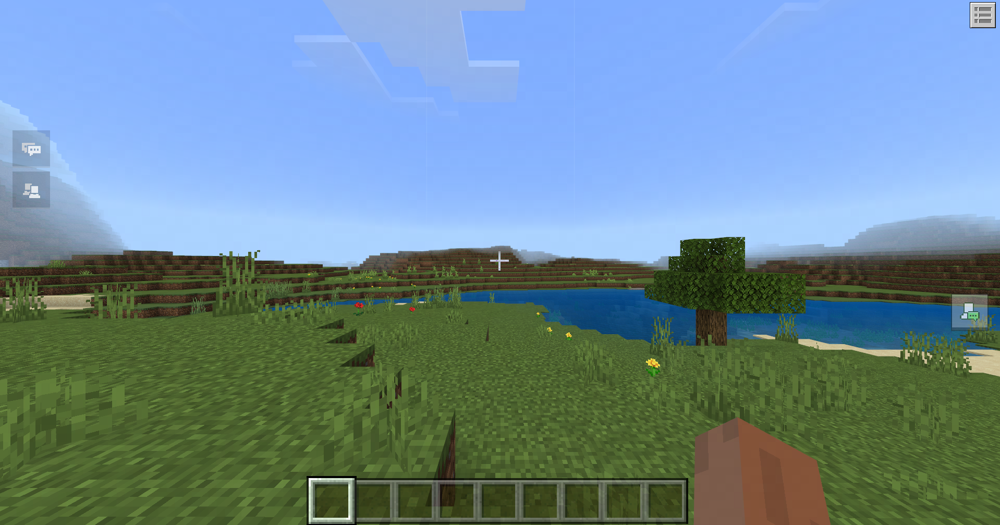
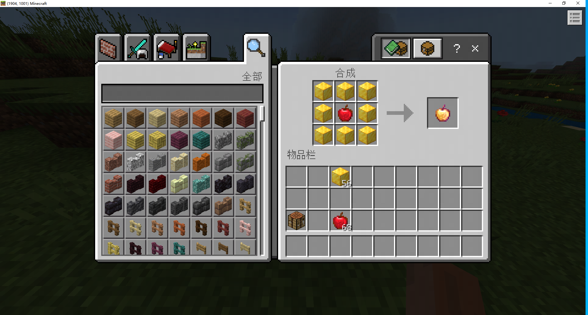
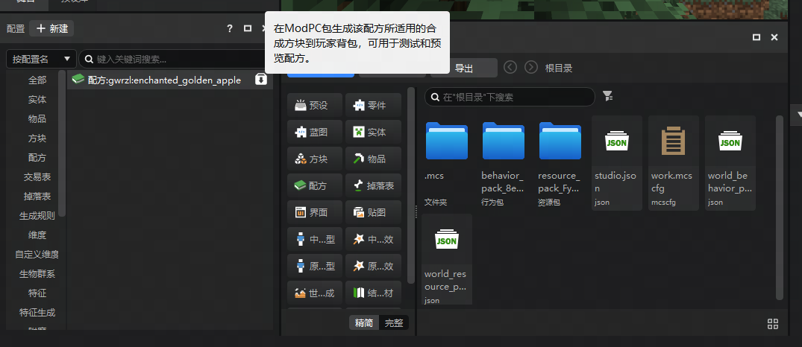
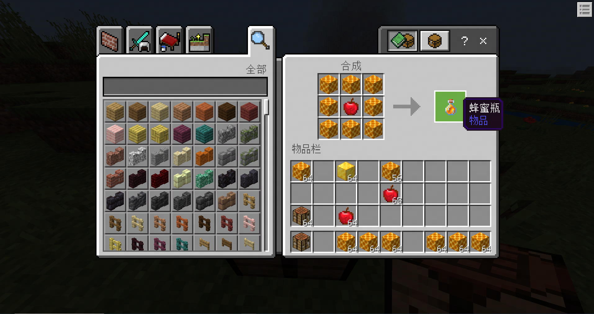

# 测试配方

在本课中，我们将测试前面自定义的配方。

我们需要：

- 点击右上方 **运行** 进入游戏检视配方。
- 点击配置面板快捷入口快速生成配方产物。

## 运行测试

点击编辑器右上角的运行进入游戏存档。

放置工作台，取出64组苹果和金块，摆出配方组合，可以看到配方产出出现附魔金苹果。

## 快速检视

微调配方后，在编辑器内，也可以在配置面板中点击入口生成按钮快速生成对应的材料到本地玩家背包，进一步查看效果。

## 结论

课程到这里已经接近尾声，恭喜您！在下一节中，我们为您准备了练习题目，你可以选择跳过它们继续学习后面的内容。

如果对前面的部分还不够清除，请借此机会再好好回顾前面学到的知识与概念。相信您能在未来创造出更好的配方。
