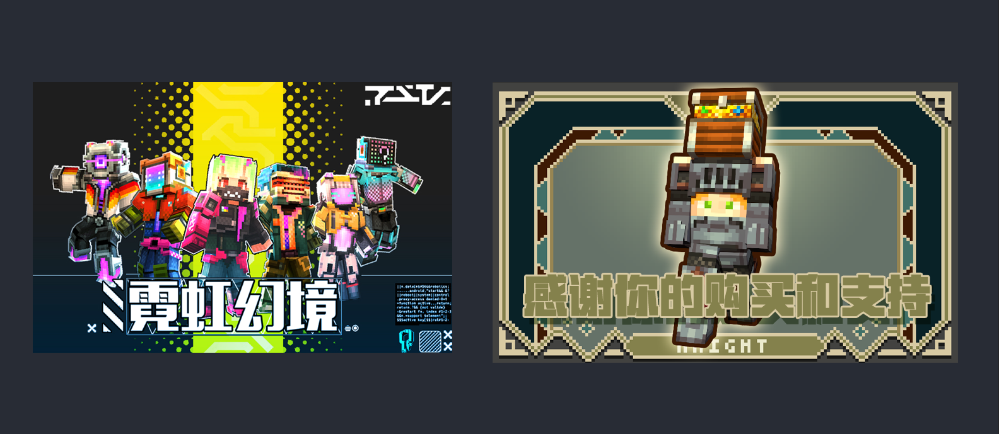
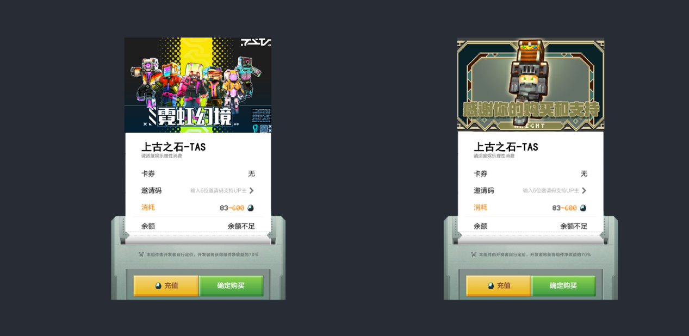
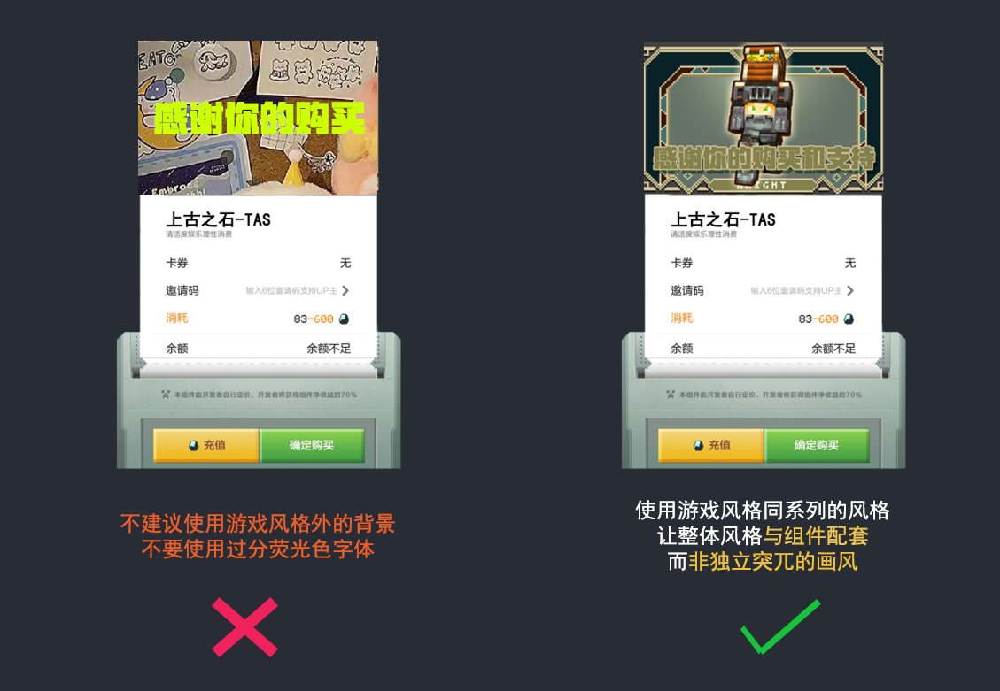

# 展示图（pos图）设计

有效的展示图（POS图）能够有效地传达促销信息、突出内容特色，并激励消费者进行购买。本章将简明扼要地介绍如何设计引人注目的POS图，来搭配平台前端的pos界面。

1.  **表达对于玩家的感谢：**
-   Pos图主要是在购买付款界面针对玩家的单向性视觉展示，也是玩家在购买组件进行游玩前，最后一个与你进行视觉交流的节点。
-   所以，我们再展示产品的核心卖点或特色功能的同时。也可以搭配简洁明了的标题或者更接地气搞笑的文字描述。例如，“”“感谢你的支持和关注” “模组速运即将到达”等等。

1.  **合理布局**
-   Pos界面相对于其他图片尺寸来说是更小的，所以需要将画面内的元素尽量精简且放大，保证前端玩家在看的时候，不会看不清内容。

    

-   文字布局准则跟之前keyart教程篇一样，将核心信息放在pos图画面的中央或者偏下，确保重要信息不回被其他视觉元素遮挡，情愿精简预留空间，也不要铺满。

1.  **保持风格的一致性：**
-   确保POS图的整体风格与前端界面大体保持适配，使POS图在平台上看起来自然且不突兀。

