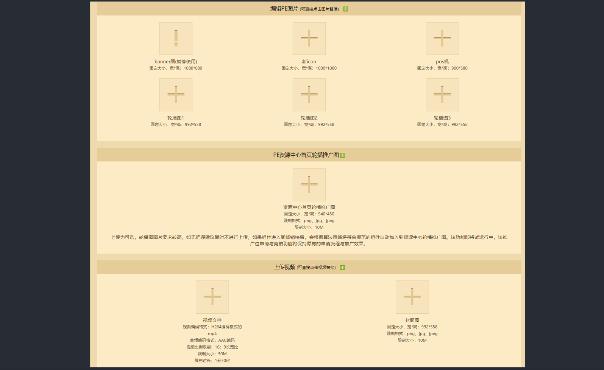
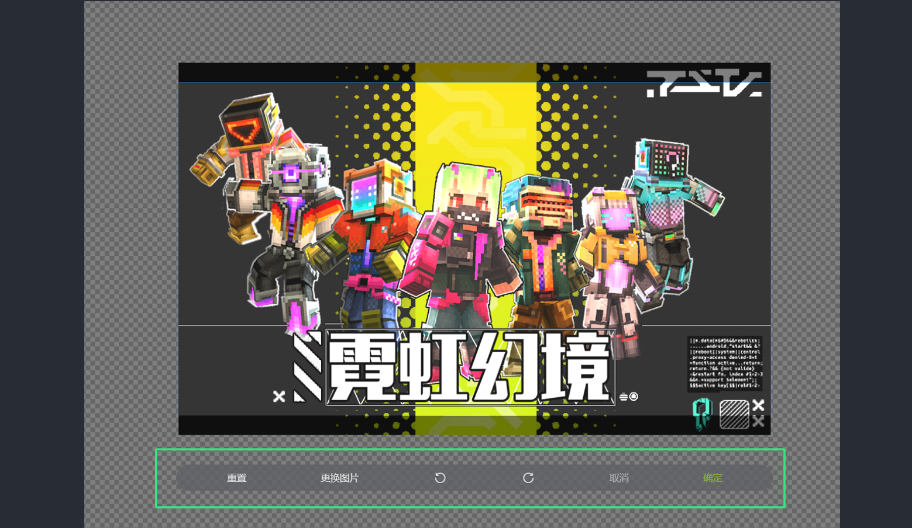

# 发布与优化

根据上述所有设计教程后，我们的所有大体设计图基本都可以制作完全，那么下一步就是在《我的世界》中国版开发者平台上上传和根据上传情况优化这些图片。这一步骤至关重要，确保图像在平台上能够完美呈现，才能进行完整发布。

**基础信息确认：**在即将发布的组件管理后台下，我们可以找到对应的图片上传位置。确保上传的文件格式和尺寸符合平台的要求，通常平台会支持JPEG、PNG等常见格式。

**裁剪预览：**上传图片后，平台会提供一个裁剪工具，让你预览并调整图片的显示区域。仔细查看裁剪预览，确保关键内容不会被裁剪掉，且图像在不同设备（如PC和移动端）上都能完美呈现。

**确保画质清晰：**注意观察上传的图片是否清晰，确保在大屏幕上显示时不会失真或模糊。如有问题及时调整重新上传。
