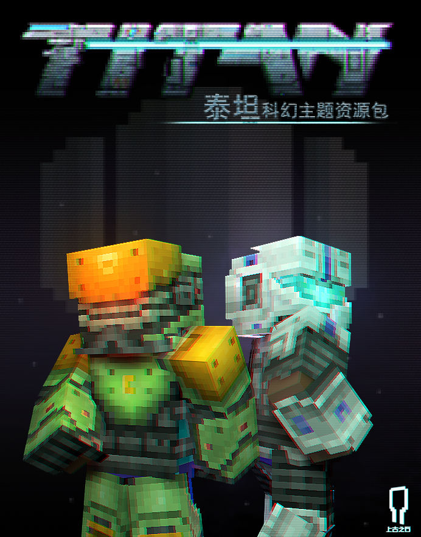

# 练习时间

让自己的作品宣传焕然一新

现在所有的教程都已经学习完毕，接下来就让我们用学到知识来让我们自己的皮肤作品宣传焕然一新！

更新练习要求如下：

**1. 更新KV：**

-   **目标**：突出皮肤的主要设计和特色，传达皮肤的主题和风格。
-   **设计**：确保KV具有强烈的视觉冲击力，主题突出且与实际皮肤一致，使用高质量的图像和颜色搭配。
-   **操作**：使用设计软件制作KV，确保图像分辨率高，符合平台要求。

**2. 更新轮播图：**

-   **目标**：展示组件的多种特色和功能
-   **设计**：设计要保持风格一致，突出各个组件的亮点，考虑不同展示角度。
-   **操作**：创建高质量的轮播图，确保在不同设备上显示效果良好，上传符合平台要求。
