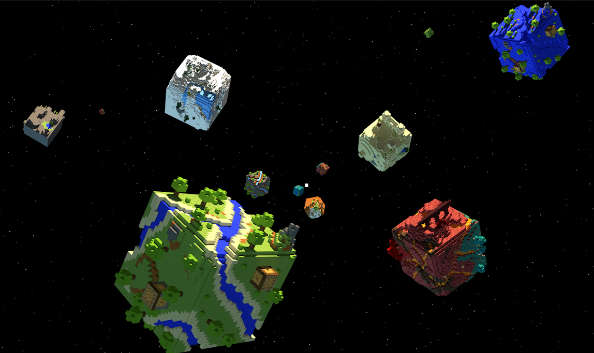
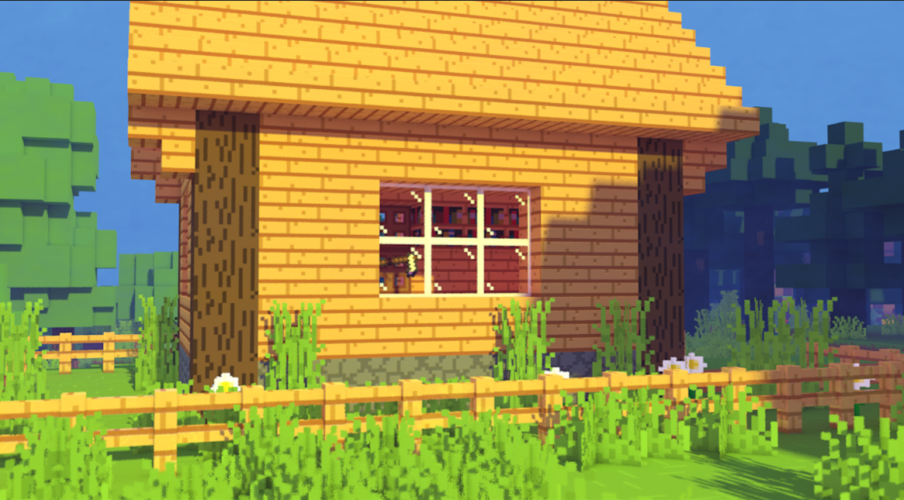
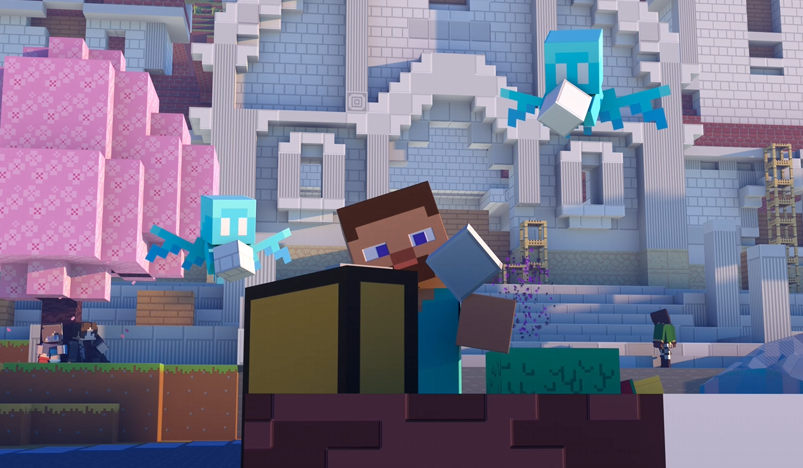

# 《史蒂夫的冒险日记》

在本次教程中，您将通过重现探险家史蒂夫早期发现的古代遗迹，从而深入了解地图编辑搭建的创作流程。我们希望您通过这一过程，不仅能掌握MCstudio地图编辑器的使用技巧，还能体验到从零还原创造神秘古迹的乐趣！

**为什么要学会搭建建筑场景？**

在游戏初期，搭建一个生存小屋避难是游戏核心乐趣之一。进入中后期，通过一层一层的堆叠搭建和调整建筑造型，不仅可以抵御敌人的攻击，还可以将自己构思和锻炼的创意技能展现出来，为自己和其他玩家创造一个独特的游戏视觉体验。但是在生存时期作为玩家搭建的建筑，也往往会遇到一个让人困扰的问题，就是简陋又无法轻易推翻重来，甚至也无法满足构思的玩法使用。

所以，当您的创意和玩法升级到自我创作后，生存时期的“手动”建造场景和建筑，就成为了一种低效又费力的做法。为了更好提升自我创作的游戏体验，融合进需要视觉创意，增加游戏更多可延展的可玩性，并且高效提高后期制作玩法开发，所需要的场景环境等。学习搭建建筑场景是开发者必备的重要技能之一，它不仅仅能满足上述的全部要求，您还能通过掌握的这些技能，为玩家创造一个更具吸引力和互动性的玩法世界。

**如何让自己搭建的建筑场景，视觉效果更自然结构更好？**

那这就是本次教程选择古代遗迹作为主题的原因之一，在《我的世界》中探索地图的时，每位玩家都会不自觉的被各种各样的结构和遗迹所吸引，会让在探索时感受到一种穿越时空的奇妙体验。

重现古代遗迹需要运用建筑结构技巧和创意，通过细致入微的设计和搭建，将遗迹历史感的痕迹生动又自然地呈现出来。这样赋有时光和自然载体的建筑教程学习，不仅能提升您的建筑水平，还能激发您的想象力和创造力。每一个细节的设计和还原，都是对建筑能力的一次提升和激发。

接下来，请跟着我们的教程，一步步地了解并尝试搭建制作属于自己的神秘遗迹吧！
