# 地形和环境的设置

根据上节，我们已经能很好的学会规划整体布局。接下来，就需要给我们规划布局选择一个合适的“窝”，优先进行地形的确认就可以让整体干瘪的布局立刻充满生机。

选择地形修缮融合

1.  将上节已经做好的整体布局进行【选取】-【素材】-【设置名字】-【保存】后，我们就可以在【自定义素材】库看到刚才保存的素材。

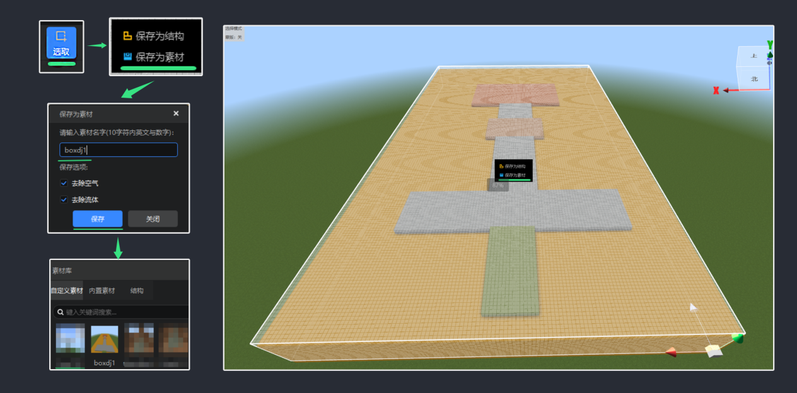

1.  挑选自然山体：我们新建一个包含有自然地形的新地图世界类型选择【无限】挑选一块能适合我们规划的自然环境。

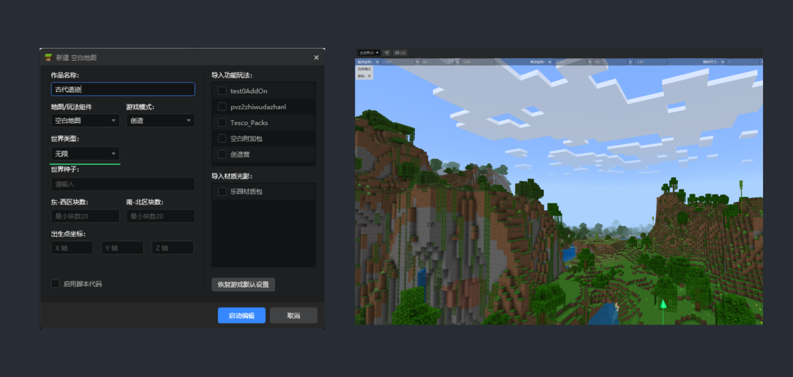

1.  放置规划图：挑选一块适合我们规划的图放置的风水宝地，并将之前提前保存的规划图素材从【自定义素材库】选中，将它与我们选择的地方使用【轴】控制移动进行摆放。

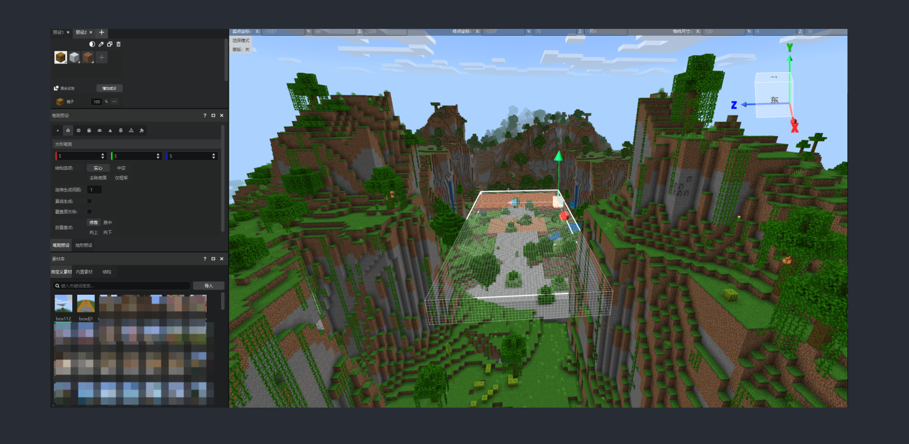

1.  整体基础清理：放置后，我们可以将规划图上会多出一些多余的方块，我们可以使用【选取】- 【替换】/【删除】将多余的方块进行空气替换。

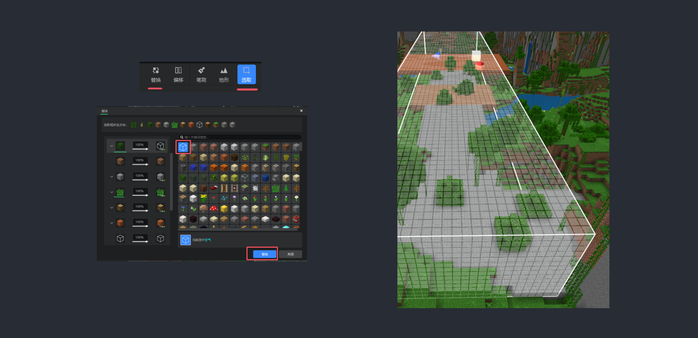

清理后，规划图就更直观，如果删除替换过程中发现一些与自然环境融合的还不错的，也可以保留。

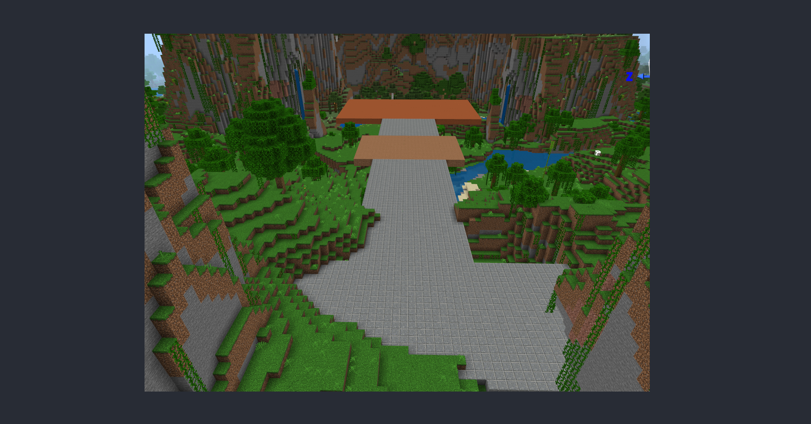

1.  修改衔接山体：使用工具栏-【笔刷】/【地形】下的基础预设，根据规划图的布局安排，我们将四周进行衔接和修改。

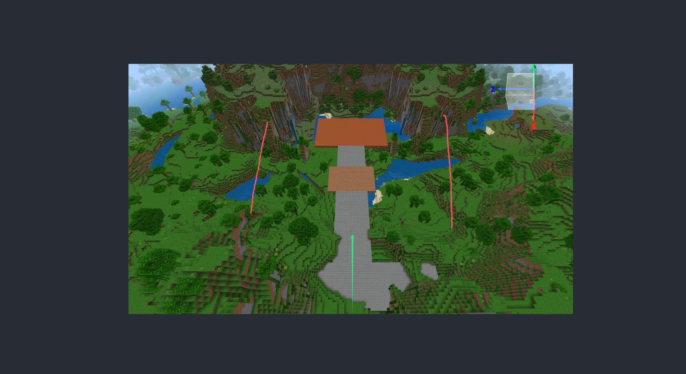

【笔刷】-先设置一个最大的尺寸进行大块面的堆叠，再由大变小的缩小笔刷大小，一层层的堆叠上去。

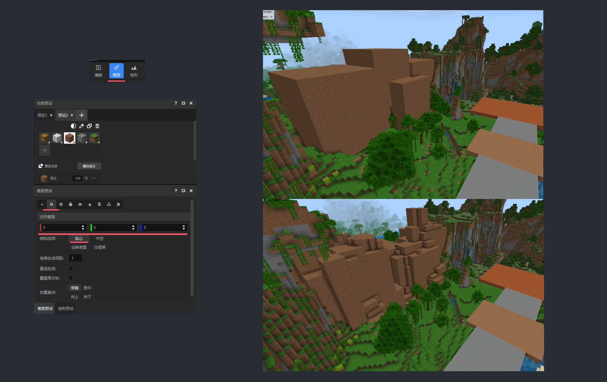

堆叠到山体起伏大体大约都表现出来后，就可以进行下一步精修圆滑过渡了。

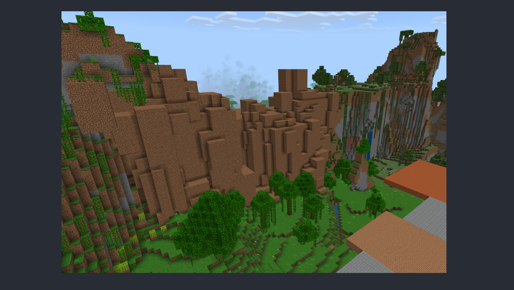

1.  精修地形：想要地形整体变成原生自然的状态，那就需要经过一下几步的递进打磨。
2.  先工具栏-【地形】-【隆起】（初次强度建议：3-5）增加堆叠厚度，进行粗打磨

    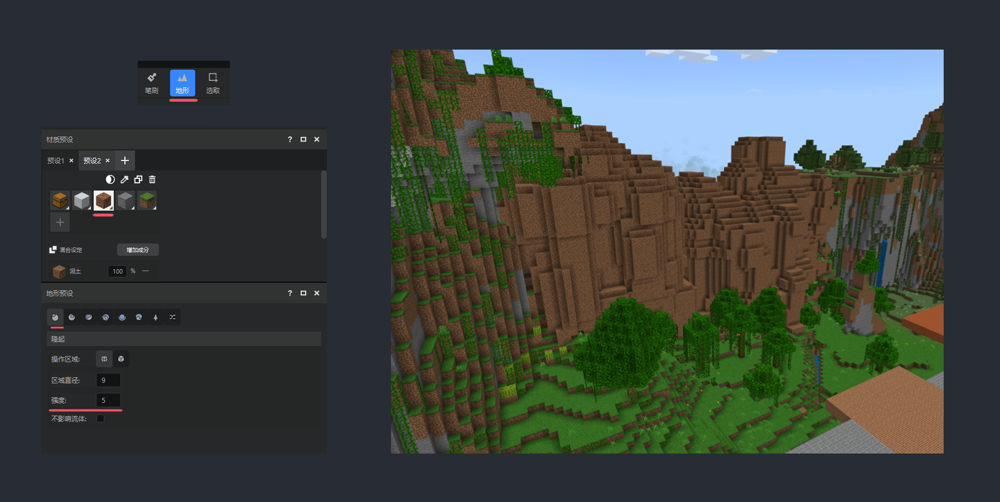

3.  工具栏-【地形】-【凹陷】（初次强度建议：3-5）加强地形起伏

    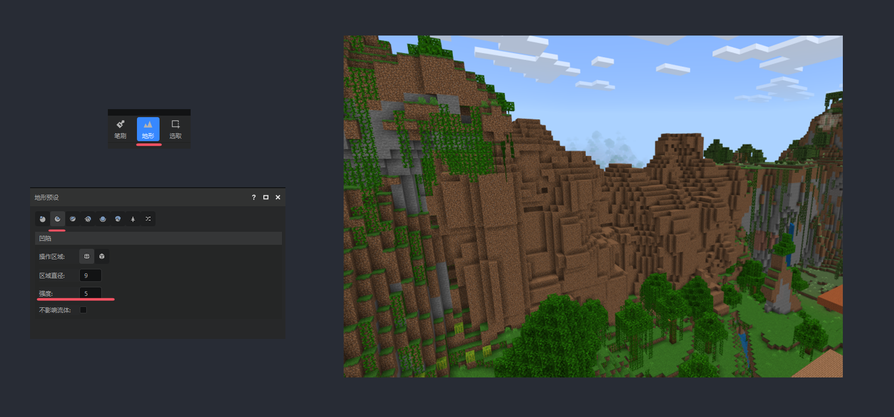

4.  工具栏-【地形】-【平滑】（初次强度建议：3-5）让地形更自然衔接

    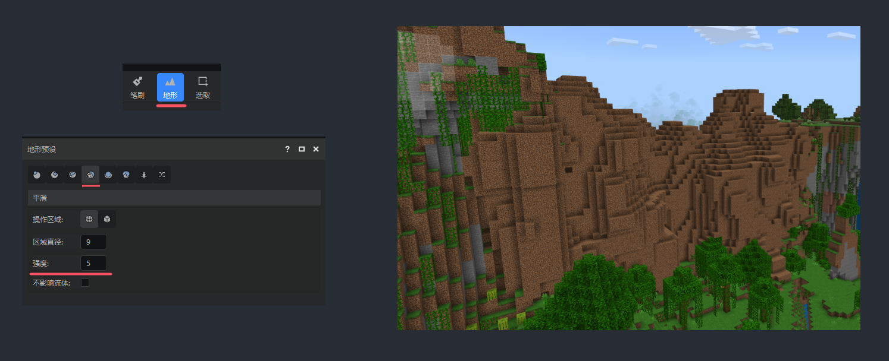

5.  工具栏-【地形】-【侵蚀】（初次强度建议：1-2）增加自然腐蚀的效果

    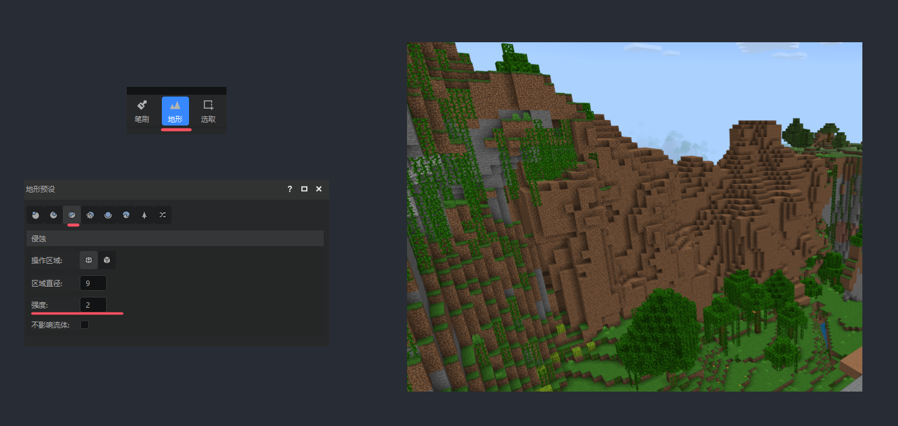

地形环境美化

地形“上色”：地形整体调整后，为了让它更融合与原生，我们需要使用【笔刷】-【蒙版开关】（选择需要被覆盖的方块）-【笔刷预设】-勾选【覆盖原方块】进行方块适当的覆盖替换，让它变成更符合原生自然地形的纹理。

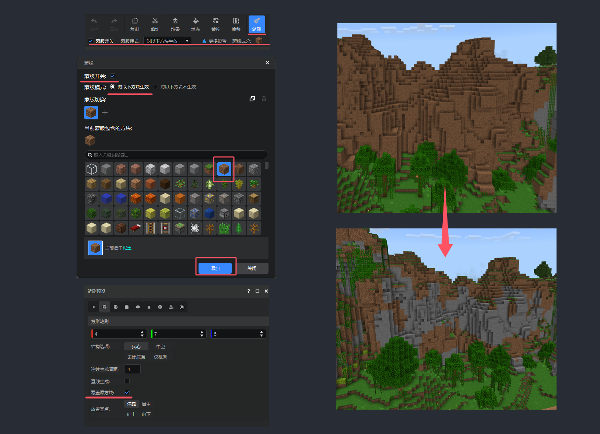

铺设绿植美化地形：地形整体都已经初见样貌，但是还差一点画龙点睛的小装饰，我们就可以使用【地形】-【植被】进行铺设美化。

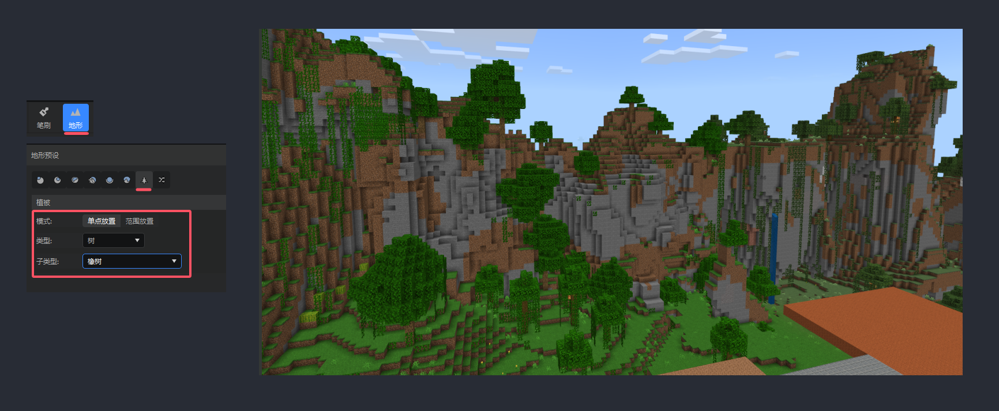

一个完整的地形结合环境修缮，通过上述步骤就可以完成了，遗迹规划区内其余需要进行修缮改建的地形，我们也都可以通过上述教程步骤来进行以此类推，添加密林、湖泊、瀑布等景观地形环境等。

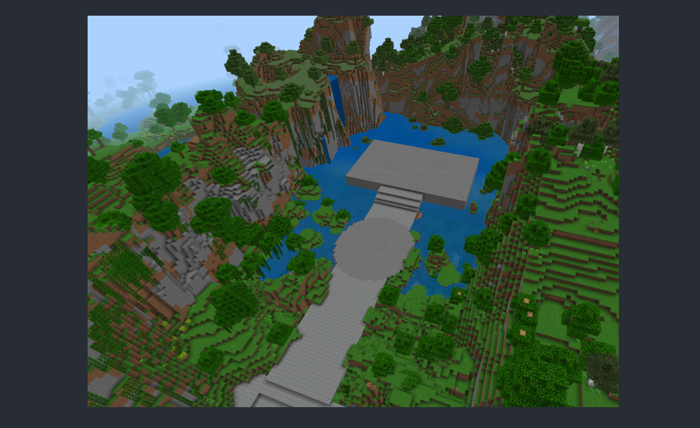

Tips：当然我们也可以直接使用【选取】-【复制】-【镜像】的操作，直接将做好的半山体复制到另外一边，衔接处进行小修整就可以啦
