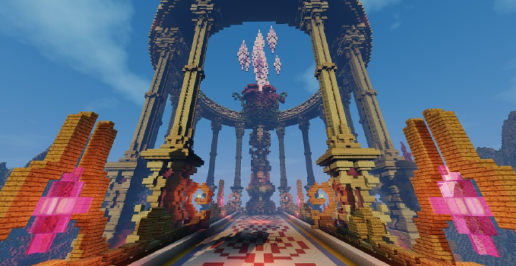

# 练习时间

建造一个属于自己的古代遗迹

现在所有的教程都已经学习完毕，大家是不是已经都忍不住搓搓手准备尝试了。那么，接下来，让我们一起打开创意思维将古代遗迹文明下，那些被天灾所毁灭的建筑给“复原”！

# 建筑场景需求如下：

你作为一名古建筑修复建筑师，接到任务要重建一个传说中的古代祭坛遗迹。这座祭坛曾经是古代遗迹文明中重要宗教和仪式场所，如今只剩下废墟。你的目标是根据历史记录和考古发现，重建这个神秘的祭坛，以恢复它曾经的荣耀和使命。

建筑风格：需要符合教程的古代遗迹时期

建筑体量：50\*50（更大也没关系）

必要建筑：祭坛

周围环境：自然地形需要与建筑融为一体，需要植物和装饰
