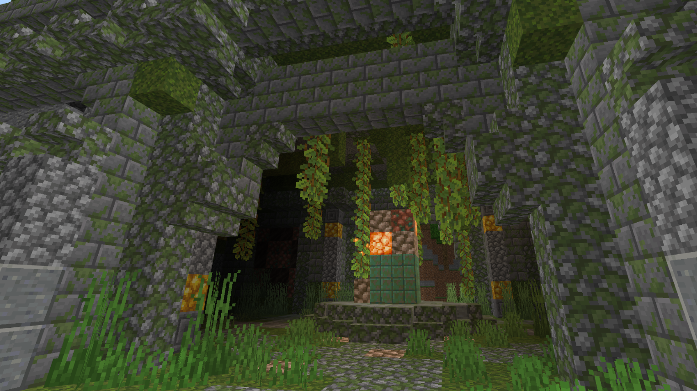

# 课程总结

# 建筑场景的制作要点总结：

**1. 规划和设计**：

- **场景建筑整体布局**：在开始前，制定设计草图和地图布局，确保建筑场景结构相互空间合理。
- **建筑场景定位**：确定建筑场景的主要位置及功能，考虑与周围地形环境的融合。

**2. 地形和环境设置**：

- **编辑地形**：使用编辑器工具制作调整地形，如瀑布、河流、山脉和森林，创建自然的地形过渡。
- **添加环境元素**：植入植被和装饰物，提高环境的视觉感和美观度。

**3. 细节与氛围**：

- **建筑细节**：精细化建筑内部内饰和功能区域，提升整体沉浸感和可玩性。
- **装饰点缀**：不同的方块搭配、特质的小雕塑、适量的植被点缀，用小内容点缀点亮整体的氛围和视觉效果。
